# BRCA 首版结果展示

输入提交：8663004f8d98acaf1368badc7436c84b059e4462；单细胞仅至来源。示例不是最终排名。

## 研究设计与数据范围

**问题：**哪些测量可以对应？

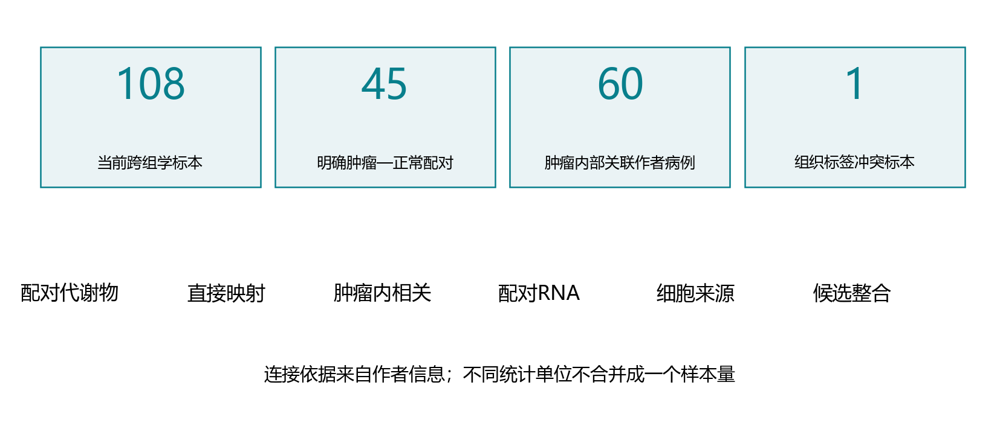

**结果与解释：**108个标本中，45对支持配对比较；组织冲突排除后的肿瘤内关联为60个作者病例。

**限制：**相同作者标本编号不证明同一分装；组织冲突标本已在新关联中排除，冲突本身仍待解释。

## 配对代谢物：全量效应概览 / CAMP_BRCA1_Terunuma

**问题：**肿瘤相对自身正常组织，哪些代谢物变化？

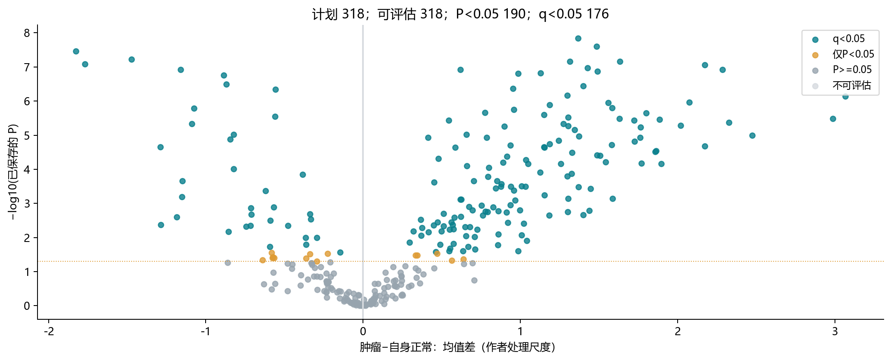

**结果与解释：**318项全部可评估：190项P<0.05，其中176项q<0.05。190项用于探索映射，不能全部称FDR支持。

**限制：**均值差沿用作者处理尺度，不是浓度倍数；同队列探索，不是外部验证。

## 示例代谢物：配对方向人数

**问题：**示例代谢物有多少配对方向一致？

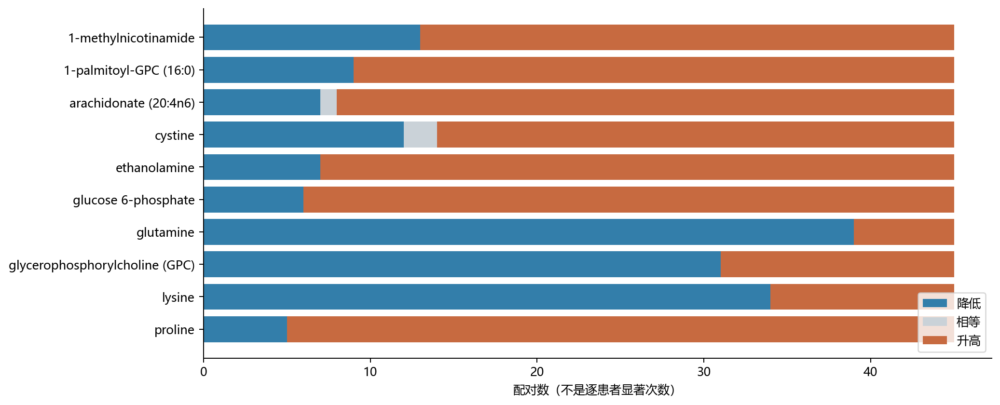

**结果与解释：**谷氨酰胺39/45对降低；1-palmitoyl-GPC 36/45对升高；两者构成方向不同的示例。

**限制：**每对只表示方向，不代表对每位患者分别做显著性检验。

## 缺失敏感性：汇总效应对照

**问题：**可用值子集是否改变效应？

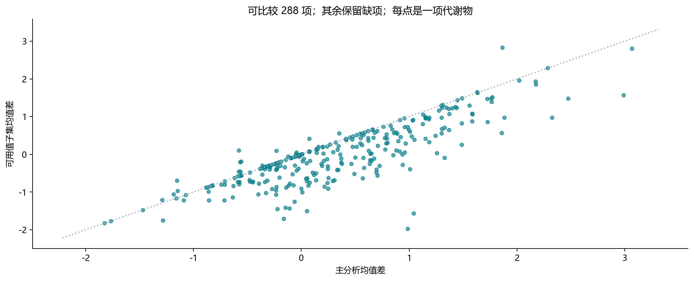

**结果与解释：**可用值子集288项可评估、121项q<0.05；两种分析均显著且均值同向的为93项。

**限制：**作者data可用值不是新增核验的仪器检测掩码；图为汇总效应，不是患者散点。

## 直接生化映射与保留范围

**问题：**代谢物如何形成候选池？

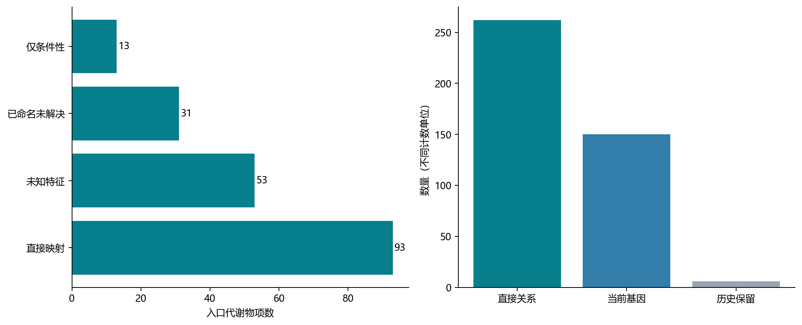

**结果与解释：**190项中93项有直接关系、13项仅条件性、31项已命名未解决、53项未知；得到262关系和150当前基因。

**限制：**直接关系包含酶、转运体及必要复合体成员，不等于功能已验证。

## 肿瘤内部关系：全量概览 / CAMP_BRCA1_Terunuma

**问题：**同一肿瘤中的代谢物与RNA是否共同变化？

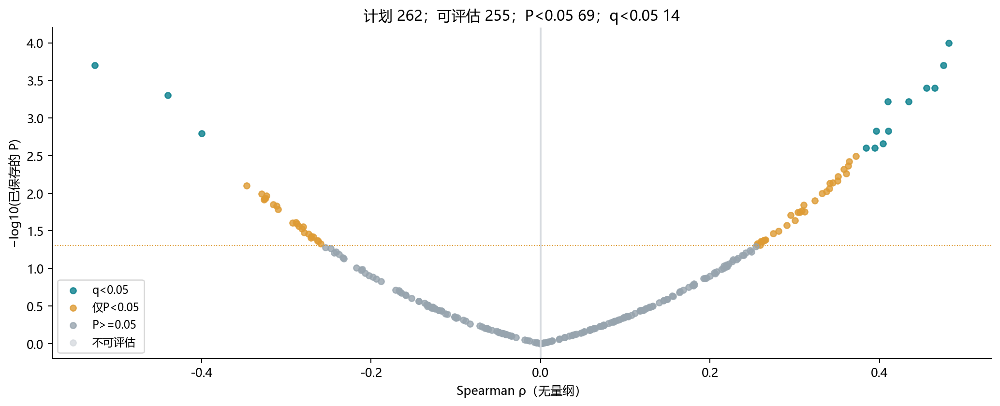

**结果与解释：**262条计划关系中255条可评估：69条P<0.05、14条q<0.05；7条缺测或身份待核。

**限制：**rho是关联强度，不是倍数；候选来自同队列，不能称独立验证。

## 固定示例：主分析与可用值相关

**问题：**不同证据类型的示例关系表现怎样？

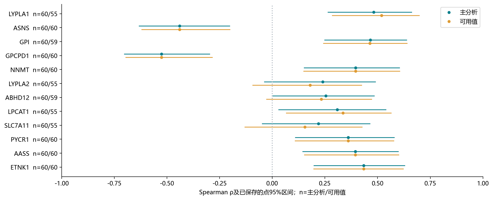

**结果与解释：**LYPLA1—1-palmitoyl-GPC主rho=0.482、可用值rho=0.518；AASS的rho不变而q跨阈值，不能称效应消失。

**限制：**12个示例不是前十名或最终靶点；RNA/来源示例的关系不因被展示而升级。

## 配对RNA：全量效应概览 / CAMP_BRCA1_Terunuma

**问题：**同患者肿瘤中的RNA是否发生变化？

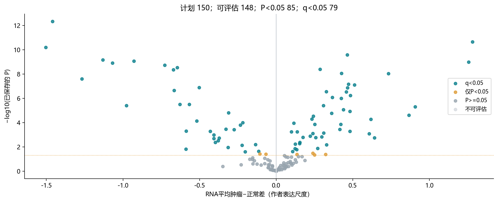

**结果与解释：**150个当前基因中148个可评估：85个P<0.05、79个q<0.05。RNA差异不作为单细胞入场门槛。

**限制：**使用已保存配对t结果与作者表达尺度，不把RNA差异当酶活。

## 示例基因：配对RNA方向人数

**问题：**RNA方向是否在患者间一致？

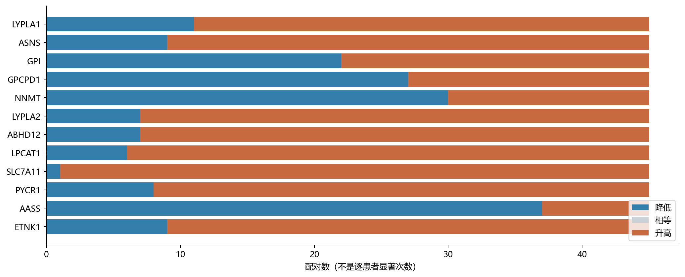

**结果与解释：**SLC7A11为44/45对升高，LYPLA1为34/45对升高，AASS为37/45对降低；方向人数不等于功能验证。

**限制：**RNA方向一致不代表靶点验证；RNA不显著也不阻止单细胞定位。

## 单细胞来源 / Wu2021

**问题：**这些基因在哪些细胞背景表达？

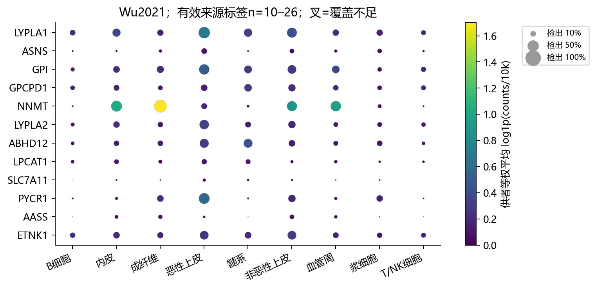

**结果与解释：**LYPLA1/LYPLA2偏恶性上皮，ABHD12偏髓系，NNMT偏成纤维；LPCAT1两研究最高类别不同，不能强指定作用细胞。

**限制：**各研究单独色标，不跨平台比较绝对颜色；表达最高不是唯一作用细胞。

## 单细胞来源 / Pal2021_reprocessed

**问题：**这些基因在哪些细胞背景表达？

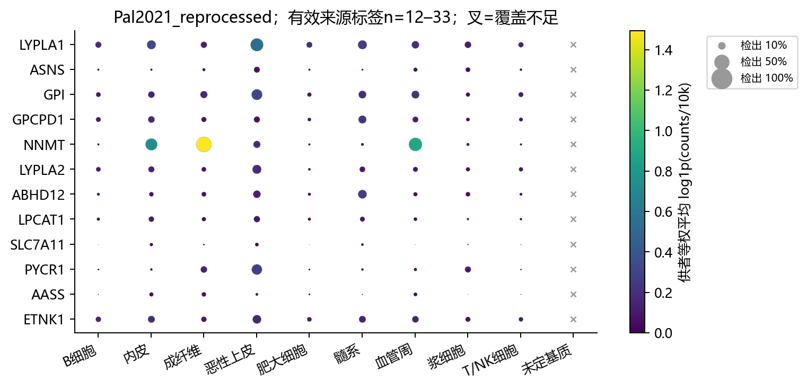

**结果与解释：**LYPLA1/LYPLA2偏恶性上皮，ABHD12偏髓系，NNMT偏成纤维；LPCAT1两研究最高类别不同，不能强指定作用细胞。

**限制：**各研究单独色标，不跨平台比较绝对颜色；表达最高不是唯一作用细胞。

## 已有分型背景：描述性排名

**问题：**分型的来源排名是否一致？

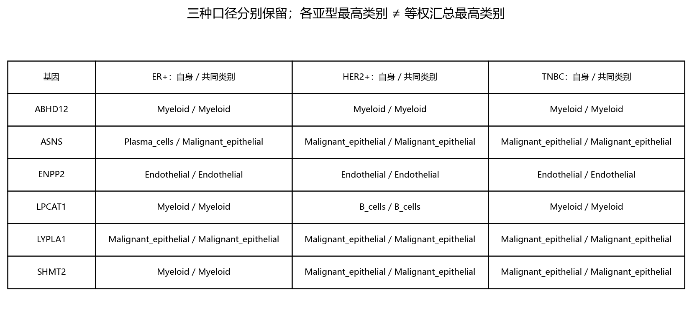

**结果与解释：**自身可用类别与共同类别分别展示；SHMT2为ER+髓系、另两型恶性上皮。

**限制：**等权汇总最高不等于各亚型都最高；ASNS类别覆盖不齐；LPCAT1第一第二名接近。

## 表达与细胞类型：同坐标对照

**问题：**高表达区域与哪些细胞群重合？

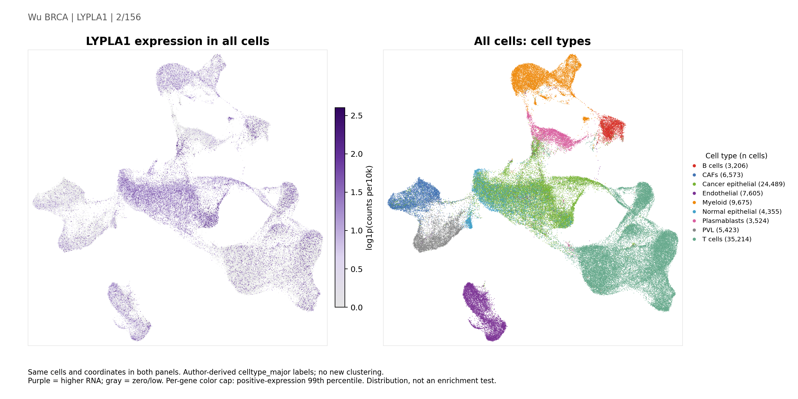

**结果与解释：**现成表达图与相同坐标的类型图一起阅读；完整候选图册见附录。

**限制：**UMAP不是富集检验；图像不能替代供者级来源表。

## 候选证据矩阵：支持与缺项并列

**问题：**证据怎样并列而不机械取交集？

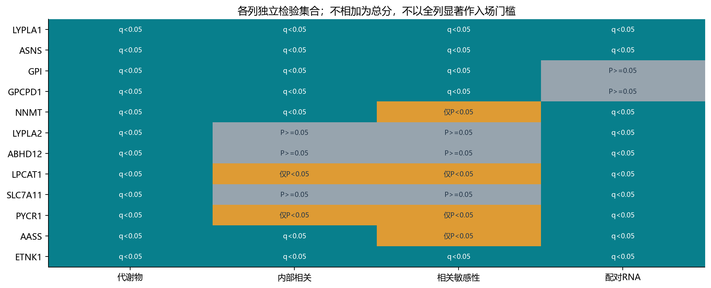

**结果与解释：**代谢物、关联、敏感性、RNA分别保留P/q；来源和外部限制另列。

**限制：**颜色仅标统计层级，不构成统一分数；缺测不能记成0。

## 候选解释：不是最终靶点名单

**问题：**这份结果最适合讨论什么？

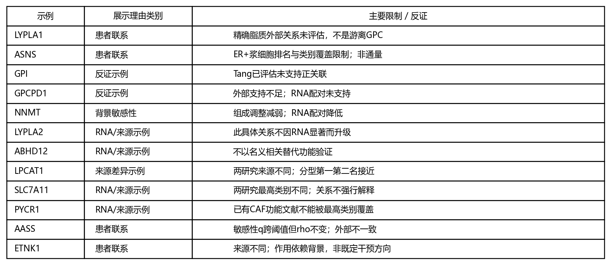

**结果与解释：**LYPLA1、ASNS患者线索较清楚；AASS、ETNK1也有具体联系；RNA/来源示例同样保留。

**限制：**GPI的Tang未支持、GPCPD1外部不足、NNMT背景敏感及研究覆盖限制均不能隐藏。

