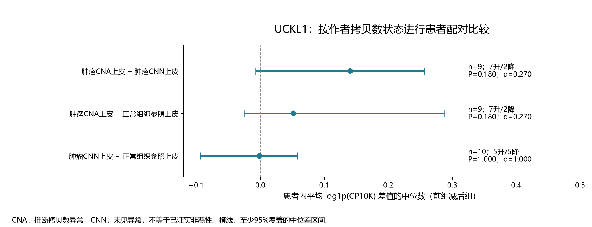

# COAD：UCKL1上皮拷贝数状态分层比较

## 本轮问题

用户要求核实恶性与非恶性上皮标签后比较UCKL1。已完成作者标签核查及Uhlitz患者层面计算。结果为：CNA上皮相对两种参照均有7/9位患者表达较高，但本轮P/q均未显著；不能据此宣布恶性上皮显著高表达。

## 输入与范围

使用GSE166555既有原始UMI提取及作者元数据，新增作者[拷贝数标签](https://github.com/molsysbio/sccrc/blob/dbac4154b841e61addfbcdab1ede298ee36975db/_data/_tab/infercnv_clone_scores.tsv)。[作者代码](https://github.com/molsysbio/sccrc/blob/dbac4154b841e61addfbcdab1ede298ee36975db/_src/infercnv.R)在每位患者的肿瘤上皮树中分两个簇，按簇的拷贝数偏离得分相对正常参照阈值区分CNA与CNN。该标签来自表达推断，非逐细胞DNA认证。原研究在12例中的10例识别到明显异常；未见异常不能排除恶性。[原论文](https://pmc.ncbi.nlm.nih.gov/articles/PMC8495451/)

本次逐细胞连接先遵循作者代码将冒号换为下划线，再检查唯一性、细胞类型、组织与供者。13,373条有细胞ID的调用均能连接；其中1,011个细胞的作者source_id与元数据不一致，涉及一位供者。未猜测纠正，整位供者在所有比较中排除。标签表另有16,932行缺细胞ID，不能按顺序补配。正常参照从既有元数据按作者规则独立选择：Normal组织、Epithelial、排除cell_type_epi_custom以TC开头的细胞；不把缺ID调用倒填给正常细胞。

|组别|合格供者|细胞数|解释|
|---|---:|---:|---|
|肿瘤CNA上皮|9|4,477|作者推断拷贝数异常，恶性支持较强|
|肿瘤CNN上皮|11|7,885|作者未见拷贝数异常，仍可能含恶性细胞|
|正常组织参照上皮|10|16,138|配对正常/邻近组织中的作者参照类上皮|

各组每供者至少20细胞，比较按同患者交集，至少6对才检验。先在细胞内按全基因UMI归一至CP10K并log1p，再在供者/组内平均。以患者差值的中位数为效应，精确双侧符号检验评价非零差值方向；零差值保留。三项比较提前固定，BH按三项统一校正。区间是覆盖率至少95%的次序统计中位数区间，并非多重校正区间。CPM及检出率只作描述，不再增加检验。分析前锁定远端提交`0720928cafcbdcd864d606eecf873923e25424f9`。

## 实际结果

|比较|患者对数|前组较高/较低/相等|中位差|中位差区间|P|本轮q|
|---|---:|---|---:|---|---:|---:|
|肿瘤CNA上皮 − 肿瘤CNN上皮|9|7/2/0|+0.1404|[-0.0076, +0.2568]|0.179688|0.269531|
|肿瘤CNA上皮 − 正常组织参照上皮|9|7/2/0|+0.0514|[-0.0253, +0.2884]|0.179688|0.269531|
|肿瘤CNN上皮 − 正常组织参照上皮|10|5/5/0|-0.0018|[-0.0935, +0.0581]|1.000000|1.000000|

肿瘤CNA−CNN的配对检出比例差中位数为+18.68个百分点；CNA−正常参照为+12.70个百分点，均为描述。两项表达中位差在逐一剔除患者后仍为正，范围分别为+0.1215至+0.1752、+0.0491至+0.0769；方向保持不是独立验证，也不能替代P/q。

## 新手解释

现在可以说：在这批通过身份检查的Uhlitz患者中，UCKL1在拷贝数异常上皮中有较高表达趋势。样本少、患者间不完全一致，统计证据尚不足。7/9是7位患者的组内平均表达较高，不是7个细胞，也不是已证明7位患者有UCKL1驱动肿瘤。

## 限制/反证

1. CNN不能命名为已证实非恶性；本批完成的是作者CNA分层比较，严格的恶性−非恶性比较仍缺独立标签。正常参照按组织与原作者参照规则定义，也不是独立健康人群。
2. 目前只有Uhlitz完成此项计算。Lee现有注释为上皮亚型/CMS，Pelka既有同步注释为上皮状态，无本轮已核实可直接接入的逐细胞恶性调用；不能按CMS或取材位置自动分恶性。Khaliq本轮未新增恶性标签审核。
3. 单基因由既有结果及用户指定后选择，是探索性定向跟进；三项本轮q只属于该问题，不替代原891关联的q。CNA调用使用表达特征，本批不独立验证调用准确性，也未核对UCKL1是否参与推断特征。
4. 旧Pelka的28对整体上皮肿瘤−正常结果与本批队列、细胞分组和效应尺度不同，不能称为恶性上皮升高的重复验证。

## 当前决定

保留UCKL1的上皮表达背景，并新增“作者CNA上皮较高趋势、未获本轮显著支持”的结果。当前证据不足以写恶性特异表达、显著上调或尿苷消耗机制。完整候选池与历史结果不改写。

## 下一步

如继续提高恶性判定可信度，需核实身份冲突及获取独立的细胞级恶性证据；本批不把重新聚类或自行调整CNV阈值作为获得阳性的手段。

## 复现命令

在server165新运行目录建立独占`.running`，复制`run_uckl1_cna_v1.py`、`check_uckl1_cna_v1.py`与参数。先运行`--mode audit`，锁定参数后运行`--mode analyze --lock-commit <参数提交号>`；两者均传`--out <新目录> --spec analysis_spec.json`。之后运行`python3 check_uckl1_cna_v1.py --out <新目录>`。患者级值与原矩阵仅存服务器，本目录只含汇总。

数值检查：独立组合公式核对符号检验、statsmodels核对BH，并从服务器患者表复算配对数/方向/效应，均PASS。图源为[results.tsv](results.tsv)，覆盖为[coverage.tsv](coverage.tsv)，组描述为[group_summary.tsv](group_summary.tsv)。
