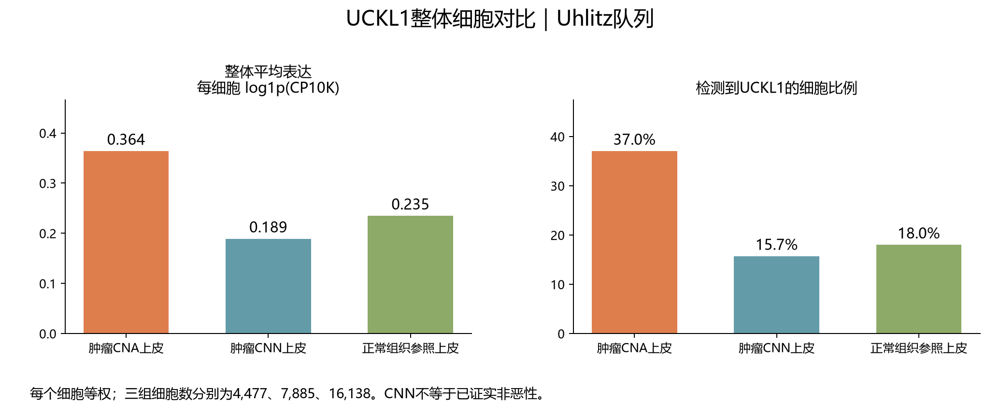

# COAD：UCKL1全部细胞等权整体对比

## 本轮问题

按用户要求直接看整体细胞分布，不按患者等权进行主展示。使用同一批已核实CNA/CNN标签及同一供者冲突排除规则。

## 输入与范围

沿用上一批CNA分层的三组细胞：CNA 4,477、CNN 7,885、正常组织参照16,138。源数据与标签哈希逐项相同。每个细胞等权，来自细胞较多的供者会占更大权重；不改变原始UMI、分组或归一化尺度。

## 实际结果

|细胞组|细胞数|平均log1p(CP10K)|平均CP10K|检出细胞数及比例|
|---|---:|---:|---:|---|
|肿瘤CNA上皮|4477|0.3638|0.7917|1658（37.0%）|
|肿瘤CNN上皮|7885|0.1890|0.4771|1238（15.7%）|
|正常组织参照上皮|16138|0.2347|0.5945|2906（18.0%）|

整体描述上，UCKL1在CNA组的平均表达和检出比例较高。在线性CP10K尺度，CNA组平均值约为CNN组的1.66倍、正常参照组的1.33倍；这是所采样细胞的归一化表达均值比，不是患者效应倍数或酶活倍数。三组单细胞表达中位数都为0，因此不是所有细胞均普遍高表达。

进一步限定到检测到UCKL1的细胞，平均log1p(CP10K)分别为0.982、1.204、1.303。CNA组在这项条件性描述中并不更高，因此整体均值较高主要伴随更高的检出比例，不能改写成每个表达阳性的细胞都更高。检出也受测序深度等技术因素影响。

## 新手解释

这张图把各组细胞放在一起，回答这批细胞总体看起来谁更高。上一批每位患者等权，回答患者之间是否一致。两种加权方式回答的问题不同，整体均值较高可以与患者配对检验不显著并存。

## 限制/反证

CNA为作者表达推断的拷贝数异常；CNN不是已证实非恶性。整体描述不作把细胞视为独立患者的P/q检验。原患者比较仍为CNA对CNN及正常参照各7/9位较高、P=0.1796875、q=0.26953125；此次不替换它们。

## 当前决定

增加整体细胞视图，保留“CNA组表达及检出较高”的描述性观察，不升级为恶性特异或显著患者效应。

## 下一步

整体展示与[患者配对报告](../20260925T140257Z_uckl1_cna_v1/README_CN.md)一并使用，按研究问题选择解释口径。

## 复现命令

server165新运行目录建立独占`.running`，复制`run_uckl1_cell_pooled_v1.py`，运行`python3 run_uckl1_cell_pooled_v1.py --out <新目录>`。本地从公开汇总运行`python code/coad/report_uckl1_cell_pooled_v1.py`绘图。直接逐细胞均值与按细胞数加权的既有患者均值交叉核对，检出数、细胞数、直方图守恒均PASS；细胞及患者级数据留服务器。
