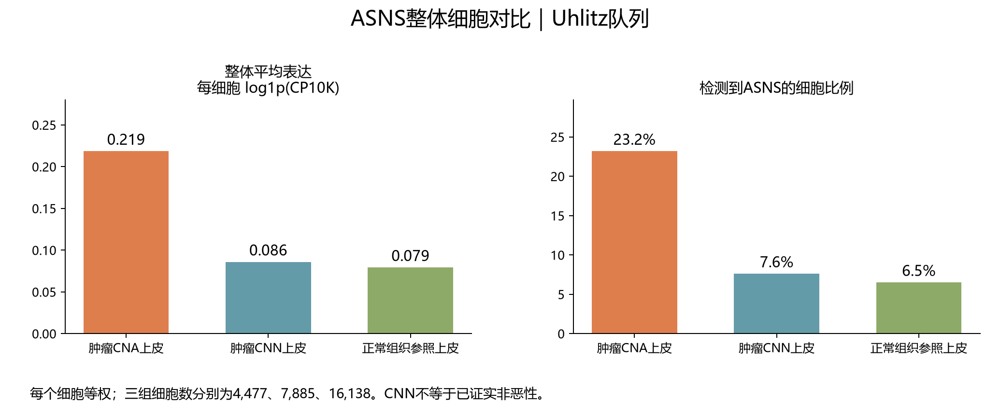

# COAD：ASNS上皮整体细胞对比

## 本轮问题

沿用UCKL1刚完成的整体细胞口径，查看ASNS在作者CNA/CNN及正常组织参照上皮中的表达。整体平均表达排序为：肿瘤CNA上皮 ＞ 肿瘤CNN上皮 ＞ 正常组织参照上皮。

## 输入与范围

GSE166555既有全基因UMI分母及ASNS独立条目，与原作者CNA调用连接。完全沿用[标签核查](../20260925T140257Z_uckl1_cna_v1/README_CN.md)：作者明确规则转换细胞ID，排除一位来源编号冲突供者，正常参照排除作者TC标签。三组仍为4,477、7,885、16,138个细胞，来自9、11、10位供者。输入哈希与上一批一致，不按本基因表达选择细胞。

## 实际结果

|组别|细胞数|平均log1p(CP10K)|平均CP10K|检出细胞数及比例|仅检出细胞的平均log1p(CP10K)|
|---|---:|---:|---:|---|---:|
|肿瘤CNA上皮|4477|0.2185|0.4466|1038（23.2%）|0.9425|
|肿瘤CNN上皮|7885|0.0859|0.2065|600（7.6%）|1.1286|
|正常组织参照上皮|16138|0.0792|0.1981|1051（6.5%）|1.2166|

在线性CP10K尺度，CNA整体均值约为CNN的2.16倍、正常参照的2.25倍。该比值只表示采样细胞的归一化表达均值，不是酶活或患者效应。全细胞表达中位数依次为0.0000、0.0000、0.0000。

## 新手解释

平均表达将未检出的零值也算在内；检出比例回答多少细胞有非零计数。应同时查看检出比例和仅检出细胞的表达，区分更多细胞检出与检出细胞中表达更强这两种表现。

## 限制/反证

每个细胞等权，细胞较多的供者贡献较大。CNA是作者推断拷贝数异常，CNN不能改称已证实非恶性，正常参照是患者的正常/邻近组织。没有把数千细胞当独立患者进行P/q检验。本批未计算ASNS患者配对推断，不能把UCKL1的患者P/q借给ASNS。检出比例受测序深度及细胞状态影响，不能直接归因为癌变机制。

## 当前决定

保留实际整体表达及检出比例对照，仅用于描述；原候选安排与历史统计保持不变。

## 下一步

将此整体视图用于阅读候选表达背景；若要判断患者间是否稳定，再以该基因自己的患者值分析。

## 复现命令

server165新独占运行目录运行`python3 run_epithelial_cell_pooled_v1.py --out <新目录> --gene ASNS`；本地从公开表运行`python code/coad/report_epithelial_cell_pooled_v1.py --out <结果目录>`。核对直接逐细胞均值与按细胞数加权的患者均值一致、检出数一致、直方图细胞数守恒。原始和逐患者/细胞值留服务器。
