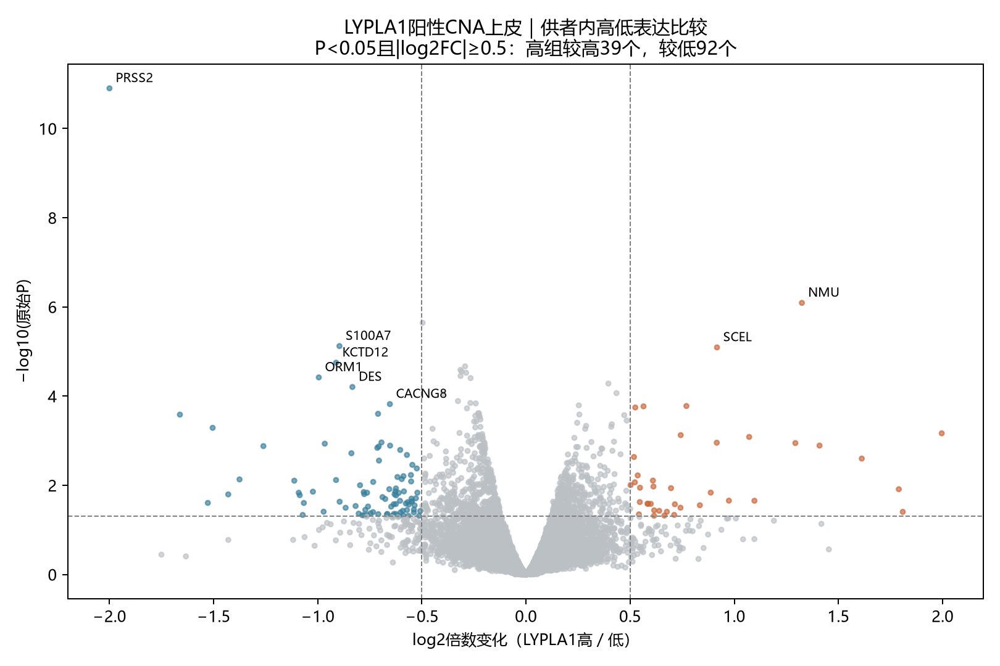
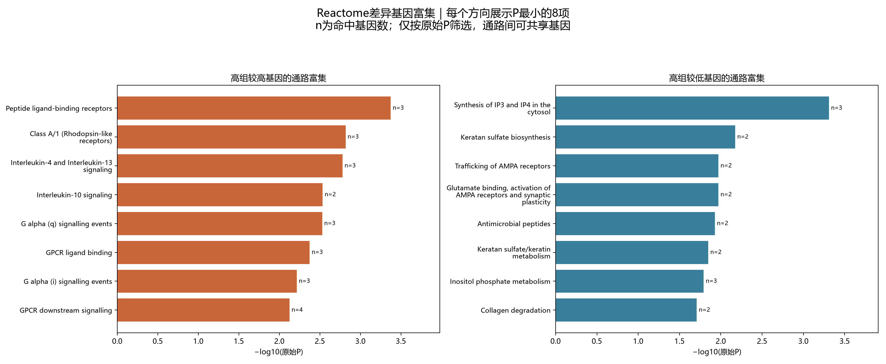

# COAD：LYPLA1高低表达分组差异与通路（原始P口径）

## 本轮问题

按用户要求，不用FDR筛选或展示，以原始P<0.05探索LYPLA1高、低表达CNA上皮的伴随基因和通路。患者分组、原始P及效应均复用；仅改变筛选口径并为新基因列表重新做ORA。不把富集视为因果调控。

## 输入与范围

Uhlitz GSE166555原作者CNA肿瘤上皮；沿用来源冲突供者排除规则。4,477个CNA细胞中2,549个检出LYPLA1；仅在阳性细胞内，按各供者的log1p(CP10K)中位数分为高（严格大于中位数）、低（其余）组。每组至少20细胞，1位供者不足，最终8位供者、2,528细胞，高1,262、低1,266。1,928个零计数不混入低组。

全基因源计数21,854项，过滤后11,058项进入edgeR供者配对伪合并比较（TMM、稳健QL，`~patient+group`），LYPLA1自身排除。主筛选P<0.05，另保留|log2FC|≥0.5作为效应门槛；完整P<0.05清单也单独提供。深度敏感性加入每个供者组别的平均UMI对数，不作为挑选主模型的依据。方法见[Bioconductor](https://www.bioconductor.org/books/3.19/OSCA.multisample/multi-sample-comparisons.html)。

## 实际结果

945个基因P<0.05；其中131个同时达到效应阈值，高组较高39个、较低92个。深度敏感性模型中有414个达到相同P及效应门槛，与主清单交集18个。主清单中18个在深度模型仍P<0.05且方向一致；这是同一数据的敏感性，不是复现。

|基因|高/低log2FC|原始P|深度模型P|
|---|---:|---:|---:|
|PRSS2|-2.000|1.26e-11|0.00543|
|NMU|1.324|8.14e-07|0.0366|
|S100A7|-0.896|7.57e-06|0.338|
|SCEL|0.917|8.11e-06|0.144|
|KCTD12|-0.912|1.78e-05|0.665|
|ORM1|-0.995|3.82e-05|0.894|
|DES|-0.833|6.26e-05|0.593|
|CACNG8|-0.654|0.000151|0.0716|
|PTGS2|0.770|0.000167|0.518|
|KITLG|0.564|0.00017|0.0472|
|PIM1|0.525|0.00018|0.173|
|NXPE1|-0.710|0.00025|0.00872|

[Reactome人通路](https://reactome.org/download-data)按实际可检验基因取交集后，15–500基因的通路共1129条。ORA以上述131个基因为输入、高低方向分别分析，全部11,058个可检验基因为背景；两方向合计35个条目P<0.05。GSEA复用全基因排序，234条P<0.05，高组端131条、低组端103条。两种方法不是独立证据，不相加计数。

|ORA通路|输入方向|原始P|命中基因|
|---|---|---:|---|
|Peptide ligand-binding receptors|高组较高|0.000423|KISS1;NMU;PPBP|
|Synthesis of IP3 and IP4 in the cytosol|高组较低|0.00049|ITPKA;ITPKB;PLCD1|
|Class A/1 (Rhodopsin-like receptors)|高组较高|0.00152|KISS1;NMU;PPBP|
|Interleukin-4 and Interleukin-13 signaling|高组较高|0.00166|MMP1;PIM1;PTGS2|
|Interleukin-10 signaling|高组较高|0.00293|IL1RN;PTGS2|
|G alpha (q) signalling events|高组较高|0.00296|KISS1;NMU;RGS13|
|GPCR ligand binding|高组较高|0.00423|KISS1;NMU;PPBP|
|G alpha (i) signalling events|高组较高|0.00609|NMU;PPBP;RGS13|
|Keratan sulfate biosynthesis|高组较低|0.0067|B3GNT7;FMOD|
|GPCR downstream signalling|高组较高|0.0075|KISS1;NMU;PPBP;RGS13|
|Post-translational modification: synthesis of GPI-anchored proteins|高组较高|0.00827|CD109;VNN1|
|Keratinization|高组较高|0.00827|CDSN;KRT7|
|Formation of the cornified envelope|高组较高|0.00827|CDSN;KRT7|
|Peptide hormone metabolism|高组较高|0.00911|DPP4;REN|
|Signaling by GPCR|高组较高|0.0104|KISS1;NMU;PPBP;RGS13|

## 新手解释

ORA回答选出的差异基因是否较多落在某通路；GSEA使用全部基因的带方向排序，正NES偏高组、负NES偏低组。通路命中和leadingEdge基因并非同一概念，后者不要求每个基因单独P<0.05。

完整文件：`all_genes_P05.tsv`（全部945项）、`selected_genes.tsv`（加效应阈值131项）、`results.tsv`（11,058项含敏感性）、`reactome_ORA.tsv`、`reactome_GSEA.tsv`、`pathway_gene_links.tsv`（每条P<0.05 ORA通路的具体基因与各自统计）。统一结果表的q列为NA，仅维持跨癌字段，旧q不用于本版；历史原文件未覆盖。

## 限制/反证

本版全部按未校正P探索。很多条目只由2–4个共享基因支持，例如NMU/KISS1/PPBP会出现在多个GPCR条目，不能把这些条目当作不同机制的重复支持。GSEA低组端的多个翻译/核糖体条目共享大量RPL/RPS基因；不能据命名推断病毒感染、氨基酸缺乏或具体通路活性。

高组总UMI中位数9,502，低组13,027.5，分组与深度有联系；敏感性也不能排除全部混杂。部分基因仅少数供者检出，完整表保留供者差值方向数，不能只看最小P。肿瘤上皮内仍可能有克隆、周期、分化及背景RNA差异。CNA是作者RNA推断，不是逐细胞DNA认证；本分析是表达关联，未做LYPLA1干预或代谢测量。

## 当前决定

交付原始P口径的差异基因、通路及命中基因清单。保留全量与深度敏感性，不把131个基因或35个通路自动升级为LYPLA1下游靶点。

## 下一步

本批到差异与富集探索收口，先结合具体命中基因阅读；不自动扩展细胞通讯或拟时序。

## 复现命令

原始配对差异脚本`analyze_lypla1_highlow_v1.R`与分组参数已版本化；本次在server165新独占目录运行`review_lypla1_highlow_nominal_v2.py --out <新目录>`，复用旧效应、P和GSEA，按新基因列表计算ORA。本地`report_lypla1_highlow_nominal_v2.py --out <结果目录>`独立核查超几何P和计数后绘图。患者/细胞数据与Reactome源文件留服务器；只发布汇总。
