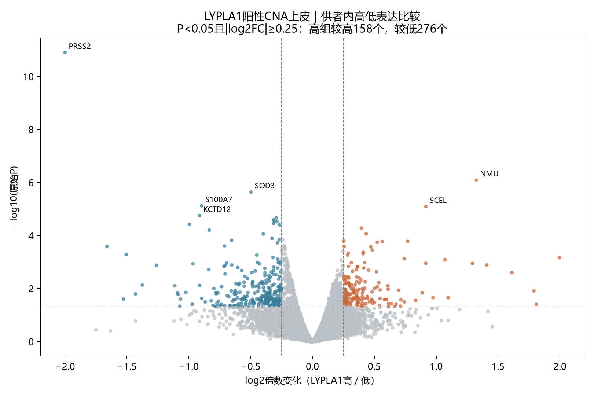
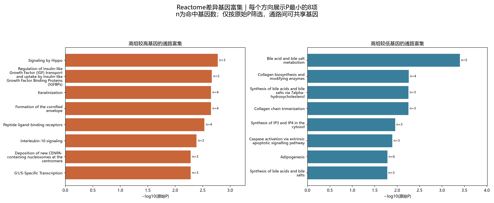

# COAD：LYPLA1高低表达分组差异与通路（原始P口径）

## 本轮问题

按用户要求，不用FDR筛选或展示，以原始P<0.05探索LYPLA1高、低表达CNA上皮的伴随基因和通路。患者分组、原始P及效应均复用；仅改变筛选口径并为新基因列表重新做ORA。不把富集视为因果调控。

## 输入与范围

Uhlitz GSE166555原作者CNA肿瘤上皮；沿用来源冲突供者排除规则。4,477个CNA细胞中2,549个检出LYPLA1；仅在阳性细胞内，按各供者的log1p(CP10K)中位数分为高（严格大于中位数）、低（其余）组。每组至少20细胞，1位供者不足，最终8位供者、2,528细胞，高1,262、低1,266。1,928个零计数不混入低组。

全基因源计数21,854项，过滤后11,058项进入edgeR供者配对伪合并比较（TMM、稳健QL，`~patient+group`），LYPLA1自身排除。主筛选P<0.05，另保留|log2FC|≥0.25作为效应门槛；完整P<0.05清单也单独提供。深度敏感性加入每个供者组别的平均UMI对数，不作为挑选主模型的依据。方法见[Bioconductor](https://www.bioconductor.org/books/3.19/OSCA.multisample/multi-sample-comparisons.html)。

## 实际结果

945个基因P<0.05；其中434个同时达到效应阈值，高组较高158个、较低276个。深度敏感性模型中有653个达到相同P及效应门槛，与主清单交集68个。主清单中67个在深度模型仍P<0.05且方向一致；这是同一数据的敏感性，不是复现。

|基因|高/低log2FC|原始P|深度模型P|
|---|---:|---:|---:|
|PRSS2|-2.000|1.26e-11|0.00543|
|NMU|1.324|8.14e-07|0.0366|
|SOD3|-0.496|2.28e-06|0.0431|
|S100A7|-0.896|7.57e-06|0.338|
|SCEL|0.917|8.11e-06|0.144|
|KCTD12|-0.912|1.78e-05|0.665|
|NOP53|-0.293|2.16e-05|0.0491|
|IER3|-0.315|2.59e-05|0.0886|
|FAM3D|-0.309|2.82e-05|0.0023|
|CDC42EP5|-0.288|3e-05|0.087|
|NRARP|-0.314|3.54e-05|0.179|
|ORM1|-0.995|3.82e-05|0.894|

[Reactome人通路](https://reactome.org/download-data)按实际可检验基因取交集后，15–500基因的通路共1129条。ORA以上述434个基因为输入、高低方向分别分析，全部11,058个可检验基因为背景；两方向合计38个条目P<0.05。GSEA复用全基因排序，234条P<0.05，高组端131条、低组端103条。GSEA使用全排序，不随本次效应门槛改变。两种方法不是独立证据，不相加计数。

|ORA通路|输入方向|原始P|命中基因|
|---|---|---:|---|
|Bile acid and bile salt metabolism|高组较低|0.0004|AMACR;CYP27A1;FABP6;HSD3B7;STARD5|
|Signaling by Hippo|高组较高|0.00168|AMOTL2;SAV1;WWTR1|
|Regulation of Insulin-like Growth Factor (IGF) transport and uptake by Insulin-like Growth Factor Binding Proteins (IGFBPs)|高组较高|0.00216|APOL1;IGFBP6;MFGE8;MMP1;STC2|
|Keratinization|高组较高|0.00224|CDSN;KRT7;KRT80;PPL|
|Formation of the cornified envelope|高组较高|0.00224|CDSN;KRT7;KRT80;PPL|
|Peptide ligand-binding receptors|高组较高|0.00294|GAL;KISS1;NMU;PPBP|
|Interleukin-10 signaling|高组较高|0.00411|IL1RN;LIF;PTGS2|
|Deposition of new CENPA-containing nucleosomes at the centromere|高组较高|0.00523|CENPN;CENPU;RUVBL1|
|G1/S-Specific Transcription|高组较高|0.00523|DHFR;E2F1;TYMS|
|Nucleosome assembly|高组较高|0.00523|CENPN;CENPU;RUVBL1|
|Collagen biosynthesis and modifying enzymes|高组较低|0.00552|BMP1;COL16A1;COL1A2;COL27A1|
|Synthesis of bile acids and bile salts via 7alpha-hydroxycholesterol|高组较低|0.0056|AMACR;CYP27A1;HSD3B7|
|Collagen chain trimerization|高组较低|0.0056|COL16A1;COL1A2;COL27A1|
|Cell Cycle, Mitotic|高组较高|0.0093|CCNB2;CDC25B;CENPN;CENPU;DHFR;E2F1;MAD2L1;NDC1;NEDD1;NEK7;NUF2;SKP2;TYMS|
|Synthesis of IP3 and IP4 in the cytosol|高组较低|0.0111|ITPKA;ITPKB;PLCD1|

## 新手解释

ORA回答选出的差异基因是否较多落在某通路；GSEA使用全部基因的带方向排序，正NES偏高组、负NES偏低组。通路命中和leadingEdge基因并非同一概念，后者不要求每个基因单独P<0.05。

完整文件：`all_genes_P05.tsv`（全部945项）、`selected_genes.tsv`（加效应阈值434项）、`results.tsv`（11,058项含敏感性）、`reactome_ORA.tsv`、`reactome_GSEA.tsv`、`pathway_gene_links.tsv`（每条P<0.05 ORA通路的具体基因与各自统计）。统一结果表的q列为NA，仅维持跨癌字段，旧q不用于本版；历史原文件未覆盖。

## 限制/反证

本版全部按未校正P探索。通路可由少数共享基因支持，例如NMU/KISS1/PPBP会出现在多个GPCR条目，不能把这些条目当作不同机制的重复支持。GSEA低组端的多个翻译/核糖体条目共享大量RPL/RPS基因；不能据命名推断病毒感染、氨基酸缺乏或具体通路活性。

高组总UMI中位数9,502，低组13,027.5，分组与深度有联系；敏感性也不能排除全部混杂。部分基因仅少数供者检出，完整表保留供者差值方向数，不能只看最小P。肿瘤上皮内仍可能有克隆、周期、分化及背景RNA差异。CNA是作者RNA推断，不是逐细胞DNA认证；本分析是表达关联，未做LYPLA1干预或代谢测量。

## 当前决定

交付原始P口径的差异基因、通路及命中基因清单。保留全量与深度敏感性，不把434个基因或38个通路自动升级为LYPLA1下游靶点。

## 下一步

本批到差异与富集探索收口，先结合具体命中基因阅读；不自动扩展细胞通讯或拟时序。

## 复现命令

原始配对差异脚本`analyze_lypla1_highlow_v1.R`与分组参数已版本化；本次在server165新独占目录运行`review_lypla1_highlow_nominal_v2.py --out <新目录> --min-logfc 0.25 --analysis-version COAD_LYPLA1_fc025_v3`，复用旧效应、P和GSEA，按新基因列表计算ORA。本地`report_lypla1_highlow_nominal_v2.py --out <结果目录>`独立核查超几何P和计数后绘图。患者/细胞数据与Reactome源文件留服务器；只发布汇总。
