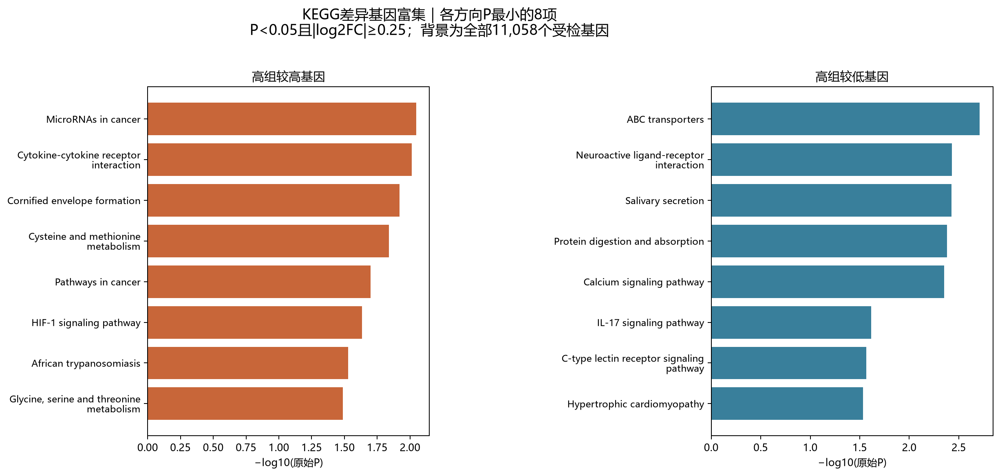
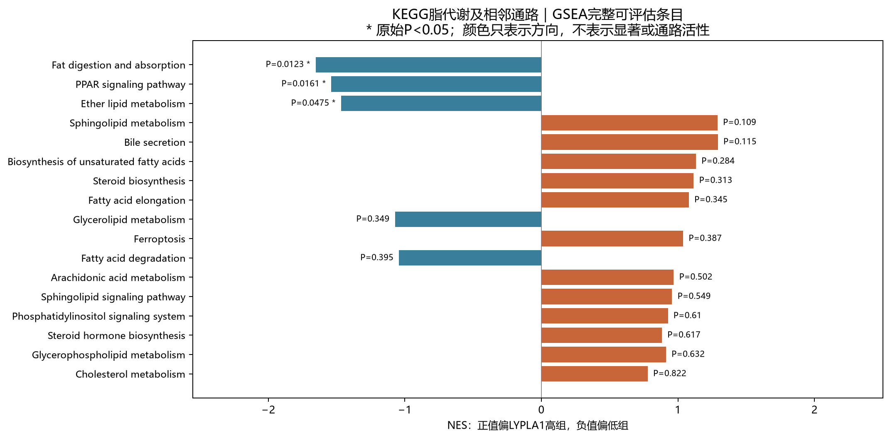

# COAD：LYPLA1高低表达的KEGG富集补充

## 本轮问题

按用户要求补做KEGG，沿用原始P<0.05、不使用FDR筛选。与既有Reactome结果并列；更换注释体系不是独立验证，不按哪套P更小选择结论。

## 输入与范围

Uhlitz GSE166555作者CNA上皮，LYPLA1检出阳性细胞按供者内中位数分高低。8位供者、2,528细胞；复用供者配对edgeR结果，11,058受检基因，LYPLA1本身排除。P<0.05且|log₂FC|≥0.25得到434基因：高组较高158、较低276。没有重新分组或计算差异表达。

使用[KEGG官方API](https://www.kegg.jp/kegg/rest/keggapi.html)取得人类通路、基因、成员和分类，来源哈希在source_manifest.tsv。服务器直接下载超时后，官方注释经本机内存转传到服务器，未下载患者矩阵。优先精确主符号匹配，唯一别名可用；歧义与多个受检符号指向同一KEGG ID均排除，去向完整保留。

KEGG人类通路共372项，排除全局/概览图及交集小于15或大于500基因的条目后，312项可评估。疾病命名条目保留，但不视为样本患有该病。4949个受检基因有至少一个KEGG通路注释；上调、下调名单中分别83、123个有通路注释。

ORA主背景与Reactome保持一致，为全部11,058个受检基因；另报告仅KEGG已注释基因的背景敏感性，不择小P。GSEA使用全部受检基因的signed sqrt(QL_F)排序，参数见analysis_spec.json；fgsea默认内部生成的padj被舍弃，不用于筛选或展示。极小负QL_F仅在排序时归零，原效应与P不改动。

## 实际结果

主背景ORA共26个方向—通路组合P<0.05，高组较高12项、高组较低14项。注释背景敏感性有25项P<0.05。GSEA有50项P<0.05，高组端21项、低组端29项；两种方法不能相加为独立证据。

脂质相关的主要观察：脂肪消化与吸收（GSEA NES=-1.653，P=0.01229）、PPAR信号（NES=-1.538，P=0.01610）、醚脂代谢（NES=-1.467，P=0.04753）均偏LYPLA1低组。三项对应的差异基因ORA均未达到P<0.05，不能写成两种方法一致验证。脂代谢官方分类中，10项达到15基因门槛，4项覆盖不足；可评估项中仅醚脂代谢GSEA达到本轮原始P阈值。

磷脂酰肌醇信号的高组较低基因ORA P=0.03917，命中ITPKA、ITPKB、ITPR2、PLCD1、PRKCG；改用已注释基因背景后P=0.03788。但该通路GSEA P=0.6098，不能从ORA进一步断言整个通路整体下降。

甘油磷脂代谢（GSEA P=0.6315）、花生四烯酸代谢（P=0.5020）、脂肪酸降解（P=0.3946）未达到P<0.05。脂肪酸生物合成仅13个受检成员、初级胆汁酸生物合成9个、亚油酸代谢10个、α亚麻酸代谢13个，均未达到预先固定的15成员门槛；不为获得结果而临时放宽。

脂代谢表按KEGG官方Lipid metabolism分类完整列出，另加明确标记的PPAR、脂肪消化吸收、胆固醇代谢、胆汁分泌、磷脂酰肌醇/鞘脂信号与铁死亡。下表不按P删行；NA表示覆盖规则不满足，不能解释为没有作用。上/下分别表示高组较高/较低基因的ORA；NES正值偏高组、负值偏低组。

|通路|受检基因交集|ORA上P|ORA下P|GSEA NES|GSEA P|
|---|---:|---:|---:|---:|---:|
|Fatty acid biosynthesis|13|NA|NA|NA|NA|
|Fatty acid elongation|19|1|1|1.08|0.3452|
|Fatty acid degradation|32|0.3695|0.5551|-1.042|0.3946|
|Steroid biosynthesis|15|1|1|1.115|0.3135|
|Primary bile acid biosynthesis|9|NA|NA|NA|NA|
|Steroid hormone biosynthesis|17|0.2172|1|0.8827|0.6174|
|Glycerolipid metabolism|43|1|0.6634|-1.072|0.3491|
|Glycerophospholipid metabolism|67|0.6198|0.8171|0.9132|0.6315|
|Ether lipid metabolism|27|1|0.495|-1.467|0.04753|
|Arachidonic acid metabolism|32|0.3695|1|0.9691|0.502|
|Linoleic acid metabolism|10|NA|NA|NA|NA|
|alpha-Linolenic acid metabolism|13|NA|NA|NA|NA|
|Sphingolipid metabolism|39|0.1067|0.6275|1.29|0.109|
|Biosynthesis of unsaturated fatty acids|19|1|1|1.132|0.2843|
|PPAR signaling pathway|48|0.1499|0.3377|-1.538|0.0161|
|Phosphatidylinositol signaling system|75|0.2908|0.03917|0.9271|0.6098|
|Sphingolipid signaling pathway|85|0.3434|0.6306|0.9569|0.5494|
|Ferroptosis|31|0.3603|0.5437|1.038|0.3869|
|Fat digestion and absorption|25|1|0.1281|-1.653|0.01229|
|Bile secretion|33|0.08032|1|1.293|0.1146|
|Cholesterol metabolism|29|0.3416|0.1627|0.7786|0.822|

## 新手解释

ORA检验入选差异基因是否较多落在通路内；GSEA检查通路基因在全排序中的偏向。ORA命中基因与GSEA leading edge含义不同，后者不要求单基因P<0.05。pathway_gene_links.tsv提供所有P<0.05通路的具体基因及其主模型、深度模型数值；lipid_pathways.tsv保留全部脂质条目，包括未过P门槛和不可评估项。

## 限制/反证

全部为原始P探索；共享基因和父子通路不能计作重复支持。分组与总UMI有关：此前高组细胞总UMI中位数9,502，低组13,027.5。434主候选中仅67项在既有深度模型仍同向P<0.05，因此本次通路结果需结合深度敏感性阅读。不能将富集方向直接称作脂质含量、代谢通量或LYPLA1因果调控。CNA为作者基于RNA推断，不是逐细胞DNA证明。注释背景敏感性不是新的供者验证。

## 当前决定

完成KEGG ORA和GSEA，保留完整通路与映射去向；不改变CAMP、Reactome或历史候选名单。只公开汇总，患者/细胞级数据和注释源文件留server165。

## 下一步

按具体通路阅读命中基因及深度敏感性；本批到富集补充收口，不自动扩展机制实验或单细胞模块。

## 复现命令

服务器新独占运行目录中执行prepare_lypla1_kegg_v1.py --out <目录> --commit <代码锁定提交>；采用已核验的官方转传注释时加--cached-sources。随后Rscript run_lypla1_kegg_gsea_v1.R <目录>。本地report_lypla1_kegg_v1.py --out <公开结果目录>重新核对ORA算术、命中集合及全部GSEA累积和效应ES。未独立重算GSEA随机P；参数、代码和来源哈希均保留。
