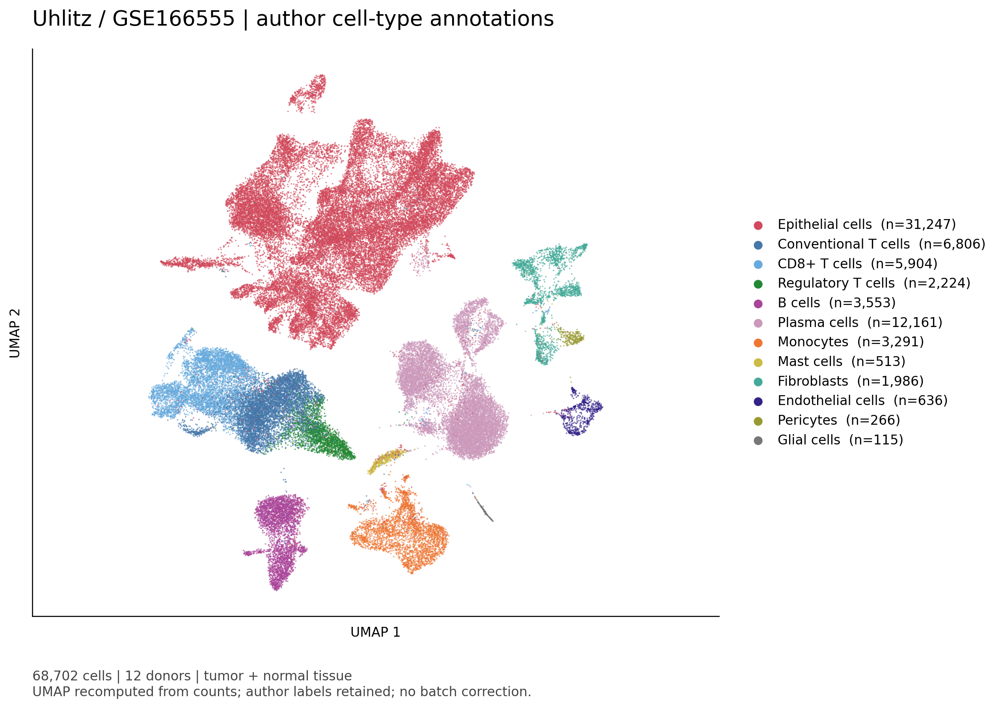
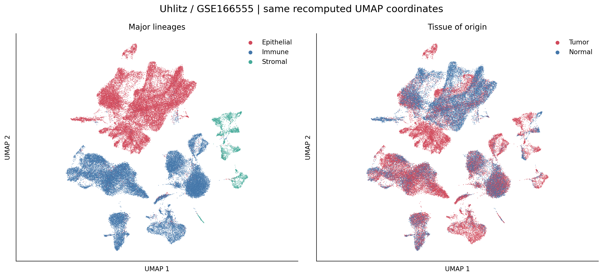
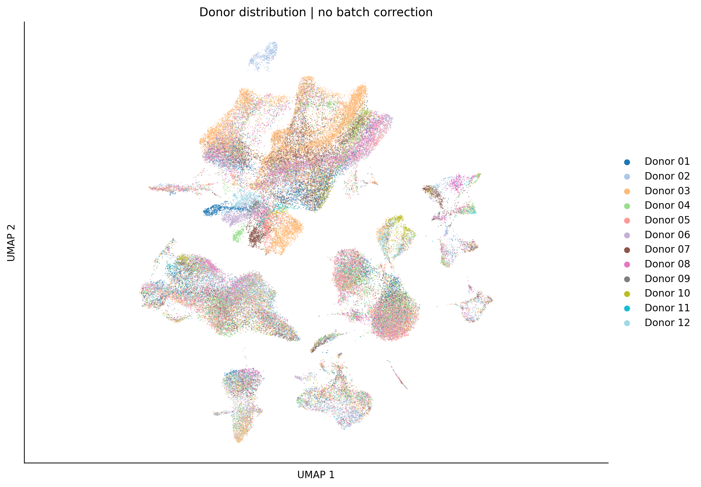

# COAD：Uhlitz单细胞UMAP注释图

## 本轮问题

按用户要求交付单细胞UMAP细胞类型注释图。使用近期UCKL1、LYPLA1等分析所用的Uhlitz/GSE166555队列。本批先核查既有GEO元数据和作者GitHub树，未取得可直接连接的作者UMAP坐标，因此用既有原始计数新计算二维坐标，保留作者注释。

## 输入与范围

68,702个作者保留细胞、12位供者；肿瘤38,233、正常组织30,469。使用全队列注释总览，不等于此前UCKL1或LYPLA1中选定的CNA上皮子集。本图没有调用CNA标签，因此不沿用CNA连接冲突导致的特定供者排除；不能用这张图替换那些分析的实际样本量。

矩阵按显式细胞ID连接元数据；25个计数文件的全基因UMI总数逐细胞与作者nCount_RNA完全匹配。原始21,854个基因，至少3个细胞检出后保留21,850个；CP10K、log1p、Seurat风格高变基因选择，实际2000个HVG；按基因标准化并上限截断10；50维PCA、15邻居、欧氏距离、UMAP min_dist=0.5，随机种子20260928。不做批次校正、不新增细胞过滤或聚类。

## 实际结果

**图的坐标是本项目重算，细胞类型来自作者。不是作者原图复刻，也不是新推断的恶性细胞标签。**

|中文类型|图例英文|肿瘤组织细胞数|正常组织细胞数|合计|
|---|---|---:|---:|---:|
|上皮细胞|Epithelial cells|13,373|17,874|31,247|
|常规T细胞|Conventional T cells|4,699|2,107|6,806|
|CD8⁺ T细胞|CD8+ T cells|4,087|1,817|5,904|
|调节性T细胞|Regulatory T cells|1,960|264|2,224|
|B细胞|B cells|1,948|1,605|3,553|
|浆细胞|Plasma cells|6,598|5,563|12,161|
|单核细胞|Monocytes|2,980|311|3,291|
|肥大细胞|Mast cells|411|102|513|
|成纤维细胞|Fibroblasts|1,324|662|1,986|
|内皮细胞|Endothelial cells|531|105|636|
|周细胞|Pericytes|249|17|266|
|胶质细胞|Glial cells|73|42|115|

仅为便于总览合并作者标签：B cells与GC B cells合为B细胞，Plasma K/L合为浆细胞，CB FBs/MyoFBs/CAFs/CCL FBs/UC FBs合为成纤维细胞；上皮保留宽类别。原标签与合并规则完整保存在annotation_mapping.tsv。没有将单核细胞改称巨噬细胞，也没有新增未提供的NK注释。

## 新手解释

每个点是一个被采样细胞，颜色表示作者细胞类型。邻近点在所用表达特征和降维参数下较相似；UMAP横纵轴没有基因表达量单位，也不是组织真实空间。分群面积和点数不能直接当组织内细胞比例；Tumor表示取自肿瘤组织，不表示其中每个细胞均恶性。

## 限制/反证

本图未做批次校正，供者或技术差异可能参与分群；供者面板用于显示这些差异，不证明批次已消除。全队列展示包含肿瘤与正常，不能称为纯癌细胞UMAP。不同参数的UMAP坐标可以不同，不能用本图与作者图的位置差别声称生物学反转。

本批没有新增表达差异、P/q、细胞通讯、拟时序或机制推断；CAMP、配对RNA、CNA比较和KEGG结果保持原样。逐细胞坐标、计数及身份字段只保留在server165；公开SVG中的点以栅格图层呈现，不含逐细胞标识。

## 当前决定

交付细胞类型主图、组织来源/宽谱系图、供者图，每张含高清PNG与可编辑文字的SVG。计数、注释连接、坐标有限性检查通过；未进行独立重复UMAP计算。此前“未取得作者UMAP坐标”的记录仍成立，本次新增的是明确标记的重算版本。

## 下一步

将该注释图用于解释既有表达来源；不从可视化自动推导恶性身份或机制。

## 复现命令

在server165新独占目录运行 `python3 run_uhlitz_umap_v1.py --out <目录> --commit cc9f11243708fe3fb5580b563a3622a7354e7697`。已有本批私有坐标仅重绘时加`--render-only`，不重跑坐标；参数见analysis_spec.json。本地运行`python report_uhlitz_umap_v1.py --out <公开目录>`核对公开计数并生成报告。

来源：[GEO GSE166555](https://www.ncbi.nlm.nih.gov/geo/query/acc.cgi?acc=GSE166555)、[作者分析代码](https://github.com/molsysbio/sccrc/blob/dbac4154b841e61addfbcdab1ede298ee36975db/_src/scCRC_paper_figures.Rmd)。
