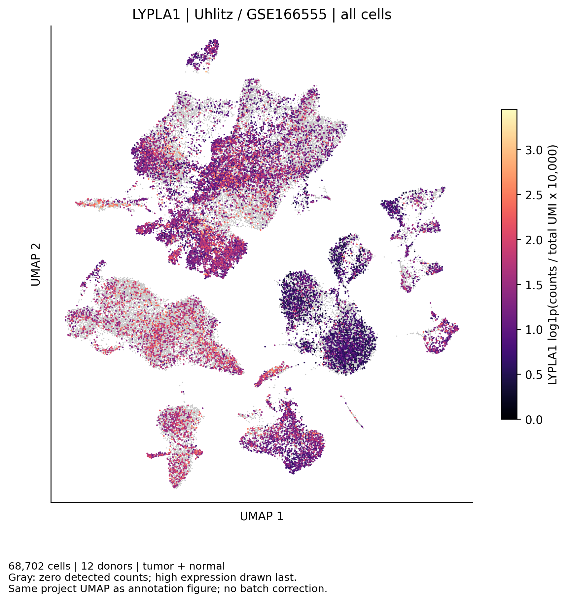
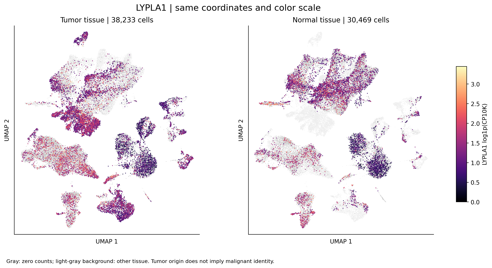

# COAD：LYPLA1单细胞表达UMAP

## 本轮问题

在已完成的Uhlitz/GSE166555细胞类型UMAP上展示LYPLA1表达，方便与注释图直接对照。

## 输入与范围

复用`20260928T025513Z_uhlitz_umap_v1`的全部68,702个细胞、12位供者的UMAP坐标，不重算降维。包含38,233个肿瘤组织来源细胞及30,469个正常组织来源细胞，不是仅恶性上皮子集。新读取同一原始计数文件中的LYPLA1行，以显式细胞ID连接，全部匹配。输入SHA256及坐标来源见source_manifest.tsv。

表达尺度为`log1p(LYPLA1 UMI / 该细胞全基因UMI总数 × 10,000)`。分母沿用已在前批逐细胞核验的作者nCount_RNA；不使用HVG缩放值、插补值或批次校正后的表达。

## 实际结果

共17,334个细胞检出LYPLA1计数，51,368个为零计数。这里是被采样细胞的描述，不能当作供者等权表达结果或组织真实细胞比例。

两组织面板使用同一坐标范围及完整数据共同色标，没有按组单独调色。更浅背景显示另一组织的位置；灰点为本组织零计数，非零表达从低到高绘制，较高值在上层。高值后绘可使其更明显，不应由图上亮点覆盖面积估计检出比例。细胞类型及组织的计数和描述性表达见expression_coverage.tsv，均为合并细胞统计，非患者等权推断。

## 新手解释

每个点是一个细胞；颜色越接近色标的亮黄端，LYPLA1归一化RNA表达越高。灰色表示此次未检出计数，不证明生物学上完全不表达。横纵轴表示表达相似性的UMAP坐标，不是组织真实空间。

## 限制/反证

坐标为本项目前批重算，不是原作者提供的坐标；未做批次校正，供者和技术差异可能影响位置。肿瘤组织来源不等于恶性细胞，不能仅由两面板亮度判断恶性上皮高于非恶性上皮。此图不新增差异检验、P/q、机制或脂代谢通路结论。

## 当前决定

交付全细胞表达图及组织分面图（PNG、SVG），补充既有注释图。逐细胞坐标与表达留server165，不导出本机或GitHub。

## 下一步

结合此前细胞类型注释图阅读来源；既有LYPLA1上皮比较及高低组富集统计保持原样。

## 复现命令

在server165新独占目录中运行`python3 plot_lypla1_umap_v1.py --out <运行目录> --commit <代码锁定提交>`。脚本路径为`code/coad/plot_lypla1_umap_v1.py`，使用前批已保存的坐标；软件、色标和实际输入哈希见随附JSON/TSV。本地运行`python code/coad/report_lypla1_umap_v1.py`核对公开计数并生成说明。
