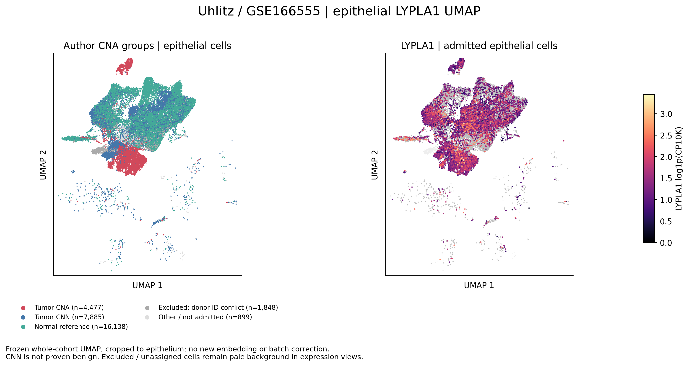
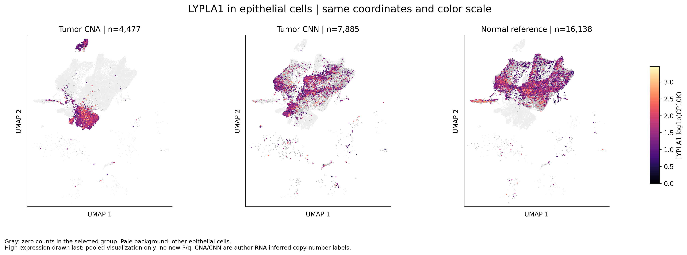

# COAD：上皮细胞LYPLA1表达UMAP

## 本轮问题

按用户要求展示上皮UMAP，直观对照CNA分组与LYPLA1表达；不以柱状图替代UMAP。

## 输入与范围

沿用Uhlitz/GSE166555前批全队列UMAP坐标及LYPLA1表达，只显示上皮细胞区域，不重算降维。31,247个作者标注的上皮细胞均保留为可视背景；正式表达比较三组共28,500个细胞：肿瘤CNA 4,477、肿瘤CNN 7,885、正常参照16,138。

分组直接复用`run_uckl1_cna_v1.build_labels`：显式细胞ID连接作者调用、排除整位来源身份冲突供者、正常参照排除作者TC标签。未纳入三组的细胞在分组图明确标注，在表达图仅作浅灰背景，不强行赋予恶性/非恶性。

## 实际结果

|分组|细胞数|供者数|
|---|---:|---:|
|excluded_donor_identity_conflict|1848|1|
|normal_reference|16138|10|
|not_selected|899|10|
|tumor_CNA|4477|9|
|tumor_CNN|7885|11|

三组共用坐标范围和色标，颜色使用此前的`log1p(LYPLA1 UMI / 全基因UMI × 10,000)`，不插补、不缩放到各组独立范围。表达图灰色为组内零计数，浅灰为其他上皮细胞；亮黄端表示较高表达。高表达点后绘，仅为避免遮盖。

## 新手解释

第一张左图显示上皮CNA分组，右图显示三组纳入细胞的LYPLA1表达。第二张从左到右依次是肿瘤CNA、肿瘤CNN、正常组织参照。它们使用相同UMAP坐标，所以可以直接对照同一位置的细胞分布；UMAP不是组织切片位置。

## 限制/反证

CNA/CNN是作者根据RNA推断拷贝数信息给出的标签，CNN不能等同已证实非恶性。正常参照是组织来源与作者标签限定的参照。坐标没有批次校正，供者、细胞状态和技术因素可参与分布；按细胞绘图不是患者等权推断。图上分离或亮度差不构成显著性检验、因果或通路证据。

## 当前决定

交付两张上皮UMAP的高清PNG与SVG，细胞和供者ID连接、三组数量与历史批次一致。本批仅可视化，没有新增P/q；逐细胞表仍只留server165。

## 下一步

用于阅读既有上皮LYPLA1比较，不更改此前整体描述、患者分析或高低组富集结论。

## 复现命令

将`code/coad/plot_lypla1_epithelial_umap_v1.py`及`run_uckl1_cna_v1.py`置于server165新独占运行目录，运行`python3 plot_lypla1_epithelial_umap_v1.py --out <新运行目录> --commit <锁定代码提交>`。输入和脚本SHA256、软件版本见source_manifest.tsv与analysis_spec.json；本地运行`python code/coad/report_lypla1_epithelial_umap_v1.py`生成本说明及阶段记录。
