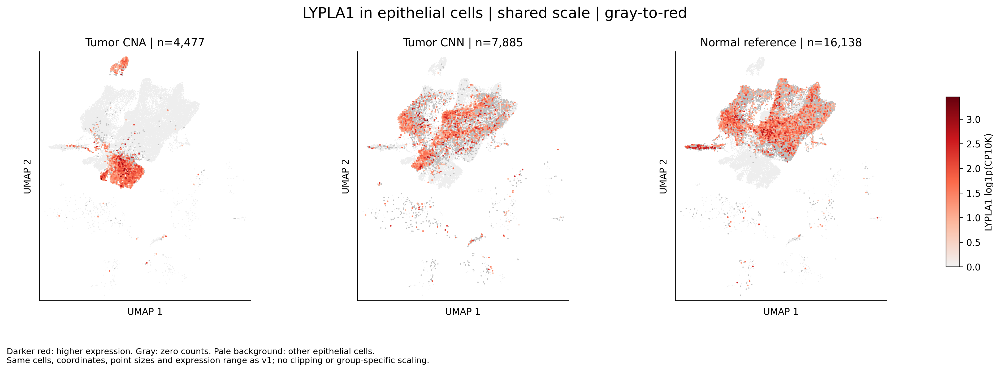
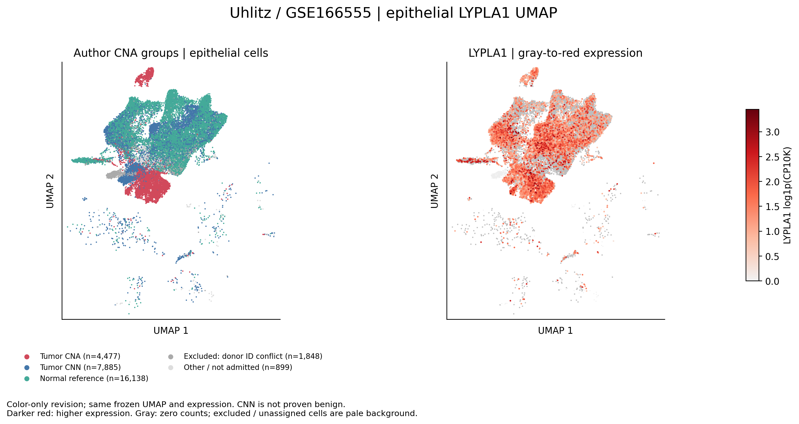

# COAD：LYPLA1上皮UMAP红色配色版

## 本轮问题

按用户要求换用更易分辨的表达配色。

## 输入与范围

完整复用上一批20260928T034349Z_lypla1_epithelial_umap_v1的私有上皮坐标、表达及CNA分组，不重算降维、表达或统计。CNA/CNN/正常参照分别4477/7885/16138细胞。

## 实际结果

表达由浅灰渐变至红、深红；颜色越深表示表达越高。零计数仍单独用灰色表示，其他上皮作浅灰背景。点大小、绘制顺序、坐标、三组共享色标上下限与前版完全一致，未做分位数截断或按组缩放。

## 新手解释

从左到右为肿瘤CNA、肿瘤CNN、正常参照。重点观察哪些区域检出表达及颜色强度，不能由亮点覆盖面积推算检出率。

## 限制/反证

换色只改善可读性，不增加组间差异或统计证据。CNN并非已证实非恶性；供者差异、测序深度及降维限制沿用前版。未做批次校正。

## 当前决定

新增两张PNG/SVG，保留前版。不新增P/q或机制解释。逐细胞表留服务器。

## 下一步

使用红色版对照既有表达统计。

## 复现命令

在server165的新独占目录运行`python3 recolor_lypla1_epithelial_umap_v2.py --out <目录> --commit <锁定提交>`。脚本为code/coad/recolor_lypla1_epithelial_umap_v2.py，输入及代码哈希见source_manifest.tsv。
