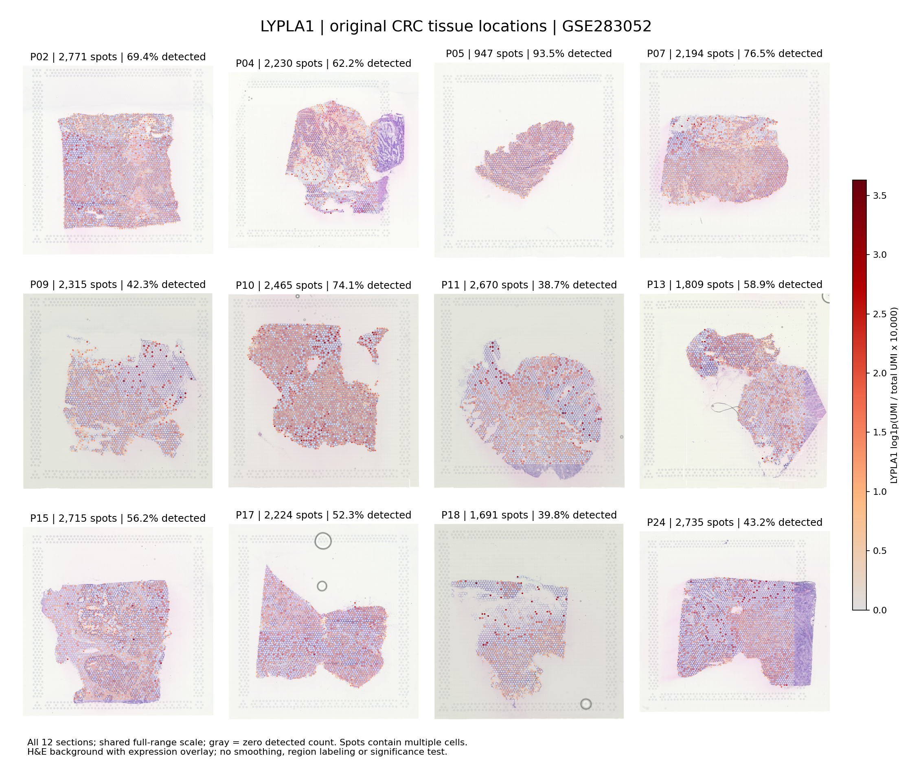

# LYPLA1在结直肠癌组织中的空间表达：GSE283052

## 本轮问题

寻找能实际测到LYPLA1、并保留组织位置的公开结直肠癌空间转录组，查看其分布。本轮交付真实组织坐标表达图；不开展新差异检验、机制、通讯或通路推断。

## 输入与范围

- 主队列为[GSE283052](https://www.ncbi.nlm.nih.gov/geo/query/acc.cgi?acc=GSE283052)，来自[Neve等原始研究](https://pmc.ncbi.nlm.nih.gov/articles/PMC12796597/)，DOI：10.1016/j.isci.2025.114283。使用其全部12份CRC冷冻肿瘤组织切片，范围在读取表达结果前确定。
- 每份作者矩阵为36,601特征×4,992采集点；共享特征和条码文件与每份矩阵维度逐项核对。LYPLA1唯一对应ENSG00000120992。
- 采用作者`in_tissue=1`且总Gene Expression UMI>0的采集点。通过显式条码连接坐标，按作者缩放系数对齐H&E低分辨率图，不按文件行顺序推断组织对应。
- 表达为`log1p(10,000×基因UMI/该点全部Gene Expression UMI)`；零总量不可评估，不填补。保留原始LYPLA1计数和总UMI图。
- 这是传统Visium多细胞采集点，不是单细胞；本轮不将CRC称为已经核实部位构成的纯COAD队列，也不将12份切片的点数当患者数。未独立核实与CAMP等队列的患者重叠。

## 实际结果

12份切片合计 **26,766个** 可描述采集点，其中 **15,323个（57.2%）** 检出LYPLA1。这个合并比例是采集点加权的描述，不是患者阳性率或供者等权效应。各切片均单独保留。

|切片|可描述采集点|LYPLA1检出点|检出比例|平均log1pCP10K|总UMI中位数|
|---|---:|---:|---:|---:|---:|
|P02|2,771|1,924|69.4%|0.581|13,510|
|P04|2,230|1,386|62.2%|0.506|11,342|
|P05|947|885|93.5%|0.637|39,641|
|P07|2,194|1,678|76.5%|0.633|25,818|
|P09|2,315|980|42.3%|0.362|6,603|
|P10|2,465|1,826|74.1%|0.932|7,262|
|P11|2,670|1,034|38.7%|0.400|5,906|
|P13|1,809|1,066|58.9%|0.540|10,570|
|P15|2,715|1,525|56.2%|0.491|10,491|
|P17|2,224|1,164|52.3%|0.469|8,350|
|P18|1,691|673|39.8%|0.316|4,397|
|P24|2,735|1,182|43.2%|0.415|5,471|

检出比例最高为P05（93.5%，每点总UMI中位数39,641）；标准化表达均值最高为P10（0.932 log1pCP10K）。检出比例和标准化表达描述不同方面，需要结合测序深度、组织构成及原计数图阅读。



完整[表达汇总](expression_summary.tsv)、[采集点覆盖核查](sample_qc.tsv)和[PDF总览](figures/LYPLA1_spatial_all12.pdf)。

各切片另有六联图：LYPLA1标准化表达、原始UMI、总UMI，以及EPCAM、COL1A1、PTPRC参照表达。所有切片对同一指标使用相同范围；不同基因各有自己的色标，不按颜色比较不同基因的绝对表达量。

- [P02六联图](figures/P02_LYPLA1_context.png)
- [P04六联图](figures/P04_LYPLA1_context.png)
- [P05六联图](figures/P05_LYPLA1_context.png)
- [P07六联图](figures/P07_LYPLA1_context.png)
- [P09六联图](figures/P09_LYPLA1_context.png)
- [P10六联图](figures/P10_LYPLA1_context.png)
- [P11六联图](figures/P11_LYPLA1_context.png)
- [P13六联图](figures/P13_LYPLA1_context.png)
- [P15六联图](figures/P15_LYPLA1_context.png)
- [P17六联图](figures/P17_LYPLA1_context.png)
- [P18六联图](figures/P18_LYPLA1_context.png)
- [P24六联图](figures/P24_LYPLA1_context.png)

## 新手解释

图上位置是组织上的实际位置；颜色越红，表示该点的LYPLA1标准化表达越高，灰色表示没有检出计数。零计数不等于组织生物学上绝无表达。

每个圆点可能混合多种细胞。EPCAM、COL1A1、PTPRC图用于观察表达背景，分别提供上皮、基质和免疫相关参照，但不是本项目据此给出的细胞标签。LYPLA1颜色与某个参照空间接近，也不自动证明两者来自同一细胞。

## 限制与反证

1. 本轮先检查了高分辨率候选[GSE280315](https://www.ncbi.nlm.nih.gov/geo/query/acc.cgi?acc=GSE280315)。实际取得的探针表中，LYPLA1唯一探针标记`included=False`；因此在来源准入阶段停止HD矩阵下载，转用冷冻全转录组数据。没有把HD不可测当低表达，未完成的HD计数矩阵也没有用于结果。逐样本取得情况见[HD准入记录](hd_eligibility.tsv)。
2. 原研究有病理医师标注癌区，但本轮取得的GEO文件没有逐点病理标签或作者聚类对应表。论文中图示不能自动变成12份切片的可靠点标签。因此本轮没有给出恶性/非恶性上皮差异、癌区/基质区倍数或显著性。
3. 作者原论文使用过SCTransform、整合和聚类；本项目为了描述单基因原始空间分布，另行明确采用上述log1pCP10K尺度，未复现其聚类或差异模型。
4. 保留所有来源组织点，不按LYPLA1强弱筛点。未额外按线粒体比例或检出基因数过滤；低深度、细胞密度和组织构成仍影响检出。总UMI及检出基因数已汇总，原计数图用于参照，不将深色孤立点直接解释为生物学热点。
5. 不进行空间插值、平滑、补零或选择性截断；同一指标在12份切片共用从0到实际最大值的色标。没有新增P/q，也没有把空间定位称为代谢物关联或机制验证。
6. 复用了作者空间坐标和图像配准，未从原始测序或全分辨率图像重新处理。源矩阵、图像和逐点测量仅保留在server165；这里只发布生成图件、汇总和来源哈希。

## 当前决定

GSE283052可以用于LYPLA1的组织位置表达描述，12份切片全部输出。GSE280315本轮不能作为LYPLA1表达阴性证据。既有CAMP和单细胞统计不改写。

## 下一步

如需回答“癌区是否比非癌区高”，应优先取得原作者逐点病理/区域标注，再对各切片分别描述；不能从LYPLA1本身的颜色反过来定义癌区。当前任务先交付可核查的空间表达图，不为补齐标签重聚类或编造恶性身份。

## 复现命令

在server165对应独占运行目录中，使用仓库固定版本脚本：

```bash
python3 acquire_lypla1_spatial_frozen_v1.py
python3 analyze_lypla1_spatial_v1.py --out RUN_DIRECTORY --commit CODE_LOCK_COMMIT
```

网络慢时可先将同一公开URL以内存流方式中转到服务器，不在本机落源文件。完成下载后分析读取原文件，实际SHA256记录于[source_manifest.tsv](source_manifest.tsv)。输出`public/`复制至本批仓库目录，再运行：

```bash
python code/coad/report_lypla1_spatial_v1.py --results results/COAD/06_EXTERNAL/20260928T084322Z_lypla1_spatial_v1
```

详见[参数与版本](analysis_spec.json)和[核验](validation.json)。
