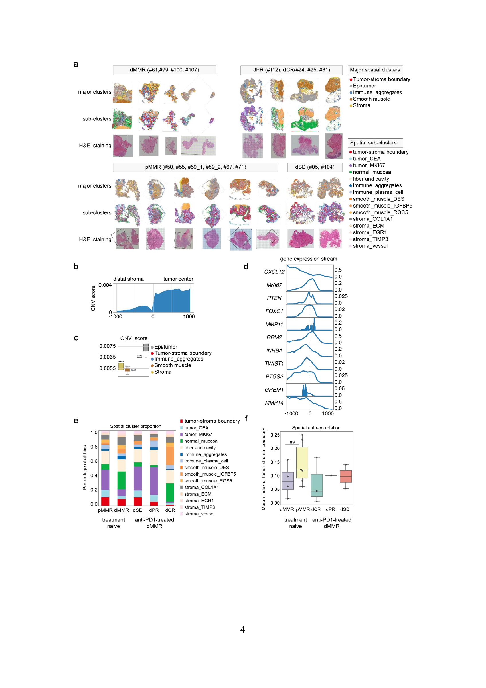

# Stereo-seq病理切片：作者H&E已找到，原始图像与配准仍待取得

## 本轮问题
用户要求找到作者提供的真实病理切片，以便理解LYPLA1空间表达位置。此前仅展示空间坐标的图不能替代H&E底图；本轮补查公开原文、补充文件及数据目录，不重算LYPLA1。

## 输入与范围
原研究：Feng等，*Spatially organized tumor-stroma boundary determines the efficacy of immunotherapy in colorectal cancer patients*，Nature Communications 2024，[DOI:10.1038/s41467-024-54710-3](https://www.nature.com/articles/s41467-024-54710-3)。

通过[Europe PMC补充材料接口](https://www.ebi.ac.uk/europepmc/webservices/rest/PMC11599708/supplementaryFiles)实际取得完整补充压缩包，核查Supplementary Information、Supplementary Data 1、Source Data。源PDF、XLSX和ZIP留server165，仅公开来源哈希与论文图的完整页面渲染。

另外检查[STT0000036的supp目录](https://ftp.cngb.org/pub/stomics/STT0000036/supp/)及SpatialTranscriptome.h5ad元数据。H5AD全文件17,636,967,892字节，本轮只以HTTP Range读取1,230,292字节元数据，没有下载全部矩阵或给出整文件哈希。补查[StereoMM作者代码](https://github.com/STOmics/StereoMMv1/tree/StereoMM)：示例路径不是已公开的配准图像下载地址。

## 实际结果
**找到了作者H&E：Supplementary Figure 2a，PDF第4页，第5页为图注。** 作者把16个标本的主要空间分区、细分空间分区、H&E三行对应展示。下图是完整第4页，无新增涂色或LYPLA1叠加。



来源：Feng等，2024，Supplementary Figure 2。[CC BY-NC-ND 4.0](https://creativecommons.org/licenses/by-nc-nd/4.0/)。完整页面仅转换格式显示，科学图内容未修改。不得将论文缩略图说成原始全切片扫描文件。

PDF中该复合图的嵌入位图为1269×1759像素；本页面渲染为1698×2400，不会恢复原始扫描分辨率。原文方法提及Motic EasyScan扫描，但这不表示高分辨率扫描文件已在所查目录中公开。

H5AD的uns中是颜色、邻居、PCA/UMAP参数等，未找到常用spatial图像/缩放字段；obsm中有coords、coords_trans，但名称本身不能证明与H&E图像配准。Source Data中19张嵌入图片已作预览检查，包括荧光、组织染色及实验图片，未由此取得匹配16张Stereo-seq标本的原始全切片底图。

## 新手解释
先看图上半部a：每组三行，第一行是较宽的空间区域，第二行是更细的区域，第三行标注“H&E staining”的粉紫色图才是真实组织病理图。

图例中灰色Epi/tumor为作者上皮/肿瘤区，红色为肿瘤—基质边界；细分图里浅蓝tumor_CEA、紫色tumor_MKI67为癌相关区域，绿色normal_mucosa为正常黏膜。**这些是作者区域图例，不是LYPLA1表达强弱。** 底部b–f属于作者其他分析，不能当成本项目新增结果。

## 限制/反证
1. 发现公开图内编号不一致：未经治疗dMMR标题列#61，治疗后dCR标题也列#61；临床Table S1记录#56未治疗、#61治疗后。本轮不认定哪个图具体对应#56，不默改原标号，不按轮廓猜配准。
2. 当前实际拿到的是论文H&E缩略图。尚未取得可确认样本身份的高分辨率原图和到表达坐标的变换，不能据此制作像素精确的LYPLA1覆盖图。
3. 这是有限范围公开取数核查，不代表作者没有原图或所有潜在存储位置均已穷尽。
4. 既有10张未经治疗切片的LYPLA1描述来自作者矩阵标签，本轮不改这些数值；论文图与矩阵的图像身份问题另列待核实。

## 当前决定
病理图查找的论文证据已取得；原始切片取数及精确叠加保持PARTIAL。保留原图、哈希、编号疑点和未完成事项，不将论文图冒充已配准的新结果。


补查记录：[16个切片详情、StereoMM作者答复及剩余附件](SEARCH_FOLLOWUP_CN.md)。公开原始H&E与配准仍未取得。

## 下一步
需要取得各切片的原始H&E扫描/注册图、明确的图像—矩阵标本对应，以及裁切、旋转、翻转、缩放或配准参数；优先解决#56/#61标记差异。材料取得前可并列阅读作者H&E与空间分区，不能伪造叠加。未发送取数邮件。

## 复现命令
源文件存server165的data/candidates/coad_stereoseq_histology_20260928；运行目录为results/collaborative/COAD/B/20260928T121500Z_stereoseq_histology_v1。

```bash
python3 audit_stereoseq_histology_v1.py --source <server_source_dir> --out <server_run_dir>/public
python3 inspect_stereoseq_h5_remote.py > inspect.log
pdftoppm -f 4 -l 4 -singlefile -scale-to 2400 -png <source_dir>/41467_2024_54710_MOESM1_ESM.pdf author_supplement_figure2_page4
```

核查脚本位于code/coad/，发布脚本为report_stereoseq_histology_v1.py。无新P/q、患者模型或表达变换。
