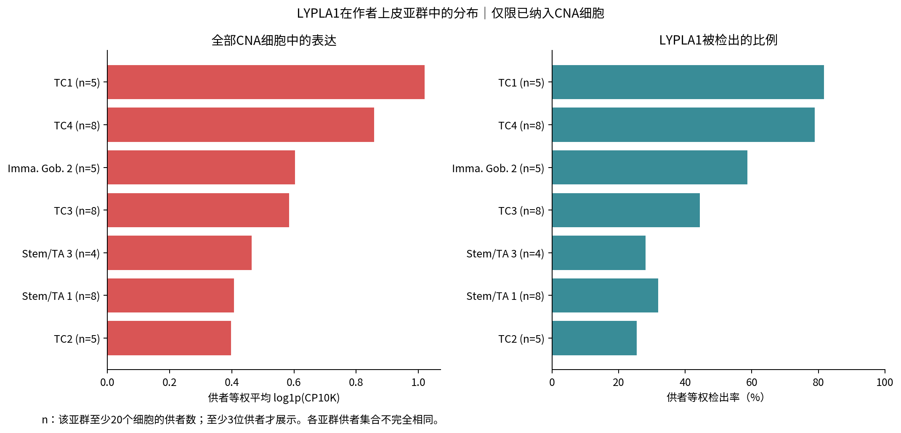
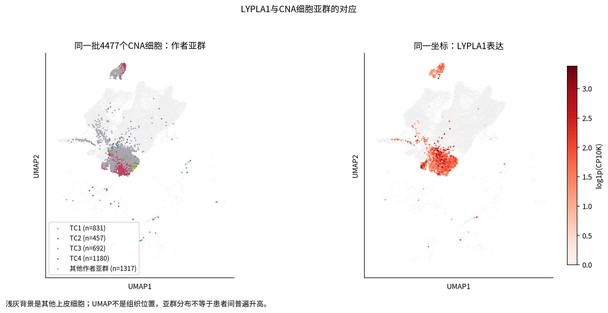
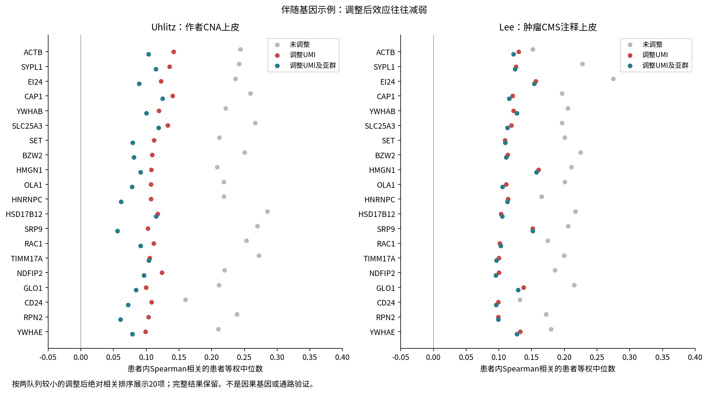
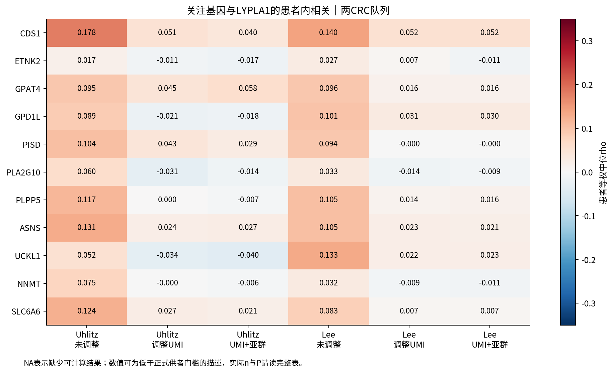

# LYPLA1：癌上皮亚群与患者内伴随表达

## 本轮问题

判断LYPLA1在作者CNA上皮中的亚群分布，寻找患者内部可重复的伴随表达，并对照独立CRC研究及BRCA已有结果。本轮是表达关联，不新增代谢关系、通量或机制验证。按用户要求不以FDR筛选，全部原始P及不可评估项目保留。

## 输入与范围

- Uhlitz / GSE166555：沿用已核实的作者CNA准入，4,477个细胞、9位供者；保留17个作者原始上皮亚群标签，没有重新聚类或推断恶性。
- Lee / GSE132465：作者Tumor、Epithelial、CMS1–4标签，17,469个细胞、23位供者；22位符合本批患者内关联门槛。CMS标签不等于Uhlitz的TC标签，也不构成对CNA判定的复现。
- Uhlitz全21,854基因，9,875项达到至少6供者可检验门槛；在读取Lee表达前锁定4,179个复核目标（初筛与11个事先关注基因的并集）。缺失、低检出均保留，不补零。
- BRCA只读复用账号A的Wu2021与Pal2021_reprocessed汇总，固定提交 `a395909c8f4a6234cd8b2faec9db344ceb4aa056`，未计算或修改BRCA矩阵。来源见 `BRCA_readonly_provenance.json`。

## 实际结果

### 1. TC4的患者内升高最一致；不是所有CNA细胞均高

|作者亚群|覆盖达标供者数|供者等权平均log1p(CP10K)|检出率|相对同患者其他CNA细胞|
|---|---:|---:|---:|---|
|TC1|5|1.020|81.7%|5/5方向较高；不足6供者，不做推断检验|
|TC4|8|0.858|78.9%|8/8较高；配对均值差中位数0.261，原始P=0.0078125|
|TC3|8|0.585|44.4%|2/8较高，P=0.2891|
|TC2|5|0.398|25.4%|0/5较高；不足6供者，不做推断检验|

检出率是观察到至少一个LYPLA1计数的细胞比例。各行供者集合不完全相同，不能仅用TC1均值高于TC4就比较两亚群的效应大小。亚群与其余CNA比较在同供者内进行，两侧各至少20细胞。TC4结果支持亚群背景，不说明每个TC4细胞都高，也未把TC4命名为未经核实的增殖或脂代谢状态。

### 2. 大量原始伴随关系经过深度调整后减弱

主要方法在每位供者内部计算Spearman，再对供者等权取中位数；包括LYPLA1零计数细胞。P检验的是供者相关方向，不是把数千细胞当作数千独立患者。

|层次|数量|含义|
|---|---:|---|
|Uhlitz原始初筛|4,173|原始P<0.05、绝对中位rho≥0.1、同向供者≥75%|
|Lee亦符合原始规则且同向|3,016|选定范围内的名义方向复核|
|两研究深度调整仍有同向名义P支持|608|尚未要求调整后绝对rho≥0.1|
|上述608中两侧调整后绝对rho均≥0.1|15|较小的效应保留集合，仍是探索性伴随表达|

15项完整记录见 `CRC_depth_effect_ge01.tsv`。不可将3,016或608写成已验证调控基因。进一步亚群调整、仅LYPLA1阳性细胞分析、供者bootstrap区间及逐一剔除范围均与主结果并列；阳性细胞分析回答不同的条件性问题，不据此选择更好看的结果。

### 3. 事先关注的脂质相关候选没有形成强而一致的伴随证据

|基因|Uhlitz原始rho|Lee原始rho|Uhlitz深度调整rho|Lee深度调整rho|
|---|---:|---:|---:|---:|
|CDS1|0.178|0.140|0.051|0.052|
|GPAT4|0.095|0.096|0.045|0.016|
|GPD1L|0.089|0.101|−0.021|0.031|
|PISD|0.104|0.094|0.043|约0|
|PLA2G10|0.060|0.033|−0.031|−0.014|
|PLPP5|0.117|0.105|约0|0.014|

ETNK2在Uhlitz仅2位供者满足该基因检出门槛，暂不可推断。NNMT同样仅2位；不是证明没有关系。CDS1虽两侧原始正相关，但调整后效应均很小。PISD的Uhlitz调整后原始P=0.0391，没有在Lee保留同向效应。本表不是新的通路富集结果，也不否定此前高低分组的描述；两种问题和控制条件不同。

### 4. 跨癌种：方法对齐后仍未得到四队列稳定的伴随集合

为避免将COAD Spearman与BRCA Pearson直接比较，新增COAD的Pearson敏感性：同时控制LYPLA1之外的UMI数、检测基因数，并另加原始细胞状态。供者至少100细胞、至少10个LYPLA1阳性；基因覆盖规则和至少5供者门槛对齐BRCA。细胞来源与恶性判定仍各按原研究，不能认为完全同质。

|对齐分析|四队列均可评估|四队列方向一致|四队列均满足效应及方向比例门槛|
|---|---:|---:|---:|
|UMI＋检测基因数调整|3891|1204|0|
|再加原始细胞状态|3891|1120|0|

主计算validation.json的cross_cancer_status=NOT_RUN是其结束时状态；随后完成的只读比较以cross_cancer_validation.json为准，历史计算记录不覆盖。

“同向”未设P门槛；较强描述性规则另要求四队列绝对中位r均≥0.1、各至少70%供者同向。没有用FDR，也没有把TC4、Cancer Cycling和epi_1当作同一亚群。跨癌种亚群同源性尚未建立。本次结果不支持直接宣称普遍跨癌种共表达程序。

## 新手解释

TC4像是“更容易检测到LYPLA1的一类癌上皮背景”。同一患者里两个基因一起高，可能部分来自细胞RNA总量或检测能力；调整后剩余的弱关联不能解释成LYPLA1直接调控这些基因。UMAP显示细胞表达相似性，不是病理切片位置。

## 限制与反证

本批名义检验数量大，不做FDR意味着不能把P<0.05名单当作控制假发现的名单。Uhlitz只有9位供者，TC1仅5位覆盖达标。供者身份沿用来源标签，未通过基因型确认；Lee肿瘤CMS上皮不等于CNA认证的同一癌细胞集合。跨癌比较限定已锁定4,179目标，不是全转录组无偏验证。深度/检测数控制及阳性子集本身也会改变所问问题，不可据单次调整认定原关联一定是伪象。

## 当前决定

本批计算、独立CRC复核和只读BRCA对照完成。保留TC4定位及全部伴随结果；不升级为机制，不改变CAMP关系和历史候选名单。患者/细胞级文件和矩阵仅存server165。

## 下一步

若深入，先核对TC4原始标志与生物学定义、在有可比标签的独立CRC材料中定位；现有结果不足以声称TC4亚群已跨队列复现。不要直接据名义P增加机制结论。

## 复现命令与交付

服务器运行脚本 `code/coad/lypla1_state_coexpression_v1.py`、`lypla1_brca_aligned_sensitivity_v1.py`，参数和历史来源见analysis_spec及各manifest；图由 `plot_lypla1_states_correlations_v1.py` 生成。调用参数见脚本 `--help`。主计算锁定提交b2175dccbf5a6e8ebc18eda0c3cdac4f2eb40887，对齐敏感性锁定3bc850d。已完成155次独立SciPy Spearman对照、历史计数及全基因总量核对。跨癌公共表整合命令：`python code/coad/package_lypla1_states_v1.py`，输入只需本批公共汇总和固定BRCA公共表（存runtime/brca_states_reference）。

完整TSV（大表gzip）、4组PNG/PDF、来源、范围和校验文件均同目录。专属亚群及跨癌表列含义见本报告，主关联表沿用统一前缀；q_value为NA，原因是本批未计算FDR，不是q=0。
