# COAD 首版结果展示

输入提交：3c64c24ec171b2753b0226fdd5aafb7766e45b00；单细胞仅至来源。示例不是最终排名。

## 研究设计与数据范围

**问题：**哪些测量可以对应？

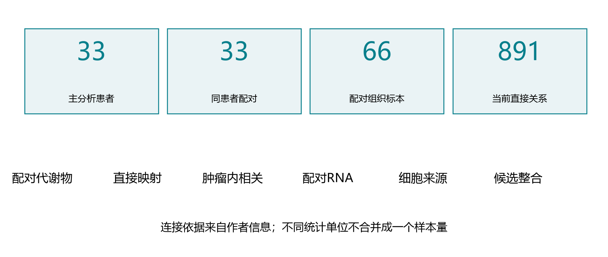

**结果与解释：**33名Ⅰ–Ⅳ期患者，各有肿瘤和自身正常；66个组织标本在两组学按显式标签连接。

**限制：**不把66个标本当66名患者，肿瘤内部关联只用33个肿瘤。

## 配对代谢物：全量效应概览 / CAMP_COAD

**问题：**哪些代谢物在患者配对中变化？

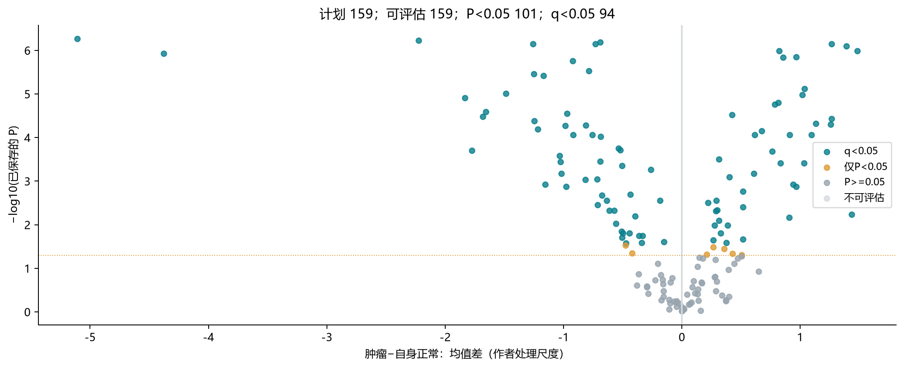

**结果与解释：**159项全量分析，101项P<0.05，其中94项q<0.05。原P/q保留，图展示新增均值描述。

**限制：**原Wilcoxon无连续性校正；均值区间不是其反演区间。作者log底数未核实，不称浓度倍数。

## 示例代谢物：配对方向人数

**问题：**有多少患者的配对方向相同？

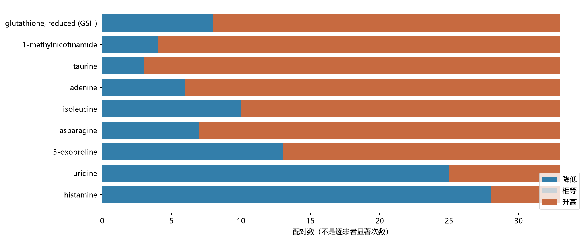

**结果与解释：**比例分母包含相等配对。多数升降是方向描述，不是逐患者显著次数。

**限制：**展示的是固定关系示例对应代谢物，完整159项和101项入口均保留。

## 缺失敏感性：汇总效应对照

**问题：**作者表可用值子集怎样变化？

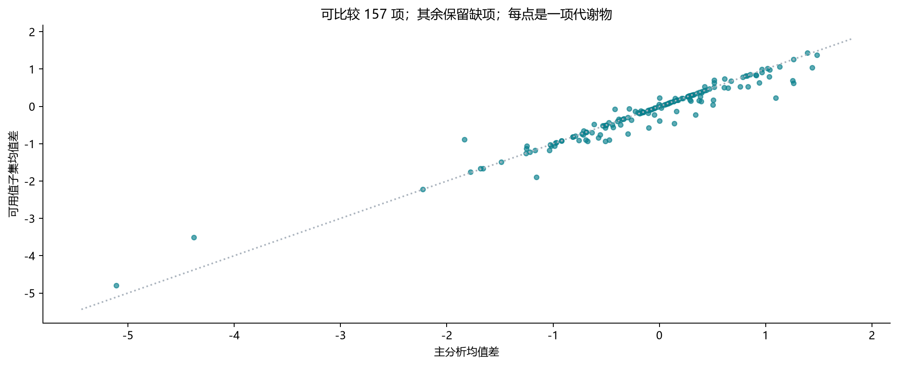

**结果与解释：**157项可评估，97项q<0.05；该历史敏感性仍保留固定159项BH。

**限制：**作者表有值不是重新核实的质谱检出；不能选择两种分析中更显著的一套。

## 直接生化映射与保留范围

**问题：**为什么候选基因较多？

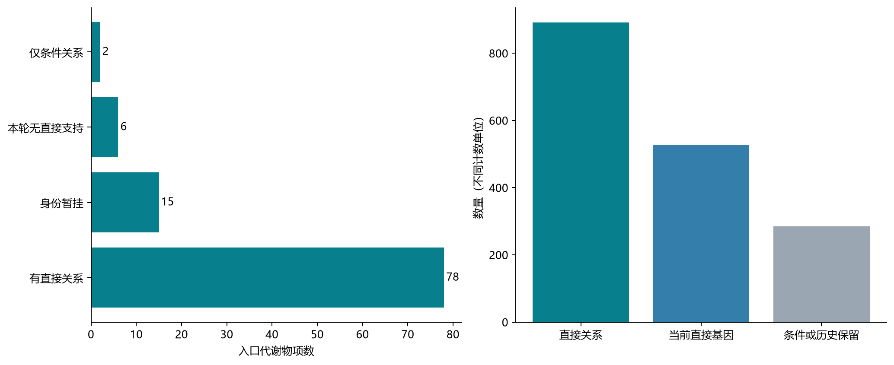

**结果与解释：**101项入口中78项有直接关系，形成891关系和526基因。另有15项身份暂挂、2项仅条件关系、6项本轮无直接支持。

**限制：**全来源台账811个稳定ID记录，含条件性和历史保留及3个身份待核，不是811个验证靶点。

## 肿瘤内部关系：全量概览 / CAMP_COAD

**问题：**不同肿瘤患者的代谢物与RNA是否相关？

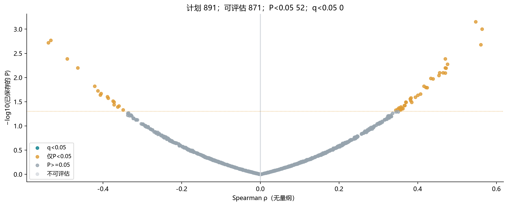

**结果与解释：**891计划关系中871项可评估，52项P<0.05、0项q<0.05。595条旧P和效应经哈希及向量核对后复用。

**限制：**全部是同CAMP队列探索，尚无新FDR关联或独立代谢验证。

## 固定示例：主分析与可用值相关

**问题：**相关方向和敏感性是否稳定？

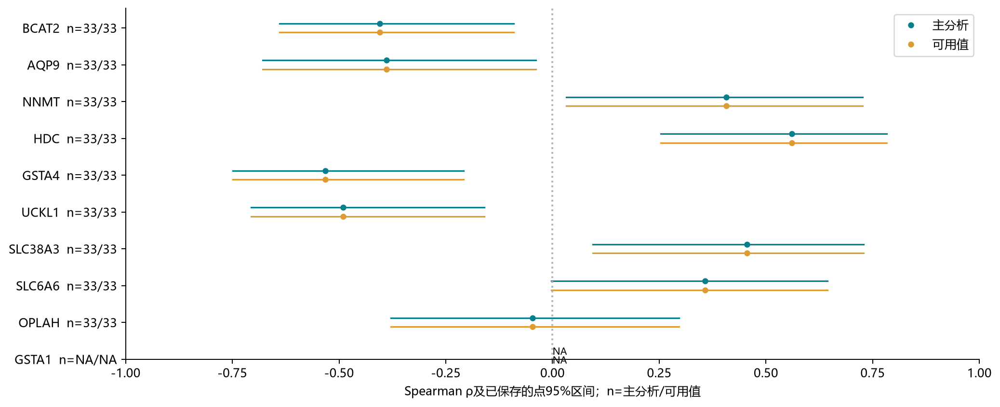

**结果与解释：**主分析与可用值分析分别报告效应、区间和n。可用值56项P<0.05，仍无q<0.05。

**限制：**展示名义支持、未支持和RNA缺项示例，不形成最终排名。每个区间是逐项区间。

## 配对RNA：全量效应概览 / CAMP_COAD

**问题：**同患者RNA是否改变？

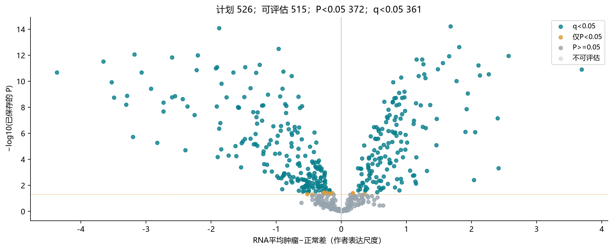

**结果与解释：**526基因中515项可评估，372项P<0.05、361项q<0.05；11项缺RNA。

**限制：**新版为作者log2连续RNA配对t，旧Wilcoxon另存。RNA变化不能替代代谢物关联。

## 示例基因：配对RNA方向人数

**问题：**RNA配对方向是否一致？

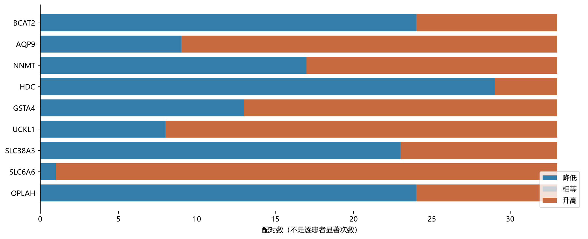

**结果与解释：**升、降、相等人数分别保留，每个可评估基因最多33对。

**限制：**GSTA1缺RNA，图中不绘制人数；缺测不能画成33对无变化。

## 单细胞来源 / Lee

**问题：**候选在哪些细胞背景表达？

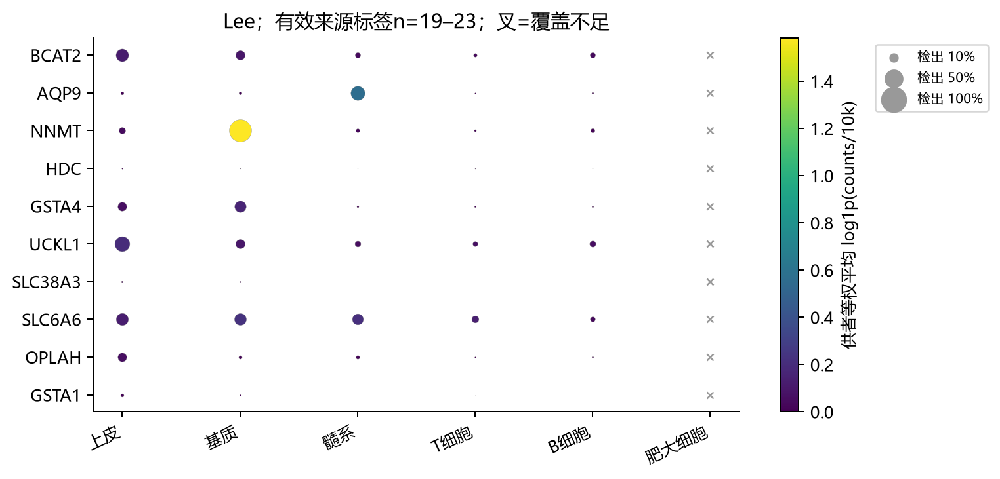

**结果与解释：**Lee与Uhlitz分别有646和642条记录可描述来源。NNMT基质/成纤维背景稳定，HDC仅Uhlitz肥大细胞可定位。

**限制：**供者等权log1p(CP10K)，每研究独立色标。低检出、少类别显示暂不可定位。

## 单细胞来源 / Uhlitz

**问题：**候选在哪些细胞背景表达？

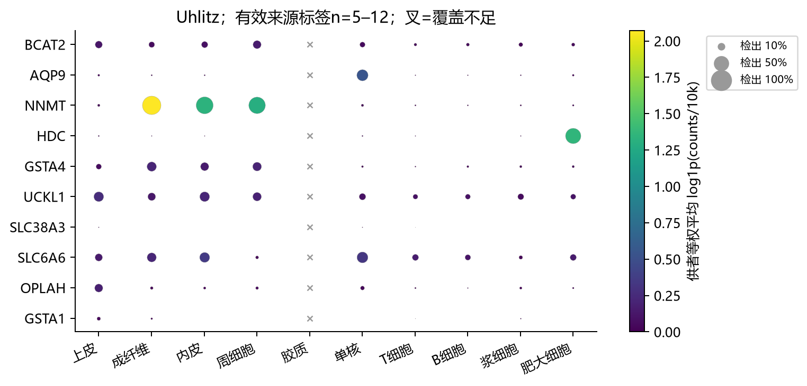

**结果与解释：**Lee与Uhlitz分别有646和642条记录可描述来源。NNMT基质/成纤维背景稳定，HDC仅Uhlitz肥大细胞可定位。

**限制：**供者等权log1p(CP10K)，每研究独立色标。低检出、少类别显示暂不可定位。

## 临床分型：暂无适用输入

**问题：**能按可靠患者临床分型展示吗？

**结果与解释：**本批没有已核实的患者临床分型表。

**限制：**细胞表达推断的CMS不替代临床患者分型。

## UMAP：已准入资料未提供坐标

**问题：**是否已有可复用的作者UMAP？

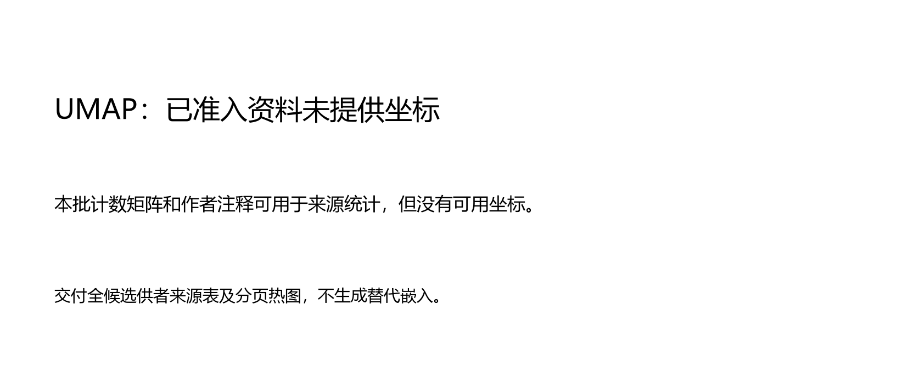

**结果与解释：**已准入表达矩阵与注释中未取得可用坐标，改用完整来源表和分页热图。

**限制：**不编造坐标，不为每个基因重算嵌入；UMAP模块明确缺项。

## 候选证据矩阵：支持与缺项并列

**问题：**不同证据怎样并列？

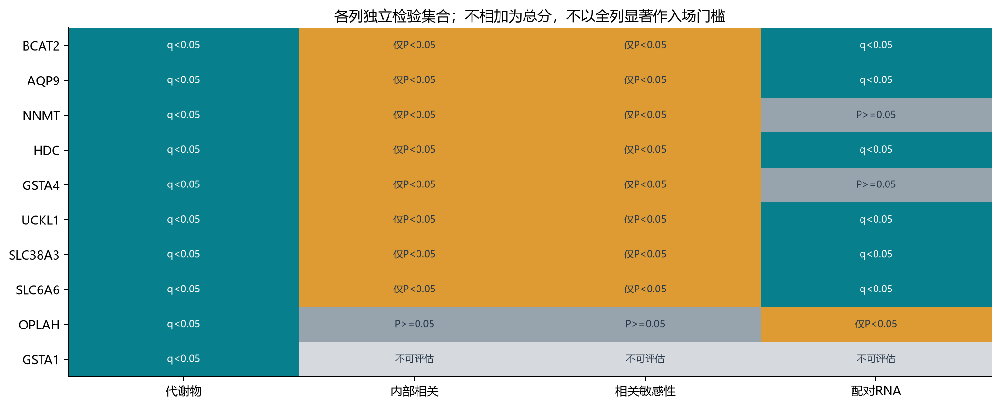

**结果与解释：**代谢物、内部关联、敏感性和RNA各自保留P/q，不机械取全部显著交集。

**限制：**条件性映射不因单细胞有表达而升级。来源是RNA背景，不是代谢物产地。

## 候选解释：不是最终靶点名单

**问题：**这些结果支持怎样的讨论？

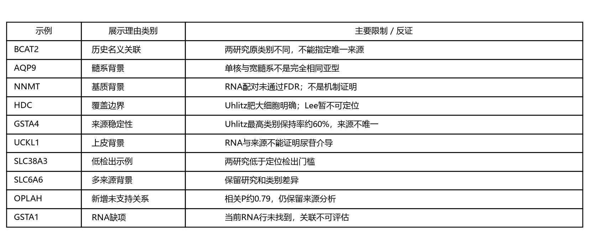

**结果与解释：**605项在共同宽类别中均可评估，466项最高类别相同，380项两侧描述性保持率均≥80%。

**限制：**宽类别相容不等于相同亚型或机制。单细胞到来源停止，历史功能证据只作索引。
