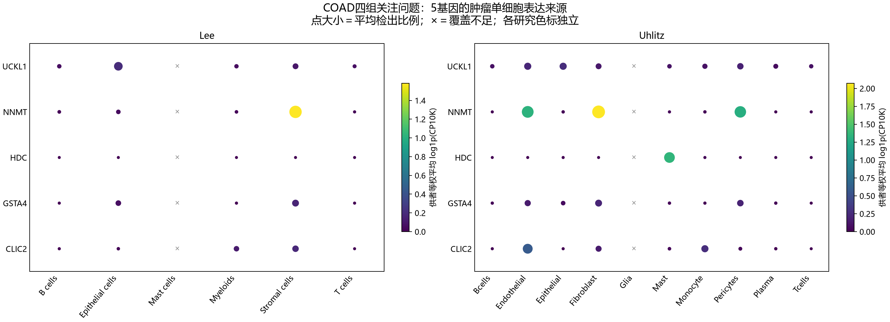

# COAD四组代表性问题：证据分层汇报

## 本轮问题
将现有结果组织成四组可讲清楚的问题，不重新筛选候选或计算统计量。

## 输入与范围
新版患者关联为33个肿瘤内的891项计划关系，旧协变量结果只覆盖历史674项；配对变化来自33对患者，来源来自Lee/Uhlitz两研究。完整候选与历史9/21/5安排见原版总表，本页展示6条关系，不是靶点排名。

## 实际结果
|问题|具体关系|肿瘤内ρ；P；q|配对方向与来源|现有证据怎样解释|
|---|---|---|---|---|
|UCKL1的上皮背景|UCKL1—尿苷|-0.491；0.0041；0.504|尿苷25/33对下降；UCKL1 RNA25/33对上升；Lee/Uhlitz均上皮可见|逐一剔除ρ为-0.531至-0.442。旧CRC研究提示铁死亡保护存在非经典/低催化活性突变体保留效应，负相关不能解释为直接尿苷消耗。|
|NNMT的双关系|NNMT—1-MNA|0.407；0.0219；0.767|1-MNA29/33对上升；NNMT RNA16升17降；宽基质/成纤维背景|已有CRC细胞5-FU背景下1-MNA测量与高剂量部分救援；治疗、剂量与细胞模型均有适用范围。|
|NNMT的双关系|NNMT—SAM|-0.387；0.0268；0.767|SAM32/33对上升；基因来源同上|1-MNA产物证据不能直接充当SAM介导证据。|
|HDC的组成问题|HDC—组胺|0.560；0.0021；0.366|组胺28/33对下降；HDC RNA29/33对下降；Uhlitz肥大细胞表达|Lee肥大细胞覆盖不足。组织RNA变化可能含细胞组成与细胞内表达两部分，当前33例未测细胞比例。|
|GSH的多候选|GSTA4—GSH|-0.532；0.0017；0.366|GSH25/33对上升；Lee宽基质，Uhlitz成纤维最高但保持率约59.7%|GSTA4经典脂质过氧化产物结合背景不能直接定为组织GSH负相关原因。|
|GSH的多候选|CLIC2—GSH|-0.539；0.0019；0.366|同一GSH特征；CLIC2 RNA29/33对下降；Lee宽基质/Uhlitz内皮|已有体外GSH依赖氧化还原与内皮屏障功能线索，两者均非本患者GSH机制验证。|

本版891关系中871可算、52项P<0.05，**0项q<0.05**。上表只展示读者需要逐层判断的例子；GSTA4与CLIC2的ρ差别没有比较检验，不能排序。逐一剔除后GSTA4ρ为-0.593至-0.488，CLIC2为-0.595至-0.505，均仍为负；它们属于同一队列内诊断。

图中点色为供者等权平均log1p(CP10K)，点大小为平均检出比例；两队列色标分别设定。表达位置不能推定组织代谢物的来源。

## 新手解释
“尿苷25对下降”与“UCKL1 RNA25对上升”分别是边际计数，并没有证明是同25人；交集至少17、至多25人，实际交集未在公开汇总中给出。肿瘤内ρ比较的是33个肿瘤之间的高低，不是患者内变化量相关。RNA差异、细胞来源和体外功能证据各自回答不同问题。

## 限制/反证
NNMT两条关系在**旧674范围**的M2（年龄、性别、分期）中分别为ρ=0.211、P=0.2769与ρ=-0.210、P=0.2823；这只作为旧版敏感性，不代表新版891关系全做了M2。已有1-MNA实验涉及HT29/CCD-18Co模型、高剂量或5-FU，不能套成CAMP患者CAF因果机制。CLIC2文献部分采用用户本轮给定的原始研究解读，未另作逐图审计；本报告不计新增功能认证。来源颜色按队列独立，不跨研究比较数值大小。

## 当前决定
UCKL1、NNMT、HDC与GSTA4/CLIC2作为四组汇报案例；AQP9、SLC6A6、ASPA可辅助展示，SLC6A17与ENO2展示覆盖/可用性边界。完整关系和全部候选保持原版，不新增靶点名次。

## 下一步
依据原始关系表讨论测量与细胞模型；此汇报不启动新的机制、细胞通讯或患者分析。

## 复现命令
`python code/coad/build_four_questions_v1.py --out <全新运行目录>`。本脚本只读取已发布汇总；`focus_relations.tsv`和`source_five_genes.tsv`是图源数据。图中×表示供者覆盖不足。

## 定向功能来源
已核查仓库历史记录：[UCKL1功能说明](../../05_FUNCTION/20260921T031711Z_mediation4_v1/README_CN.md)、[NNMT定向核查](../../05_FUNCTION/20260921T031711Z_mediation4_v1/README_CN.md)。本轮采用用户提供的[CLIC2体外研究](https://pmc.ncbi.nlm.nih.gov/articles/PMC4291220/)、[CLIC2内皮研究](https://pubmed.ncbi.nlm.nih.gov/30929599/)及[GSTA4生化研究](https://pubs.acs.org/doi/10.1021/bi902038u)解读；论文模型与当前患者数据独立。
