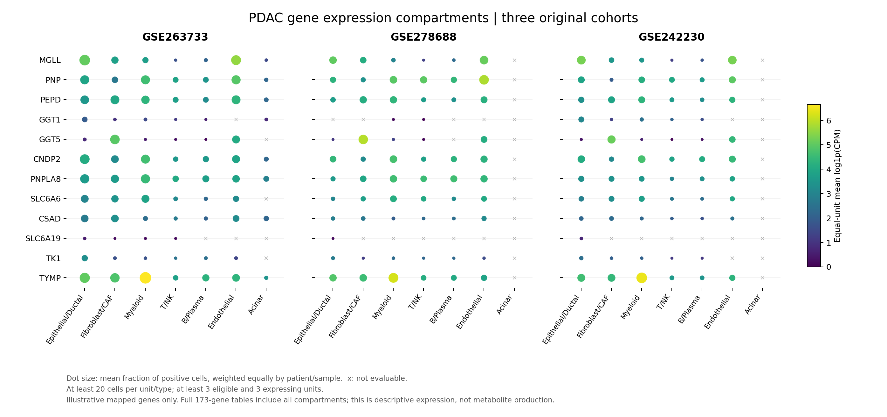

# PDAC 三套单细胞：队列选择与首批基因来源

## 本轮问题
用户要求至少3套质量合适的PDAC单细胞分析相关基因来源。本批已完成三原创队列选择、矩阵与注释匹配、173基因描述性来源分析；不是只提供数据集编号。

## 输入与范围
重点是11对配对代谢分析中原始P<0.05的51条（所有配对q均>=0.05）。目前只有25条能接到既有直接/条件映射，形成173个不重复基因；另外26条在paired51_mapping_coverage.tsv明确保留MAPPING_NOT_YET_ESTABLISHED。这不意味着26条无生物学关联，也不能称全部51条已完成基因分析。

|队列|本批纳入单位|本批细胞数|选用理由与边界|
|---|---:|---:|---|
|[GSE263733](https://www.ncbi.nlm.nih.gov/geo/query/acc.cgi?acc=GSE263733)|21患者|46,148|治疗前原发肿瘤，患者/组织来源注释完整；只用Pm0/Pm1，排除肝转移和正常；7类作者注释较粗|
|[GSE278688](https://www.ncbi.nlm.nih.gov/geo/query/acc.cgi?acc=GSE278688)|13肿瘤患者|71,414|细胞类型较丰富，可分CAF、星状、髓系等；排除血液，邻近组织另留背景；25是更大研究范围，不能当本次13|
|[GSE242230](https://www.ncbi.nlm.nih.gov/geo/query/acc.cgi?acc=GSE242230)|25独立样本（作者描述）|31,215|未治疗诊断穿刺样本，有细分作者标签；仅新产生eusfnb，排除作者filtered=True的12,215细胞，不使用整合80例冒充独立队列|

合计148,777细胞，不把细胞数当独立患者数。三套为不同原创研究；按研究来源独立，未完成受保护患者身份级跨研究排重。原论文分别为[Park2024](https://doi.org/10.1186/s12943-024-02003-0)、[Chen2025](https://doi.org/10.1016/j.ccell.2025.06.020)、[Storrs2023](https://doi.org/10.1038/s41698-023-00455-z)。备用与排重理由见cohort_selection.tsv。

## 实际结果
173基因中80个在三队列最高表达大类一致、65个在两队列一致、28个队列依赖或未达可评估条件。此为描述性最高表达类群一致，不是显著性复现、特异性证明或因果来源认证。

以下示例是各队列在可评估大类中、患者等权平均log1p(CPM)最高的类别，不代表基因只在该类表达：

|基因|GSE263733|GSE278688|GSE242230|
|---|---|---|---|
|MGLL|内皮|内皮|上皮/导管|
|PNP|内皮|内皮|红系|
|PEPD|髓系|髓系|髓系|
|GGT1|上皮/导管|髓系|上皮/导管|
|GGT5|成纤维/CAF|成纤维/CAF|成纤维/CAF|
|CNDP2|髓系|髓系|髓系|
|PNPLA8|髓系|髓系|内皮|
|SLC6A6|髓系|髓系|内皮|
|CSAD|成纤维/CAF|内皮|内皮|
|SLC6A19|上皮/导管|上皮/导管|上皮/导管|
|TK1|上皮/导管|上皮/导管|上皮/导管|
|TYMP|髓系|髓系|髓系|

全表：cross_cohort_source.tsv。逐队列作者细类型及保守大类统计：cell_source_all.tsv（10,034行）。包含每类有效单位数、检测单位数、细胞数、平均与中位表达、检测比例、排序及不可评估状态。关系范围：relation_cell_source_scope.tsv，保留直接/条件标签。

## 新手解释
来源问题是“这些相关基因主要在哪些细胞类群表达”。每个患者/样本×细胞类群先汇总原始UMI，再以全部基因总UMI算CPM，最后按患者等权平均。不是把所有细胞当独立重复做P值，也不是用细胞数占比代替表达水平。

## 限制/反证
- 不新增P/q。本批没有重算细胞类型内肿瘤—正常差异；旧不显著的历史差异标签不因此升级。
- 每单位×类型至少20细胞，至少3个有效单位且3个单位检测到基因才参加来源排名。不同类型可用患者数不完全相同，排名仅描述，不能解释为已证实细胞特异性。
- 三套唯一符号覆盖分别168/173、167/173、168/173。共同未唯一匹配AQP7B、GK3、LARS1、PNLIPRP2、WARS1；第二套额外AWAT2。LARS1/WARS1等可能涉及旧名，待独立别名核验，不能称生物学不表达。重复符号保留NA，不任挑一行。
- 前两套Ductal并非逐细胞恶性认证；第三套保留作者细分标签，并在跨队列统一为上皮/导管大类。未重聚类或重算CNV。
- PNP在第三套红系标签最高等结果需要细胞污染/ambient RNA及注释复核；细胞捕获、穿刺/手术和罕见类群差异会影响排名。不得仅凭最高一格推荐机制。
- RNA丰度不是酶活、代谢通量，也不能证明某代谢物由该类细胞生成。25条映射中含条件关系，表达覆盖不解除底物身份/特异性限制。
- 原始矩阵、条形码、患者级聚合只存server165；只发布汇总。三队列重复公开副本不另算支持。

## 当前决定
三队列173基因来源批次DONE；完整51条映射及细胞来源整合仍PARTIAL，06_EXTERNAL总体PARTIAL。3项合成单元测试通过，含条形码重排、缺条形码拒绝、重复符号排除、全基因分母、患者等权与低检测处理；服务器独立回算10,034行汇总和173基因跨队列归属通过，属于汇总算术核验，不是独立细胞重注释。

## 下一步
补齐26条的精确/条件生化映射及基因旧名；在固定全集后扩展来源。对跨队列不一致或红系/血小板最高者开展注释与背景RNA复核；有正常样本的队列再单独开展细胞类型内患者级比较，不将本批描述排序当疾病差异。

## 复现命令
先读docs/PDAC/SC_SOURCE_THREE_COHORTS_V1.md。server165新建results/collaborative/PDAC/B/<RUN_ID>/，复制本批panel.json与code/pdac/sc_source_three_cohorts_v1.py；执行python3 sc_source_three_cohorts_v1.py --code-commit 8c0a390。所有来源只读，独占新目录.running。完成后运行python3 verify_sc_source_v1.py <RUN_PATH>。本地仅汇总制图：python code/pdac/report_sc_source_three_cohorts_v1.py。本地合成测试：python -m unittest discover -s code/pdac -p test_sc_source_three_cohorts_v1.py -v。
