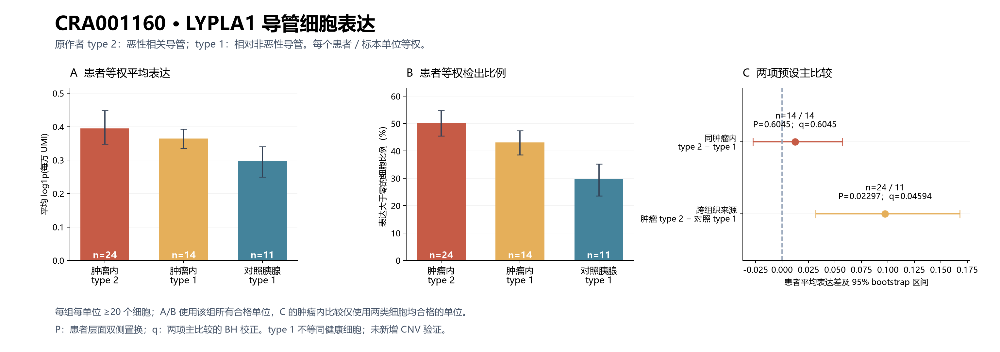

# CRA001160：LYPLA1 恶性相关与相对非恶性导管细胞比较

## 本轮问题

回答 LYPLA1 是否在恶性相关导管细胞中高于非恶性导管细胞。结论：**跨组织来源的平均表达比较存在升高信号，但同一肿瘤内不支持一致升高，且跨组织信号依赖表达汇总方式。不能据此称 LYPLA1 为恶性细胞特异高表达基因。**

## 输入与范围

- 原始研究：[Peng et al., Cell Research 2019](https://pmc.ncbi.nlm.nih.gov/articles/PMC6796938/)，GSA CRA001160 / PRJCA001063。
- 本轮实际使用[原作者 GSA 补充目录](https://download.cncb.ac.cn/gsa/CRA001160/other_files/)的 `PDAC.tar.gz`（35 套基因×细胞 UMI 矩阵）及 `all_celltype.txt`。原始数据直接下载、计算和留存于 server165。
- 最初检查的 Besca 版本不是本次数值输入；本轮使用原作者数据与原作者标签。
- 57,530 个原作者注释细胞全部唯一匹配：肿瘤 41,986 个、对照 15,544 个；24 个 T 标签单位、11 个 N 标签单位。保留原作者筛选，不再根据 LYPLA1 值选择细胞。
- 原作者 type 2 导管标签作为“恶性相关导管”分组；type 1 作为“相对非恶性导管”分组。不是本轮重新进行 CNV 或 DNA 确证；type 1 不等于健康胰腺细胞。
- 单位沿用研究的患者/标本标签；**N1 不与 T1 配对**。配对仅指同一个 T 标签中同时存在的两类细胞，不是成对切除的肿瘤和癌旁组织。
- 每单位每类细胞至少 20 个；平均单细胞 log1p(每万全基因 UMI)，再按患者单位等权比较。两项预设主比较；100,000 次双侧置换、20,000 次患者 bootstrap；仅这两项主 P 进行 BH。没有将细胞视为独立患者。

## 实际结果

|比较|单位数（前/后）|细胞数（前/后）|平均表达（前/后）|平均表达差 [95%区间]|P|q|
|---|---:|---:|---:|---:|---:|---:|
|同一肿瘤内：type 2 − type 1|14 / 14|4019 / 2616|0.3765 / 0.3644|0.0122 [-0.0274, 0.0570]|0.60445|0.60445|
|跨组织：肿瘤 type 2 − 对照 type 1|24 / 11|11315 / 7671|0.3946 / 0.2973|0.0973 [0.0316, 0.1678]|0.02297|0.04594|

表达差是平均 log1p(每万 UMI) 之差，**不是倍数变化**。

**同一肿瘤内的 14 个合格单位：7 个 type 2 较高，7 个较低，0 个相等。** 主比较 P=0.60445，q=0.60445；这不支持“在同一患者中普遍升高”，也不能解释成证明绝对没有差异。

按各组全部合格单位统计（与配对子集不能混用）：

|分组|合格单位|细胞数|平均表达|LYPLA1 检出比例|
|---|---:|---:|---:|---:|
|肿瘤 type 2|24|11,315|0.3946|50.13%|
|肿瘤 type 1|14|2,616|0.3644|43.19%|
|对照胰腺 type 1|11|7,671|0.2973|29.73%|



### 敏感性与反证

- 每组门槛降至 10 个细胞：入组单位及数值与主分析完全相同，**精确复用主结果，不作为额外重复验证**。
- 门槛升至 50 个细胞：肿瘤内 11 个配对单位，P=0.43194；跨组织 23 vs 11 个单位，P=0.02972。敏感性 P 未校正，不另称验证成功。
- 改为每个单位/细胞类型先合计 UMI，再计算 log2[(LYPLA1 UMI + 0.5)×10⁶ / 全基因 UMI]：肿瘤内 P=0.99170；跨组织 P=0.16594。**跨组织的主分析显著信号未在这一表达汇总方式下达到 P<0.05。** 这是患者汇总表达的敏感性检验，不是全转录组 edgeR/DESeq2 分析。
- LYPLA1 检出比例：14 个配对单位中，type 2 平均 51.80%、type 1 为 43.19%，差 8.61 个百分点，11 个升、3 个降，探索性 P=0.00963。跨组织差 20.40 个百分点，探索性 P=0.000030；未进行额外多重校正。
- 检出比例与表达强度是不同指标。各组患者等权平均的单细胞 UMI 中位数约为：肿瘤 type 2 **12,033**、肿瘤 type 1 **8,143**、对照 type 1 **4,909**，存在捕获量/细胞 RNA 含量差异；未用下采样或深度模型证明检出比例差独立于这些因素。

## 新手解释

从不同来源的细胞看，肿瘤的 type 2 比对照胰腺 type 1 表达高一些。但把比较收紧到同一肿瘤内，两类细胞的平均表达非常接近，升高和降低各占一半。更高的“能检测到 LYPLA1 的细胞比例”，也不等于每个细胞的相对表达量稳定升高。

## 限制与未完成项

1. 对照胰腺不是本轮核实的健康志愿者队列；未完成原始临床病理逐患者复核，不能把所有对照称为健康组织。
2. 原标签有作者研究背景支持，但本轮没有重新推断 CNV 或做 DNA 层面的恶性验证；异常/癌前导管状态不能从标签中完全排除。
3. 24 vs 11 为不同单位的跨组织比较，不是 11 对患者。临床协变量、跨研究患者独立性和细胞质量/深度混杂仍有未核实部分。
4. q 仅覆盖这次预先指定的两项 LYPLA1 主比较，不覆盖历史全部候选基因、所有单细胞队列或所有敏感性检验。
5. 无 RNA 蛋白/酶活等价推断；本结果不是 GPC—LYPLA1 代谢关系验证。历史 CAMP 效应、P/q 和其他队列结果未改动。

## 当前决定

本批原作者标签下的两项 LYPLA1 比较、预设敏感性、公开汇总图表完成，登记为此批次 DONE；不将整个外部验证或整癌种分析升级为完成。LYPLA1 保留为“跨组织表达差异的条件性线索”，不标为“稳健恶性特异升高”。

## 下一步

若继续补充，应优先在另一个具备明确恶性/非恶性上皮标签的队列中做同患者比较，并核查深度影响。无需为追求显著性改动本次入组规则，也不追加机制推断。

## 核查与复现

- 全部细胞唯一连接、非负整数 UMI、LYPLA1 标签唯一和实际单位数量检查通过。
- 使用独立 CSC 读取方式回读两个原始矩阵，LYPLA1 与全基因库大小一致；全部 10 行结果的入组数量/效应/配对方向及两项主检验 BH 独立复核通过。
- 5 项统计函数测试通过。见 `validation.json`、`independent_validation.json`、`statistical_tests.txt`。
- 图件仅包含公开汇总；逐细胞与逐单位数值保存在服务器 `private/`，不进入 GitHub 或本地交付。
- `source_manifest.tsv` 保存实际输入 SHA-256。来源未提供可核对的作者 SHA-256；本轮记录下载分段的 ETag、范围、字节数与本地计算的整包 SHA-256，不能表述成与作者公布哈希比对通过。

在 server165 的新 PDAC/B 运行目录复制本批下载、分析、参数和验证脚本，依次运行：

```bash
python3 cra001160_download.py
python3 cra001160_lypla1.py
python3 verify_cra001160_lypla1.py
python3 -m unittest -v test_cra001160_lypla1
```

原矩阵已提取且输入未变时，可用 `python3 cra001160_lypla1.py --resume-summary` 复用私有逐细胞结果；不能把它称为重新读入矩阵的独立复现。本机公开图及本报告由 `code/pdac/plot_cra001160_lypla1.py` 和 `code/pdac/report_cra001160_lypla1.py` 生成。
