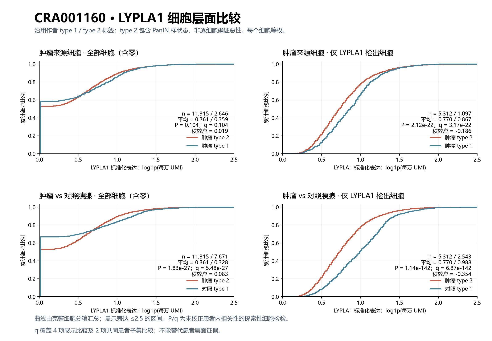

# CRA001160：LYPLA1 细胞层面探索性比较

## 本轮问题

按用户要求，直接比较细胞分布，同时展示包含零值的全部细胞及仅 LYPLA1 检出细胞。**肿瘤来源全部细胞的 type 2 与 type 1 差异不显著；仅检出细胞中，type 2 的标准化表达反而较低。**

## 输入与范围

复用上一批原作者矩阵提取的57,530细胞结果，输入 SHA-256 固定且核对通过。沿用原作者 type 2 与 type 1 导管标签；type 2 包含作者解释为 PanIN 样的状态，不能把每个细胞当作确证浸润癌；type 1 也不是健康身份认证。未新增 CNV。表达沿用 log1p(10000×LYPLA1 UMI/全基因 UMI)，阳性定义为原始 LYPLA1 UMI>0。

本轮每个细胞等权，不先按患者求平均。主展示保留全部作者注释导管细胞，不使用每患者20细胞门槛；另保留上一轮14个共同合格患者/标本单位的细胞子集作为敏感性比较。共同患者子集仍用细胞检验，不是患者配对检验。

双侧 Mann–Whitney U（Wilcoxon秩和），渐近法、并列秩及连续性校正；6项预设探索性比较共同BH。秩二列效应=2U/(n1×n2)−1，正值为type 2整体分布较高，负值较低；不是倍数。P检验的是分布/秩，而不是专门检验均值。均值和中位数均另行展示。不提供将细胞当独立重复的置信区间。

## 实际结果

下表均以前组type 2、后组type 1的顺序展示。

|比较|细胞口径|细胞数|来源单位数|平均表达|中位数|秩二列效应|探索性P|探索性q|
|---|---|---:|---:|---:|---:|---:|---:|---:|
|全部肿瘤单位|全部细胞|11315 / 2646|24 / 22|0.3614 / 0.3593|0.0000 / 0.0000|0.0186|0.1041|0.1041|
|全部肿瘤单位|仅检出细胞|5312 / 1097|24 / 21|0.7699 / 0.8665|0.7204 / 0.8549|-0.1864|2.1161e-22|3.1741e-22|
|肿瘤 vs 对照|全部细胞|11315 / 7671|24 / 11|0.3614 / 0.3277|0.0000 / 0.0000|0.0829|1.8275e-27|5.4824e-27|
|肿瘤 vs 对照|仅检出细胞|5312 / 2543|24 / 11|0.7699 / 0.9884|0.7204 / 0.9810|-0.3541|1.145e-142|6.8699e-142|
|共同14个肿瘤单位（细胞检验）|全部细胞|4019 / 2616|14 / 14|0.3717 / 0.3580|0.2003 / 0.0000|0.0425|0.0014721|0.0017666|
|共同14个肿瘤单位（细胞检验）|仅检出细胞|2028 / 1081|14 / 14|0.7366 / 0.8664|0.6936 / 0.8549|-0.2343|4.5804e-27|9.1608e-27|

## 新手解释

肿瘤type 2中5312/11315（46.95%）细胞检出LYPLA1，肿瘤type 1中1097/2646（41.46%）检出，对照type 1中2543/7671（33.15%）检出。这是按细胞计数的比例，不是上一轮患者等权检出比例。

type 2能检出的细胞比例较高，但在已经检出的细胞内，相对表达强度较低。不能只看其中一种口径就写成“LYPLA1在恶性上皮整体升高”或“整体降低”。阳性筛选改变了所比较的人群，且标准化表达仍受到捕获深度、总RNA含量和细胞状态的影响。

## 限制与反证

- 同一患者内细胞不独立，本轮P/q没有做患者聚类校正；非常小的P不等于可跨患者复现。BH不能修复这种依赖。
- 每个细胞等权使细胞较多的患者占更大权重；`group_profiles.tsv`保存最大单一单位及前三单位的细胞占比，未导出逐患者测量。
- 在共同14个单位中，全细胞检验P约0.00147，但上一轮患者层面P=0.60445，14个单位7升7降。这正说明两种统计口径的证据含义不同，不是独立验证成功。
- 肿瘤全部单位比较纳入24个type 2来源单位、22个type 1来源单位；单位构成不完全相同。共同14单位的敏感性保留在完整表中。
- type 1不等于健康细胞；跨组织对照不是同患者配对。未重新推断恶性标签，也未校正检测深度。
- 本次q只属于这6个细胞层面检验，不混用上一轮患者q、CAMP q或全部候选q。

## 当前决定

本批细胞层面展示完成，解释为细胞分布的探索性描述。保留已有患者层面结果，不提升为“恶性特异”或机制证据。

## 下一步

若需要稳健的跨患者结论，应保留患者层面的结果，或另行预设包含患者随机效应的模型；不能用本轮更小的细胞P替代。

## 验证与复现命令

输入哈希、细胞唯一性、原始计数标准化、阳性筛选和所有分箱总数检查通过；用独立 pooled ranks 重建6项U与并列秩校正P通过；公开文件另行独立复核6项BH及脚本哈希。逐细胞和逐患者数据留服务器，仅导出汇总。

在新PDAC/B运行目录复制 `code/pdac/cra001160_lypla1_cells.py`，运行 `python3 cra001160_lypla1_cells.py`；仅读既有私有结果。下载public目录后，在本地运行 `python code/pdac/report_cra001160_lypla1_cells.py` 生成报告与图件。
