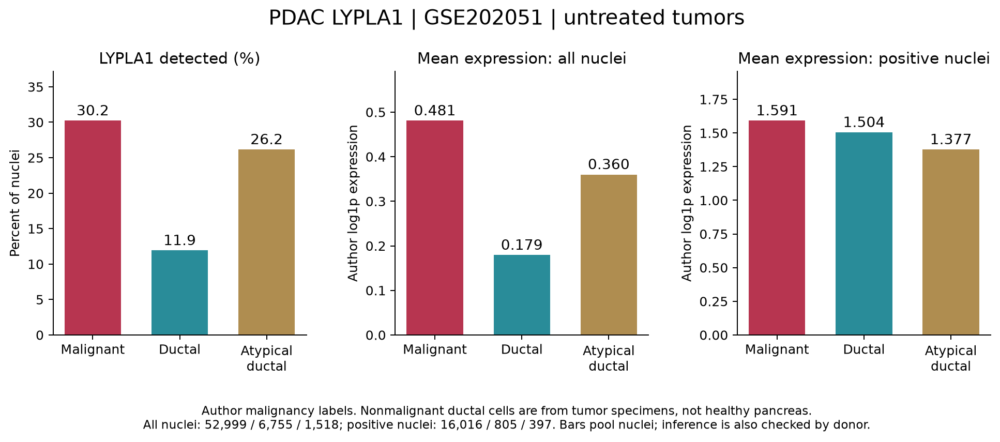
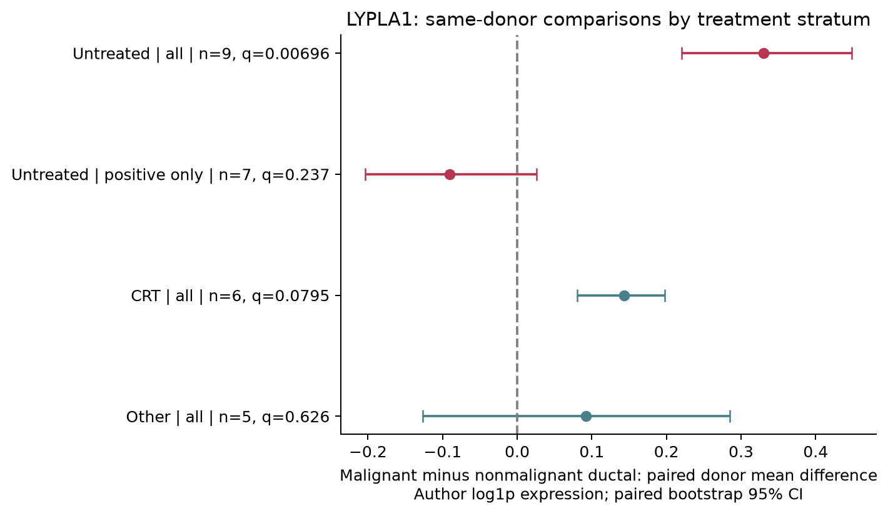

# PDAC：GSE202051 作者恶性上皮中 LYPLA1

## 本轮问题
换用不同于 CRA001160 的高质量 PDAC 队列，检查作者注释恶性上皮中的 LYPLA1。沿用作者标签，不重新聚类或推断恶性身份。

## 输入与范围
[原研究 Hwang et al., Nature Genetics 2022](https://www.nature.com/articles/s41588-022-01134-8)；[GEO GSE202051](https://www.ncbi.nlm.nih.gov/geo/query/acc.cgi?acc=GSE202051)。完整作者 H5AD 包含 224,988 个细胞核、43 个作者 PID、44 个样本库。18 个未治疗 PID 为主分析；CRT 14、CRTl 5、Other 6 个 PID 分开补充。这里是单核 RNA 测序。

输入虽存放于服务器 SCP1089 文件夹，实际为完整 GSE202051 作者对象，不能称为只含未治疗样本的 SCP1089 子集。SCP1089/SCP1096 门户与本批同属该研究，不能重复计为独立队列。

恶性上皮使用作者 Level 1 = Epithelial (malignant)、Level 2 = Malignant。参照为作者非恶性 Ductal，Ductal (atypical) 单列。本批没有使用 cnv_leiden 作为癌细胞亚群，也没有新增 CNV 分析。

## 实际结果
未治疗样本的恶性上皮包括 **52,999 个细胞核、18 个 PID**；非恶性导管为 **6,755 个细胞核、14 个 PID**；非典型导管为 **1,518 个细胞核、14 个 PID**。这些是各类总体覆盖，配对分析的实际人数另见下表。

| celltype | population | n_cells | n_donors | pooled_mean | detection_fraction |
|---|---|---|---|---|---|
| Ductal | All_nuclei | 6755 | 14 | 0.179265 | 0.119171 |
| Ductal | LYPLA1_positive_nuclei | 805 | 12 | 1.50427 | 0.119171 |
| Ductal (atypical) | All_nuclei | 1518 | 14 | 0.360093 | 0.261528 |
| Ductal (atypical) | LYPLA1_positive_nuclei | 397 | 13 | 1.37688 | 0.261528 |
| Malignant | All_nuclei | 52999 | 18 | 0.480833 | 0.302194 |
| Malignant | LYPLA1_positive_nuclei | 16016 | 18 | 1.59114 | 0.302194 |

### 主要比较：未治疗恶性上皮 vs 非恶性导管
| population | unit | n | n_reference | mean_test | mean_reference | effect | p_value | q_value | ci_lower | ci_upper |
|---|---|---|---|---|---|---|---|---|---|---|
| All_nuclei | pooled_nucleus | 52999 | 6755 | 0.480833 | 0.179265 | 0.186858 | 6.00264e-219 | 1.20053e-218 | NA | NA |
| All_nuclei | paired_author_pid | 9 | 9 | 0.500552 | 0.170559 | 0.329992 | 0.00347997 | 0.00695993 | 0.220484 | 0.448414 |
| LYPLA1_positive_nuclei | pooled_nucleus | 16016 | 805 | 1.59114 | 1.50427 | 0.10647 | 3.30219e-07 | 3.30219e-07 | NA | NA |
| LYPLA1_positive_nuclei | paired_author_pid | 7 | 7 | 1.52803 | 1.61836 | -0.0903293 | 0.237008 | 0.237008 | -0.203823 | 0.0262026 |

全细胞核的同 PID 比较有 **9 对**：9 对恶性上皮均值较高，0 对较低；均值差 **0.3300**，配对 bootstrap 95% CI **[0.2205, 0.4484]**，P=0.00347997，q=0.00695993。

仅检出 LYPLA1 的细胞核：合并细胞核检验显著，但同 PID 分析仅 7 对，均值差为负且不显著。因此不支持“每个表达 LYPLA1 的恶性细胞都表达更高”。检出率差异是本次总体均值差的重要组成；这是描述性分解，不是机制证明。

### 治疗分层及非典型导管参照
| treatment | reference | population | n | effect | p_value | q_value | status |
|---|---|---|---|---|---|---|---|
| Untreated | Ductal | All_nuclei | 9 | 0.329992 | 0.00347997 | 0.00695993 | DONE |
| Untreated | Ductal | LYPLA1_positive_nuclei | 7 | -0.0903293 | 0.237008 | 0.237008 | DONE |
| Untreated | Ductal (atypical) | All_nuclei | 9 | 0.16994 | 0.0199998 | 0.0795242 | DONE |
| Untreated | Ductal (atypical) | LYPLA1_positive_nuclei | 4 | NA | NA | NA | NOT_EVALUABLE |
| CRT | Ductal | All_nuclei | 6 | 0.143129 | 0.0318097 | 0.0795242 | DONE |
| CRT | Ductal | LYPLA1_positive_nuclei | 2 | NA | NA | NA | NOT_EVALUABLE |
| CRT | Ductal (atypical) | All_nuclei | 5 | 0.105784 | 0.0622894 | 0.103816 | DONE |
| CRT | Ductal (atypical) | LYPLA1_positive_nuclei | 1 | NA | NA | NA | NOT_EVALUABLE |
| CRTl | Ductal | All_nuclei | 1 | NA | NA | NA | NOT_EVALUABLE |
| CRTl | Ductal | LYPLA1_positive_nuclei | 0 | NA | NA | NA | NOT_EVALUABLE |
| CRTl | Ductal (atypical) | All_nuclei | 2 | NA | NA | NA | NOT_EVALUABLE |
| CRTl | Ductal (atypical) | LYPLA1_positive_nuclei | 0 | NA | NA | NA | NOT_EVALUABLE |
| Other | Ductal | All_nuclei | 5 | 0.0921443 | 0.500845 | 0.626056 | DONE |
| Other | Ductal | LYPLA1_positive_nuclei | 2 | NA | NA | NA | NOT_EVALUABLE |
| Other | Ductal (atypical) | All_nuclei | 5 | 0.0323482 | 0.750172 | 0.750172 | DONE |
| Other | Ductal (atypical) | LYPLA1_positive_nuclei | 2 | NA | NA | NA | NOT_EVALUABLE |

未治疗 vs 非典型导管的全细胞核配对差异为正，但补充检验族 FDR 未过 0.05；阳性细胞核仅 4 对，按既定门槛不可评估。治疗各层单列，不把跨层差异解释为治疗因果效应。

## 新手解释
“全细胞核”包含 LYPLA1 未检出的零值；“阳性细胞核”仅保留计数层 LYPLA1 > 0。总均值 = 检出比例 × 阳性均值。本队列恶性上皮的检出比例明显更高，但阳性细胞核中能否普遍上调，供者层面没有得到支持。

表达采用作者 X，并逐核验证其等于 log1p(10000 × LYPLA1 count / 作者 total_counts)。total_counts 与 n_counts 均匹配；当前矩阵保留基因的行和不能复现作者分母，故没有擅自用该行和重新标准化。log 表达均值差不能解释为表达倍数。

## 限制与反证
- 非恶性导管来自肿瘤标本，不等于健康胰腺正常对照。
- 同一供者多个细胞核不独立，合并细胞核 P 很小不能替代供者层面证据。
- 纳入同 PID 比较需每组至少 20 个所选群体的细胞核、至少 5 对；因此不同分析实际 PID 数不同，阳性比较还受筛选影响。
- 单核检测零值不等于生物学绝对不表达；结果尚未证明蛋白、酶活或机制。
- 作者恶性身份沿用而未重新计算 CNV；未完成与其他研究逐供者独立性核查。
- 本批完成恶性/非恶性表达比较，未完成作者恶性上皮内部程序或亚群比较。

## 当前决定
LYPLA1 值得保留为恶性上皮表达来源候选，证据表述限定为：**本队列未治疗 PDAC 中，恶性上皮总体 LYPLA1 表达及检出比例更高；全细胞核同供者均值比较支持差异，但仅阳性细胞核不支持一致增强。** 本批不改写 CRA001160 历史统计，也不把一个新队列自动视为已完成机制验证。

## 下一步
若进一步检查癌上皮内部异质性，需确认该研究公开的作者癌细胞程序/亚群映射；本对象 Level 3 对恶性上皮仍只写 Malignant，不能直接冒用常规 leiden 编号充当作者生物学亚群。

## 方法、检验范围与复现
细胞核：双侧 Mann–Whitney U，渐近并列值校正，效应为 rank-biserial。供者：按作者 PID 合并样本库，各 PID 等权，100,000 次符号置换（+1 校正），20,000 次配对 bootstrap。独立核查用完整枚举验证可评估配对结果在 Monte Carlo 误差内一致；未治疗主要全细胞核比较的枚举 P=0.00390625，不覆盖原 Monte Carlo P。

BH 分为四族：主要合并细胞核 2 项、主要配对 2 项、补充合并细胞核 14 项、补充配对 14 项；在各族可评估行内校正，所有不可评估行保留。完整 32 行位于 results.tsv；门槛与种子在 analysis_spec.json，版本在 validation.json。独立复核通过 32 行数量/效应、4 个 BH 检验族、24 组直方图总数及均值分解；详见 independent_validation.json。

服务器运行目录：`results/collaborative/PDAC/B/20260928T031629Z_gse202051_lypla1_v1`。
将仓库 `code/pdac/gse202051_lypla1.py` 和同名 spec 复制到新的专用服务器运行目录后执行 `python3 gse202051_lypla1.py`；验证脚本同样在该目录执行 `python3 verify_gse202051_lypla1.py`。本地仓库根目录执行 `python code/pdac/report_gse202051_lypla1.py` 生成图文。全部逐核/逐 PID 测量仅留服务器，交付包只含汇总结果。
