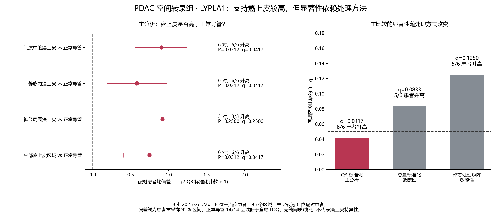

# PDAC LYPLA1 空间表达补充分析

## 本轮问题
LYPLA1 在病理标注的癌上皮区域，是否高于同一患者的正常导管区域？

**本批已完成实际计算：主分析支持较高表达；不同处理方式下方向基本一致，但统计显著性不稳定。暂不能认定癌上皮特异富集。**

## 输入与范围
- [Bell 等，Science Translational Medicine 2025](https://pubmed.ncbi.nlm.nih.gov/40991729/)，[原始数据版本](https://zenodo.org/records/16732565)，[作者代码](https://zenodo.org/records/16907251)。
- GeoMx 全转录组，8 位未治疗 PDAC 患者。作者病理及 PanCK 指导选取上皮区域，属于区域表达，不是逐细胞表达。
- 沿用作者最终 95 个区域，排除其标记疑似错标的 Stroma_063_003。ND 14、PDAC 38、PNI 8、VI 35。
- PDAC 指“生长在间质中的癌上皮”，不是间质细胞；ND 为该研究组织中的正常导管，不能等同健康供者队列。
- 6 位患者有 PDAC 与 ND 同时可用，主检验以患者为独立单位。区域数量不作为独立患者数。
- 提前固定四项比较；先对每位患者每组区域取均值，再计算配对差。PNI 有 4 位患者，但只有 3 位具备 ND 对照。
- 作者探针 QC 计数共 18,677 行，按其全局 LOQ 思路筛选后保留 7,572 个内源基因；LYPLA1 通过基因级保留规则。
- 主分析使用本次 Q3 标准化与 log₂(x+1)，方法参照 [GeoMx 数据分析说明](https://nanostring.com/wp-content/uploads/2022/06/MAN-10154-01-GeoMx-DSP-Data-Analysis-User-Manual.pdf)。不是重现作者原 DESeq2 差异分析。总量标准化与作者 VST/ComBat 矩阵作为敏感性。

## 实际结果
|比较|配对患者|升高患者|均值差|95% 区间|P|q|
|---|---:|---:|---:|---|---:|---:|
|间质中的癌上皮 vs 正常导管|6|6/6|0.903|0.557～1.241|0.03125|0.04167|
|静脉内癌上皮 vs 正常导管|6|6/6|0.580|0.187～0.975|0.03125|0.04167|
|神经周围癌上皮 vs 正常导管|3|3/3|0.918|0.702～1.330|0.25000|0.25000|
|全部癌上皮区域 vs 正常导管|6|6/6|0.746|0.400～1.092|0.03125|0.04167|

差值为 log₂(Q3 标准化计数+1) 的患者配对均值差，不能直接称为原始表达倍数。区间为 20,000 次患者重采样的描述性区间；小样本下区间与离散检验 P 值不一定一致。

### 主比较的处理方式敏感性
|处理方式|升高患者|差值（各自尺度）|P|q|
|---|---:|---:|---:|---:|
|q3_log2|6/6|0.903|0.03125|0.04167|
|cpm_log2|5/6|0.903|0.06250|0.08333|
|author_vst|5/6|0.998|0.06250|0.12500|

各尺度分别对四项预设比较做 BH 校正，不是全基因组 FDR，也不是三次独立验证。作者 VST 的差值尤其不能解释为 log₂ 倍数。

主比较逐一去掉一位患者后，Q3 平均差范围为 0.784～1.058，均保持正值；这说明平均方向不是由单个患者翻转，不能消除小样本和标准化依赖。

### 背景阈值
全局 LOQ 为 52.131 个计数。高于该阈值的区域：癌上皮 PDAC 24/38（63.2%），正常导管 ND 0/14，静脉内 VI 10/35，神经周围 PNI 2/8。

**正常导管全部低于该全局阈值，是本批的重要限制。** 其低计数没有置零、删除或填补；可以描述癌区域更多超过背景阈值，但低背景范围的精确倍数解释不可靠。这是区域信号超过阈值的比例，不是单细胞检出率，也不表示正常导管完全不表达。



## 新手解释
这套数据在组织中由病理标注选出癌上皮，再与同一患者的正常导管比较。主处理方式下 6/6 位患者都是癌上皮较高。但另外两种处理方式为 5/6 位升高且 P 未低于 0.05，所以更适合称为“癌上皮较高的空间支持信号”，仍需更多数据确认。

## 限制与反证
1. 没有纯间质或免疫区域对照，不能判断 LYPLA1 是否比所有其他细胞类型更高，不能称癌上皮特异表达。
2. 只有 6 对患者，精确双侧检验最小 P 为 0.03125；PNI 3 对的最小 P 为 0.25。PNI 不显著不证明没有差异。
3. 未重新独立判读切片，使用作者病理标注；GeoMx ROI 内仍可能存在混合细胞。
4. 作者矩阵已回归批次与患者效应；因此只作敏感性，不把它作为唯一依据。主分析不做该回归，以同患者配对控制患者层面的差异。
5. LOQ 是作者代码采用的跨区域全局阈值，不是对每个细胞或每个区域的独立检测认证。正常导管均低于阈值。
6. 不推断蛋白、酶活、因果或治疗靶点。与此前单细胞队列是否存在患者重叠尚未核实，不能宣称完全独立复现。

## 当前决定
本轮数值范围为 DONE；“LYPLA1 癌上皮特异富集”仍未闭环。保留 LYPLA1 作为有空间支持但需继续复核的候选，不追加机制分析。

## 下一步
补充同时覆盖癌上皮、间质和免疫区域且具有作者可靠注释的 Visium 或单细胞级空间数据。GSE235315 是可继续核查的候选，尚未计入本次结果。不能仅用单个上皮标记推定恶性。

## 复现命令与核查
服务器新目录：`results/collaborative/PDAC/B/20260928T094758Z_geomx_bell2025_lypla1_v1`。矩阵、逐区域和逐患者测量均留在 server165；本目录仅含可公开汇总。

```bash
python3 geomx_bell2025_lypla1.py --data <server_source_directory> --run <fresh_run_directory_with_lock> --commit <base_commit>
python3 verify_geomx_bell2025_lypla1.py <run_directory> <server_source_directory>
```

执行前把脚本及 spec 复制到新运行目录并建立独占 `.running`；详见仓库 code/pdac 同名文件。绘图只读取本目录聚合表。

6 个来源文件 MD5/SHA256 已核对；Q3 表达计算、12 项精确 P、BH 校正、区域及患者数量已独立复算通过，见 independent_validation.json。Bootstrap 区间未独立重算。所有历史 CAMP、关联及单细胞数值不变。
