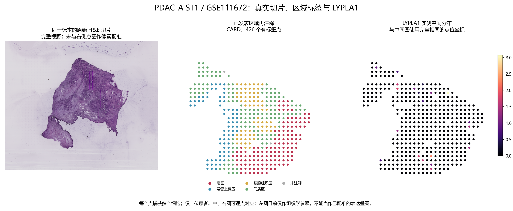
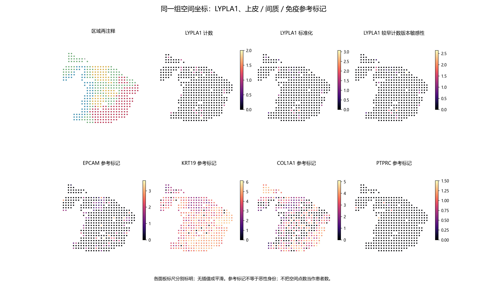

# PDAC LYPLA1：真实切片、区域注释和空间点位图

## 本轮问题
用户要求查看真实切片，判断 LYPLA1 是否出现在癌上皮区域。上一批 Bell2025 GeoMx 缺少可用的切片—区域坐标连接，因此另找可公开获取 H&E 和空间计数的数据。

**本轮已经交付真实 H&E、同一切片的已发表区域标签图和 LYPLA1 实测点位图。后两图能逐点对应；原始 H&E 与点图的像素级配准仍未完成，不能把并排图称为表达叠图。**

## 输入与范围
- [GSE111672 / GSM3036911，PDAC-A ST1](https://www.ncbi.nlm.nih.gov/geo/query/acc.cgi?acc=GSM3036911)，来自 [Moncada 等原研究](https://doi.org/10.1038/s41587-019-0392-8)。本批是一个患者的一张切片。
- GEO 提供 42,309 × 36,028 像素 H&E 原图、较新过滤计数矩阵（19,738 行，428 点）及较早计数文件。原始图片保存在服务器，展示图由完整图片缩小生成。
- 426 个区域标签来自 [CARD 研究](https://doi.org/10.1038/s41587-022-01273-7) 的手工组织学再注释，[固定版本文件](https://github.com/YingMa0107/CARD/blob/2d64b91abb5cdd0c7f576b1c5d4727c84e7c93a0/data/Figure4A_layer_annote.RData)。不是本次凭 LYPLA1 或单个上皮标记划癌区，也不把 CARD 再注释说成本次独立病理复核。
- 137 癌区点、72 导管上皮点、70 胰腺组织点、147 间质点；另有 2 点未注释并明确保留。每个捕获点包含多个细胞。

## 实际结果


从左到右：原始 H&E；已发表区域再注释；LYPLA1 的实测空间分布。中间和右边是完全相同的点位坐标，可逐点比较。左图仅为同一标本的组织学参照，未作已验证的像素配准。

|区域|点数|检出点数|检出比例|平均标准化表达|较早计数版本均值|
|---|---:|---:|---:|---:|---:|
|癌区|137|8|5.84%|0.0858|0.0760|
|导管上皮区|72|4|5.56%|0.0750|0.0646|
|胰腺组织区|70|6|8.57%|0.0552|0.0374|
|间质区|147|2|1.36%|0.0273|0.0179|
|未注释|2|1|50.00%|0.3404|0.2500|

主表达为 log1p(每万计数)，纳入各区域全部点位，包括零计数。428 个点中 21 个检出 LYPLA1，总计数为 24；检出率 4.91%。所有区域的表达中位数均为 0（未注释两点组除外）。没有删除零值来突出差异。

癌区与导管上皮的检出率接近（5.84% vs 5.56%），胰腺组织区检出率更高（8.57%）。癌区平均标准化表达高于间质，但信号很稀疏，**不能据此认定 LYPLA1 明显或特异地富集在癌上皮。**



参考图保留 LYPLA1 计数、标准化结果、较早计数版本结果，以及 EPCAM、KRT19、COL1A1、PTPRC。每幅图自己的标尺都单列；不跨基因直接比较颜色深浅。

## 新手解释
这次确实取回了切片，并把“哪个点属于哪种区域”与“该点 LYPLA1 的实测值”连接起来。这里 LYPLA1 多数点是零计数，只在少量散在点出现；不能画平滑热区来制造连续高表达区域。

## 限制与反证
1. 本次没有取得可验证的 H&E 像素变换，故如实并排展示，不把网格硬贴到组织上。完整精确配准仍为未完成项。
2. 一个患者、一张切片不能提供跨患者复现，428 个点不是 428 位患者。本轮不报 P/q，避免将空间相关点当成独立个体。
3. 癌区点可混有间质、免疫或其他细胞，区域表达不能直接归因到每个恶性上皮细胞。
4. GEO 两个计数版本的 LYPLA1 在 4 个点不同：过滤版合计 24，较早版合计 22；不篡改或强行宣称一致。较早版本的目标计数和总计数与 CARD 发布的矩阵逐点一致。敏感性图始终使用同一版本自己的分子、分母。
5. 过滤矩阵有两个非目标重复标签（1-Mar、2-Mar）；本轮不猜测其身份，保留原始行计入总计数。LYPLA1 和四个绘图参考基因均唯一匹配。本批不能作为全基因标识质量已经核实的证明。
6. 先筛查的 GSE235315 / GSM7498812 没有 LYPLA1 符号或对应 Ensembl ID，未画成零表达，也没有用 LYPLA2 或 LYPLAL1 替代。其他未完成下载的切片没有被推断为全部缺失。

## 当前决定
切片和实测坐标图已交付；精确像素配准、多个患者的癌上皮富集验证未完成，阶段状态为 PARTIAL。这张稀疏切片不构成 LYPLA1 癌上皮特异富集的强支持，也不证明 LYPLA1 在癌上皮没有表达。

## 下一步
优先采用已包含可靠组织像素坐标、LYPLA1 测量覆盖更高、并具有癌区注释的新队列；在查到 LYPLA1 行与配准材料前不承诺可交付表达叠图。Bell2025 区域比较仍单独保留，不把不同队列拼成同一张切片的验证链。

## 复现与核查
运行目录：`results/collaborative/PDAC/B/20260928T104922Z_moncada_lypla1_slice_v1`。代码：`code/pdac/moncada_lypla1_slice.py`，参数：analysis_spec.json，来源哈希：source_manifest.tsv。

```bash
python3 moncada_lypla1_slice.py --data <server_source_dir> --run <new_locked_run_dir> --image <complete_original_HE.jpg.gz> --font <CJK_font>
```

目标计数已用独立逐行读取核对；坐标键与 426 个标签完全对应；较早 GEO 计数与 CARD 矩阵交叉核对通过；完整 H&E 的 gzip CRC 检查通过。图中没有插值、填补或自行画出的癌区边界。源矩阵、逐点测量、完整映射和源图只驻留 server165，本目录仅交付计算图件和汇总。
