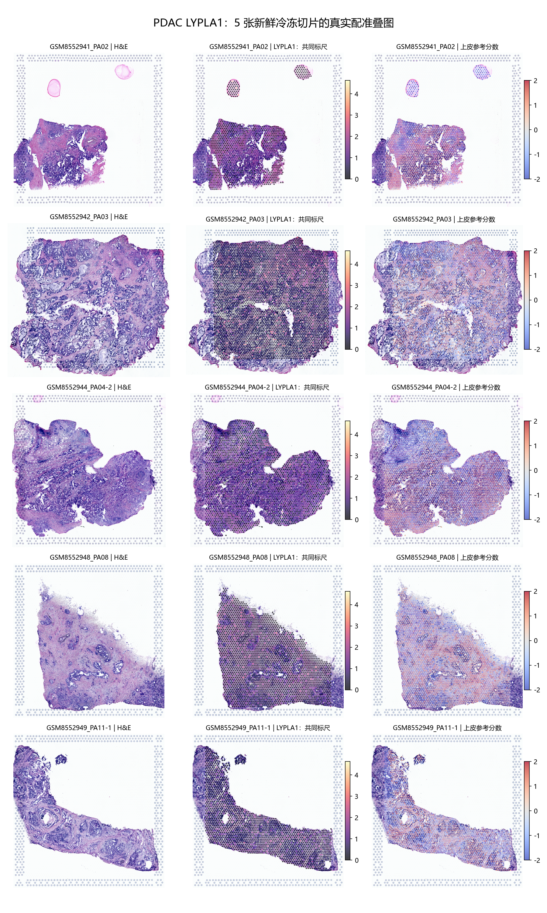

# PDAC LYPLA1：五张原始像素配准空间切片

## 本轮问题
继续寻找合适空间转录组，观察 LYPLA1 是否在癌上皮富集，并提供可直接查看组织位置的真实切片图。

## 输入与范围
使用 [GSE278687](https://www.ncbi.nlm.nih.gov/geo/query/acc.cgi?acc=GSE278687) 的全部五张 GEO 标为 FF 的新鲜冷冻切片：PA02、PA03、PA04-2、PA08、PA11-1。来自 [Chen 等，Cancer Cell 2025](https://doi.org/10.1016/j.ccell.2025.06.020)。五张均在查看 LYPLA1 表达之前按制备类型选定，没有因结果方向而删切片。其余 FFPE/CytAssist 不在本次固定分析范围。

本批将每张切片的计数条码与作者像素坐标、H&E 和缩放因子精确连接。原压缩包为双层 gzip，完整解压验证；若同时有 tissue_positions.csv 和 tissue_positions_list.csv，先验证语义完全一致。五张切片均确认 LYPLA1 与 ENSG00000120992 唯一匹配。

已下载的 GEO 文件没有作者逐点恶性区域标签；作者代码虽使用 niche3 恶性导管生态位分类，但仅有代码不能恢复原标签。本批上皮分数来自六个预设标记 EPCAM、KRT8、KRT18、KRT19、KRT7、MUC1，**不含 LYPLA1，且不能代替恶性身份判断**。同一研究已有的单细胞结果也不能当作独立队列复现。

## 实际结果
共 13,557 个组织内非空点，3,916 点检出 LYPLA1。下面的均值为包括零值的 log1p(每万计数)；高、低组分别为该切片上皮参考分数最高与最低四分位，结果是上皮关联探索，不是病理癌区差异。

|切片|点数|LYPLA1 检出率|上皮高分组均值|低分组均值|高－低|深度等校正后的相关|
|---|---:|---:|---:|---:|---:|---:|
|PA02|1389|60.0%|0.944|0.348|+0.596|+0.123|
|PA03|4579|8.0%|0.208|0.172|+0.036|-0.021|
|PA04-2|3088|62.9%|0.884|0.630|+0.254|+0.039|
|PA08|2677|20.0%|0.358|0.170|+0.188|+0.059|
|PA11-1|1824|13.2%|0.262|0.147|+0.114|+0.075|

五张中 5/5 的上皮高分组 LYPLA1 平均值更高，固定质量筛选后方向仍一致。但控制总计数、检出基因数及线粒体比例后，相关明显减弱：PA03 接近零且略为负，其余四张仅为弱正相关。因此不能把未校正的上皮关联描述成强而稳定的富集。完整结果及质量筛选敏感性见 section_summary.tsv。reference_associations.tsv 同时保留上皮、间质、免疫的原始和校正相关，不能只展示有利结果。



每行从左至右为 H&E、LYPLA1、上皮参考分数。全部点保持真实大小与位置，LYPLA1 使用跨切片共同标尺，无插值或平滑。单张图另含间质和免疫参考分数。参考分数色标为 -2 至 2，超界值仅在显示上饱和，分析使用原数值。

## 新手解释
这批已经可以把“LYPLA1 信号在哪里”贴回实际组织，而不是把切片和表达点图分开。上皮参考分数高，表示该点的上皮标记较强；它可能包含恶性导管、非恶性导管或混合细胞。检出率高也可能受测序深度影响，所以同时核对了总计数、检出基因数和线粒体比例。

## 限制与反证
- **本批不能判定癌上皮特异富集**，关键缺项是同一批点位的可靠恶性/非恶性标签。真实叠图完成不等于恶性身份核查完成。
- 各切片测量深度与目标检出率不同；主要结果与固定质量敏感性均保留，不按显著性调筛选门槛。
- Visium 一个点包含多个细胞，空间共定位不等于 LYPLA1 只由该点的恶性细胞表达。
- 五张切片未在本批完成逐供者独立性来源核对，不报告跨患者 P/q，更不把数千点当作数千患者。
- 参考分数与表达相关不证明功能、酶活、因果关系或治疗价值。

## 当前决定
真实配准叠图与上皮参考关联已计算完成；“癌上皮富集”结论仍为 NOT_EVALUABLE，批次整体 PARTIAL。结果须结合完整五张的方向、效应大小和质量敏感性阅读。

## 下一步
优先接入作者逐点恶性区域注释或具有可靠病理标签的新队列，分别比较恶性上皮、非恶性导管及间质；不将本批上皮参考分数改名为癌区。

## 复现
代码 code/pdac/lypla1_registered_spatial.py；预先固定参数 analysis_spec.json；来源 SHA-256 source_manifest.tsv；数值和配准验证 validation.json。源矩阵、逐点结果、源图和完整映射仅留 server165。

```
python3 lypla1_registered_spatial.py --data <GSE278687_dir> --run <new_locked_run_dir>
```
