# PDAC 首版结果展示

输入提交：2971100b37e40d66a88cf89102c0fd3a56b7bcee；单细胞仅至来源。示例不是最终排名。

## 研究设计与数据范围

**问题：**本次哪些样本能用于哪种分析？

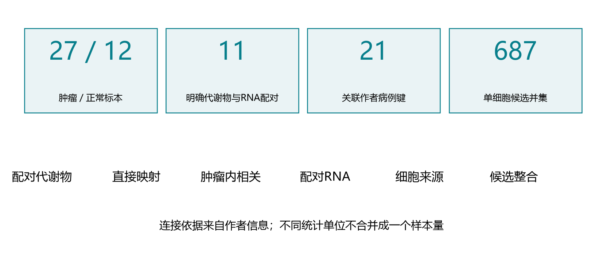

**结果与解释：**39个跨组学标本：27肿瘤、12正常；11个作者明确配对用于代谢物与RNA，21个不同作者病例键用于肿瘤内关联。

**限制：**另6个肿瘤缺病例键，未默认独立。临床身份和分装层级未再认证。

## 配对代谢物：全量效应概览 / CAMP_PDAC_GSE62452

**问题：**全量代谢物中有哪些探索线索？

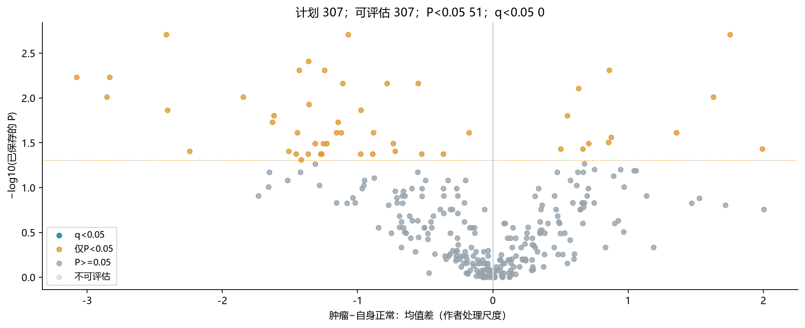

**结果与解释：**307项均可评估；51项P<0.05，0项q<0.05。入口是探索性工作池。原CAMP冻结303/42另行保留，不与307/51混算。

**限制：**配对精确符号秩和原10000次整对区间复用；处理尺度不是浓度倍数。

## 示例代谢物：配对方向人数

**问题：**配对变化方向有多少一致？

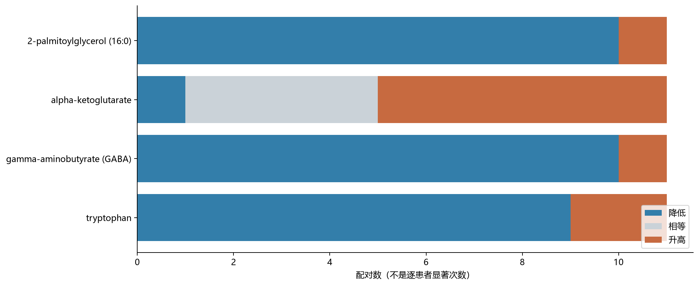

**结果与解释：**展示固定候选对应代谢物的全部11对方向计数。α-KG为6升、1降、4相等；比例分母包含相等对。

**限制：**相等值可能受到作者处理影响；人数不是逐患者显著次数。完整排序与所有代谢物见附录。

## 缺失敏感性：汇总效应对照

**问题：**限制到作者原有值后，效应如何变化？

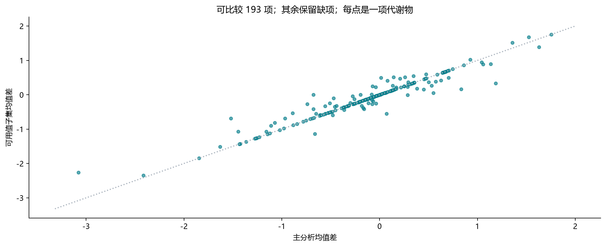

**结果与解释：**193/307项达到至少8对门槛；27项P<0.05，0项q<0.05。其余114项保留不可评估状态。

**限制：**作者表可用性不是质谱检出认证；缺项不能当阴性。均值区间不等于符号秩检验反演区间。

## 直接生化映射与保留范围

**问题：**51项怎样形成候选范围？

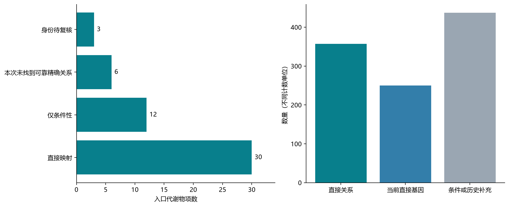

**结果与解释：**357条直接关系对应250基因；358条条件关系另列。条件及历史并集687基因全部进入来源，7项没有计划关系仍保留。

**限制：**图中非直接基因437个包括条件与历史补充，不全是历史独有。命名和身份限制不被映射消除。

## 肿瘤内部关系：全量概览 / CAMP_PDAC_GSE62452

**问题：**肿瘤之间代谢物和RNA是否共同变化？

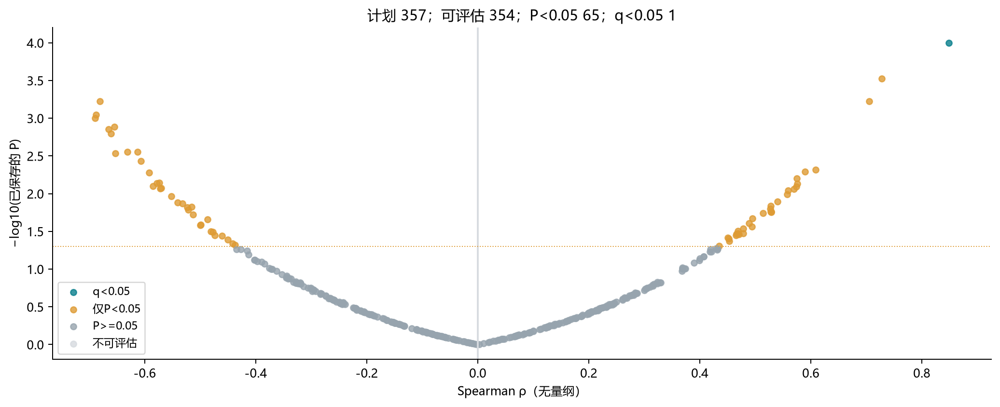

**结果与解释：**357条直接关系中354条可评估：65条P<0.05、1条q<0.05。条件关系另族350/358可评估，4条q<0.05。

**限制：**21个作者病例键，未调整协变量；同队列探索。直接、条件及可用值各有独立BH族。

## 固定示例：主分析与可用值相关

**问题：**固定示例的相关及敏感性怎样？

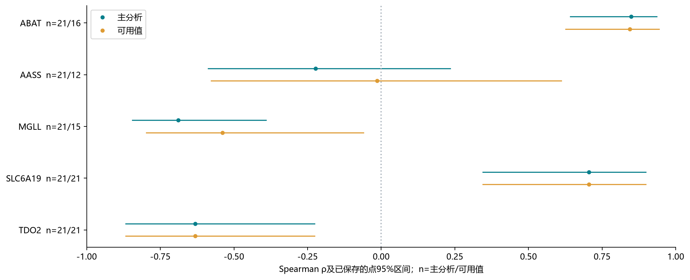

**结果与解释：**GABA—ABAT主rho=0.849、q=0.0354，可用值q=0.0342。AASS—α-KG主rho=-0.223，可用值rho=-0.014。

**限制：**示例含支持、未支持、身份及版本边界；不是按最小q形成的靶点排名。

## 配对RNA：全量效应概览 / CAMP_PDAC_GSE62452

**问题：**AASS等候选在配对RNA中如何变化？

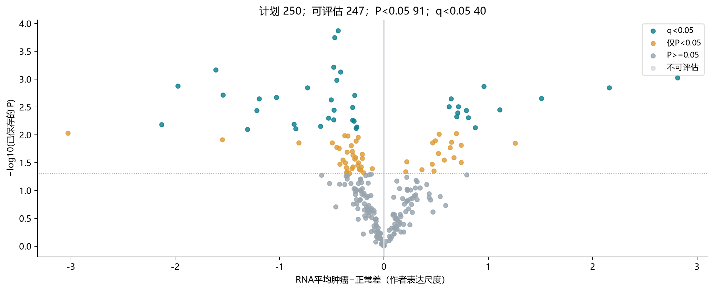

**结果与解释：**当前250基因中247可评估，91项P<0.05、40项q<0.05；补充437基因独立一族，429可评估、0项q<0.05。

**限制：**RNA来自已处理连续微阵列，配对t检验；丰度不等于酶活性或通量。

## 示例基因：配对RNA方向人数

**问题：**RNA的患者内方向是否一致？

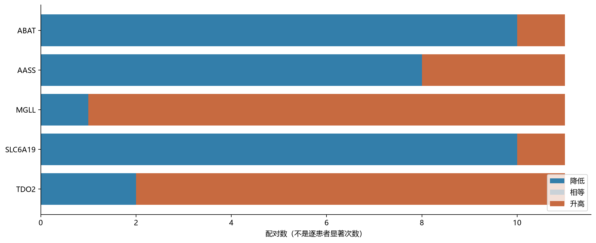

**结果与解释：**全部方向来自同一11对。AASS为8对降低、3对升高，P=0.0527，q=0.1369。完整250基因结果含NA。

**限制：**方向人数不能取代配对检验；作者尺度差值不称log2倍数。RNA未显著仍进入单细胞。

## 单细胞来源 / GSE263733

**问题：**候选在哪些细胞类别表达？

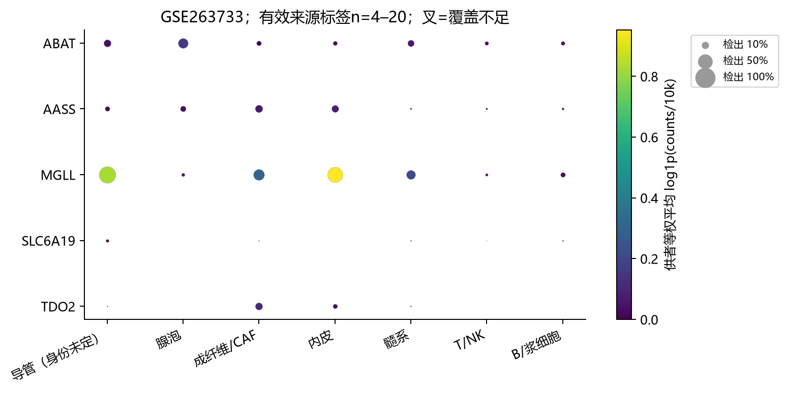

**结果与解释：**全部687基因已按来源标签等权汇总。AASS偏CAF/内皮，TDO2为三队列CAF首位；各研究分别显示色标。

**限制：**GSE242230拆分10783作者恶性与350正常上皮；另两研究导管身份未定。最高表达不证明唯一作用细胞。

## 单细胞来源 / GSE278688

**问题：**候选在哪些细胞类别表达？

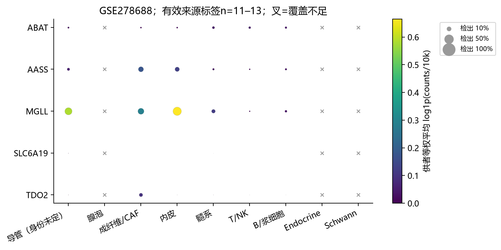

**结果与解释：**全部687基因已按来源标签等权汇总。AASS偏CAF/内皮，TDO2为三队列CAF首位；各研究分别显示色标。

**限制：**GSE242230拆分10783作者恶性与350正常上皮；另两研究导管身份未定。最高表达不证明唯一作用细胞。

## 单细胞来源 / GSE242230

**问题：**候选在哪些细胞类别表达？

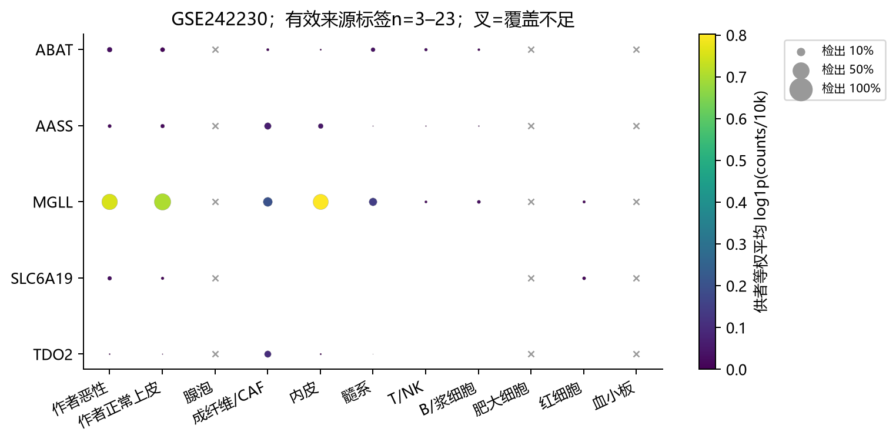

**结果与解释：**全部687基因已按来源标签等权汇总。AASS偏CAF/内皮，TDO2为三队列CAF首位；各研究分别显示色标。

**限制：**GSE242230拆分10783作者恶性与350正常上皮；另两研究导管身份未定。最高表达不证明唯一作用细胞。

## 分型、UMAP及身份缺项

**问题：**哪些模块目前不能展示？

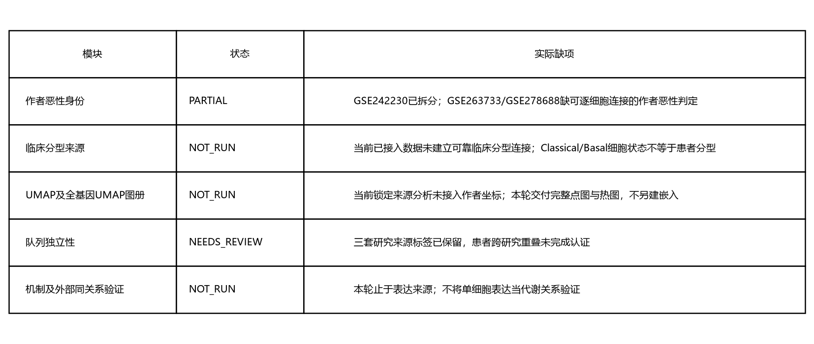

**结果与解释：**两队列恶性身份、临床分型连接、作者UMAP坐标和跨研究患者独立性仍有缺项。点图与热图覆盖完整基因池。

**限制：**不以细胞Classical/Basal状态代替患者分型；不凭肿瘤组织来源认定恶性，不临时新建嵌入。

## 来源覆盖与严格身份一致性

**问题：**来源一致和可靠定位覆盖怎样？

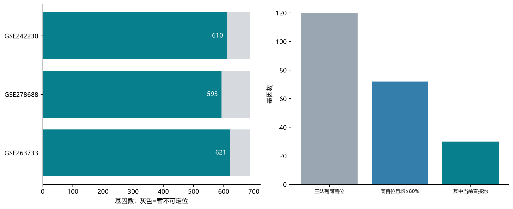

**结果与解释：**三研究可解释来源分别621、593、610/687；120基因三队列首位相同，72个同时保持率≥80%，当前直接池30个。

**限制：**缺项显示暂不可定位；共同类别另表。不同恶性/正常/身份未定类别不强行合并。

## 候选证据矩阵：支持与缺项并列

**问题：**不同证据如何并列？

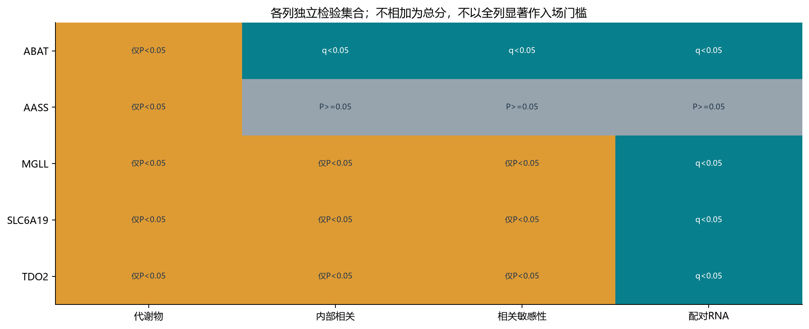

**结果与解释：**代谢物、内部关联、可用值及RNA各自保留原P/q。直接主分析只有GABA—ABAT过FDR，不能将其他层显著移作该关系支持。

**限制：**所有列不合成评分；单细胞没有疾病差异检验P/q。

## 候选解释：不是最终靶点名单

**问题：**当前可以提出哪些问题？

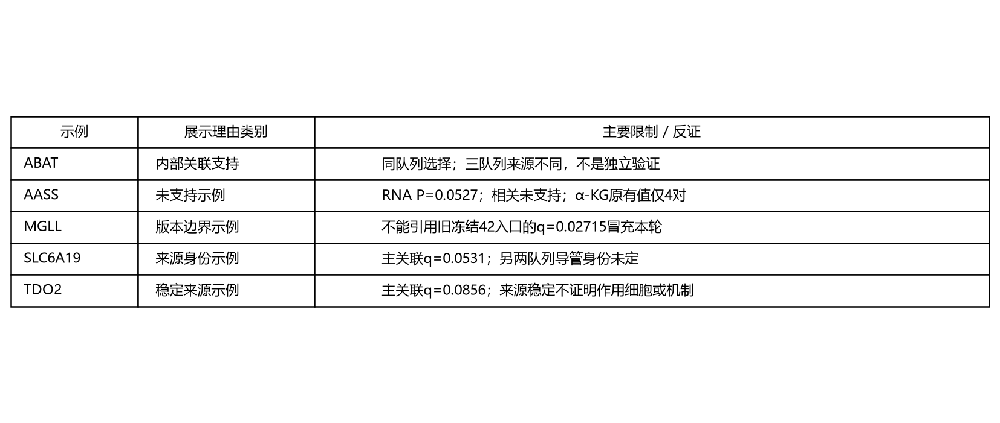

**结果与解释：**保留ABAT的内部联系、AASS的未支持结果、MGLL/SLC6A19的版本边界和TDO2的来源线索。完整715关系及687基因保留。

**限制：**机制、临床分型和外部同关系验证不由本报告补证；停在来源。

