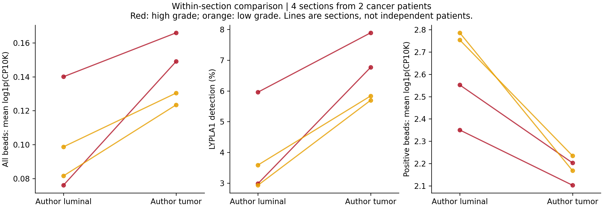
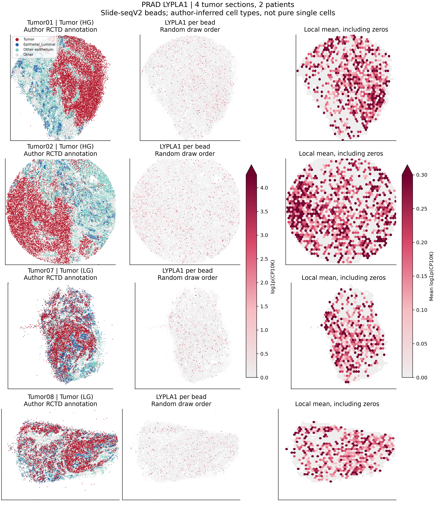

# PRAD：LYPLA1 空间定位首轮验证

## 本轮问题

寻找有可靠注释、可下载表达矩阵的 PRAD 空间转录组，检查 LYPLA1 是否富集于癌上皮，并区分检出率与阳性点表达。以名义 P<0.05 描述探索性显著性，不以 q 值筛选结果。

## 输入与范围

选用 [Hirz et al., Nature Communications 2023](https://www.nature.com/articles/s41467-023-36325-2) 的 Slide-seqV2，矩阵、坐标及注释来自[作者仓库](https://github.com/shenglinmei/ProstateCancerAnalysis)列出的原始公开下载链接。

- 全部 12 张切片、276,884 个作者保留的空间珠子，4 位供者。
- 主要比较限于 4 张癌组织切片、83,632 个空间珠子，实际来自 **2 位癌症患者**：一位 Gleason 4+3、一位 Gleason 5+4，各两张切片。依据原文 Methods 与 Supplementary Data 2；不按编号自行推断配对。
- 其中作者标注 Tumor 42,373 个，Epithelial_Luminal 8,810 个，Fibroblasts 7,652 个。
- 作者使用 RCTD 将单细胞标签映射到空间珠子，保留 singlet/doublet-certain。这里完全复用标签，无重聚类、无基于 LYPLA1 的重新注释。
- 每个珠子原始 UMI 至少 101；癌切片中位 UMI 456–620，中位基因数 345–446.5。分辨率和细胞亚型注释是优势，单基因检出稀疏和患者数少是限制。
- 原始矩阵、切片/患者测量及逐珠数据仅在 server165。其他候选见 `dataset_candidates.tsv`。

## 实际结果

以下为四张癌切片合并后的描述统计；推断不把合并珠子数当患者数。

|指标|作者癌上皮 Tumor|作者腔面上皮|成纤维细胞|
|---|---:|---:|---:|
|LYPLA1 检出率|6.68%|3.79%|2.89%|
|全部点平均 log1p(CP10K)|0.1447|0.0980|0.0733|
|阳性点平均 log1p(CP10K)|2.1671|2.5850|2.5380|
|合并计数 CPM|78.14|63.49|42.65|

同片比较：

|参照|平均表达升高切片|名义珠子级 P<0.05|按 UMI 校正后的计数率比范围|4×4 空间分块稳健 P<0.05|8×8 分块 P<0.05|
|---|---:|---:|---:|---:|---:|
|腔面上皮（主比较）|4/4|4/4|1.13–1.59|1/4|1/4|
|所有非恶性上皮标签合并|4/4|4/4|1.19–1.55|3/4|4/4|
|成纤维细胞|4/4|4/4|1.68–2.14|4/4|4/4|

珠子级检验为双侧 Mann–Whitney，空间敏感性检验为 Poisson GLM、log(总 UMI) offset、固定空间网格 cluster-robust 标准误。精确 P 的范围见 `contrast_summary.tsv`；各切片精确 P、效应和区间留在服务器 `private/section_contrasts.tsv`。计数率比表示每单位测序 UMI 的 LYPLA1 相对丰度比；平均 log 表达的比值不当作 RNA 生物学倍数。

## 新手解释

**空间数据支持 LYPLA1 在癌上皮区域富集的倾向，尤其相对间质成纤维细胞；相对腔面上皮的差异较弱。** 癌上皮中更容易检出 LYPLA1，但已检出的点并不表达更高，四张切片的阳性点均值均低于腔面上皮。这个模式与之前单细胞的“检出比例主导总体差异”相似，但不同技术的检出率不能直接横向比较。

不能把阳性点均值较低直接解释为癌细胞下调：条件于检出会产生选择效应，而且癌上皮珠子的测序深度较高。深度校正后的主比较效应较小，空间敏感性结果也没有在四张切片中全部显著。

## 限制与反证

1. 4 张癌切片只有 2 位患者；此轮不做患者总体显著性推断，也不把 4/4 切片称为 4 位患者复现。
2. RCTD 是作者推断标签，不是逐细胞病理金标准。Slide-seqV2 珠子可能包含混合信号；原作者映射模型是否包含 LYPLA1 本轮未审计。
3. 所有点的检验受空间相关性和深度影响。空间网格稳健标准误仅是敏感性检查，网格之间仍可能存在依赖，不等于解决全部空间混杂。
4. 当前证据支持相对比较，不证明 LYPLA1 癌细胞特异、酶活升高或 LPC 通量改变。阳性点条件表达不支持癌上皮更高。
5. 来自不同研究，但未获得与此前 PRAD24 队列之间的供者身份对照，不能声称已核实供者完全不重叠。
6. 原文还包含癌旁和无前列腺癌对照。本轮主要问题是癌组织内细胞类型富集；并未以癌旁整体代替良性上皮。

## 当前决定

完成首轮探索性空间验证。保留 LYPLA1 作为有空间支持的候选，但将“癌上皮特异高表达已得到稳健验证”标为尚未建立。癌上皮对间质的对比强于癌上皮对腔面上皮。

## 下一步

优先补充多患者、未经治疗的 Visium 队列和可连接到 barcode 的病理癌区/良性腺体注释。GSE278936 是首选扩展候选，本轮已核验 GEO 数据类型与下载文件结构，但尚未取得可直接连接的病理标签，未对其做 LYPLA1 统计。避免把更多技术切片当作更多患者，也不以插补后的 LYPLA1 当作实测表达。

## 复现命令

在 server165 新运行目录下载；矩阵不得下载到本地或 Git 工作树：

```bash
RUN=/public3/xuzx/Cancer/pancancer_metabolomics_direct_matrix_20260716/results/collaborative/PRAD/B/NEW_UNIQUE_RUN_ID
python prad_lypla1_spatial_fetch_v1.py "$RUN"
Rscript prad_lypla1_spatial_extract_v1.R "$RUN"
python prad_lypla1_spatial_v1.py "$RUN"
python prad_lypla1_spatial_finalize_v1.py "$RUN" BASE_GIT_COMMIT
```

下载器可用 `--proxy URL`；本轮下载时通过临时 SSH 回环转发访问公开 Google Drive，数据直接落 server165。无凭据写入代码。图中局部均值只汇总观测值（包括零），不做插补；所有切片使用同一色标。完整 SHA256 与软件版本见 manifest/spec。




