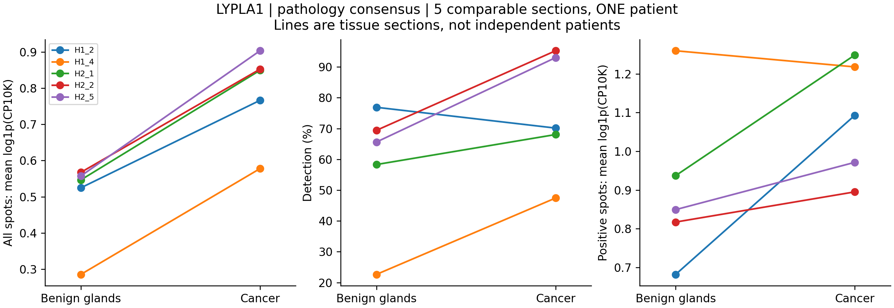
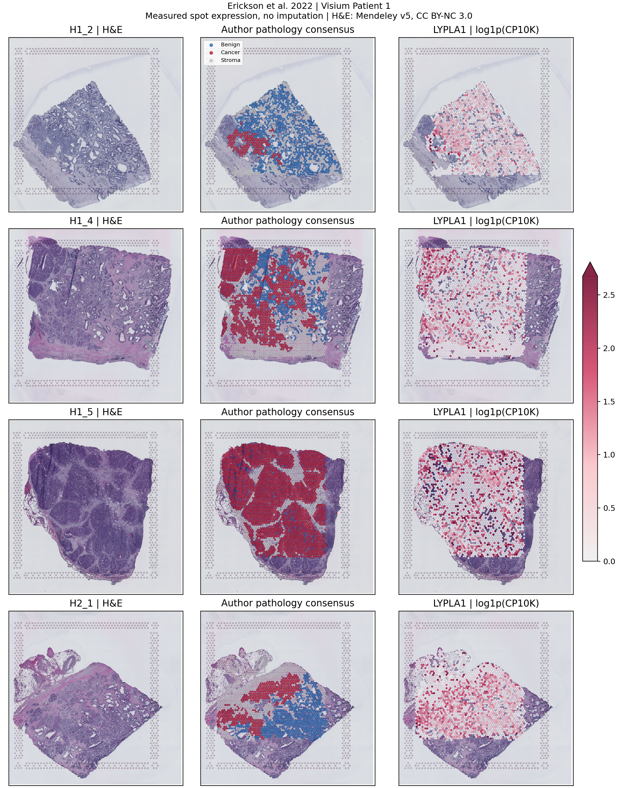
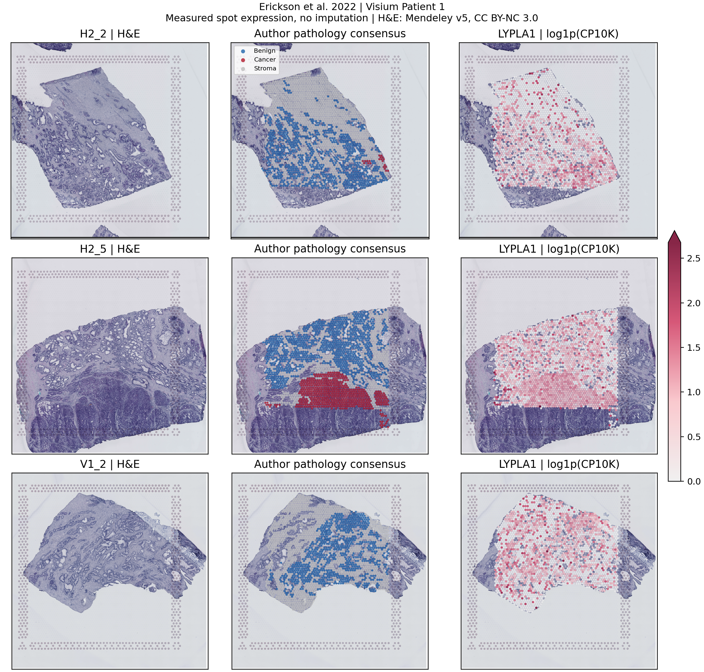

# PRAD LYPLA1：另一套病理标注空间数据复核

## 本轮问题

更换上一轮 Hirz2023 Slide-seqV2，使用有病理共识标签的空间数据，复核 LYPLA1 是否在癌上皮区域相对良性腺体富集。以名义 P<0.05 描述探索性显著性，不以 q 值筛选。

## 输入与范围

- [Erickson et al., Nature 2022](https://www.nature.com/articles/s41586-022-05023-2)，[Mendeley 数据版本 5](https://data.mendeley.com/datasets/svw96g68dv/5)。本轮下载全部 `Patient 1/Visium_with_annotation` 的 7 张切片，没有根据 LYPLA1 结果选择切片。
- 原作者由两位泌尿病理医师逐点标注，以某一组织类型占比 >50% 为条件，并经过共识复核；难以分类的混合区域排除。这比单细胞参考映射标签更直接，但不是纯单细胞分辨率。
- 复用 `Final_Consensus_Annotations`：GG1/GG2/GG4/GG4 Cribriform 等癌区合并为 Cancer，Benign 为良性腔面腺体，Stroma 为单独的次要参照。PIN 和 Transition_State 未混入癌区或良性腺体。
- 7 张切片来自 **同一位患者**。研究中的 Patient 2 虽有矩阵，但本轮公开文件目录未见对应逐点共识注释，因此没有推断标签后混入主分析。
- 采用总 UMI>500、in_tissue=1，排除 Exclude 和缺失标签，共保留 17,313 个 spot。可进行同片癌区—良性腺体比较的 5 张共含 2,582 个癌区 spot、4,032 个良性腺体 spot。
- 每个比较组至少 20 个 spot。H1_5 缺良性腺体对照，V1_2 无癌区；两者为 NOT_EVALUABLE，不当作阴性。H2_2 只有 21 个癌区 spot，结论精度受限。
- 35 个下载文件全部通过数据发布方 SHA256 校验。原始矩阵、逐点注释、逐切片测量和原始 H&E 均保存在 server165；Git 中为汇总、衍生图和代码。

## 实际结果

### 主比较：同片癌区 vs 良性腺体

|结果|数值|
|---|---:|
|可比较切片|5/7；实际患者数 1|
|癌区总体表达升高|5/5|
|直接 spot 级双侧检验 P<0.05|5/5；P=2.31×10⁻⁴⁵ 至 0.00270|
|校正总 UMI 后，癌区/良性腺体相对丰度比|1.37–1.84|
|4×4 空间分块稳健标准误下 P<0.05|5/5；最大 P=0.01649|
|8×8 空间分块稳健标准误下 P<0.05|5/5；最大 P=0.00129|
|癌区检出率更高|4/5|
|仅阳性 spot 的平均表达更高|4/5|

5 张可比较切片合并后的描述统计：

|指标|癌区|良性腺体|
|---|---:|---:|
|spot 数|2,582|4,032|
|LYPLA1 检出率|63.40%|61.76%|
|全部 spot 平均 log1p(CP10K)|0.7168|0.5133|
|阳性 spot 平均 log1p(CP10K)|1.1306|0.8312|
|汇总计数 CPM|156.71|98.29|

合并统计用于描述，不以合并 spot 数作为患者数。主结论依据各切片同片比较；公共 `results.tsv` 给出切片等权平均相对丰度比，不能把该描述值的统计单位误读为独立患者。

### 次要比较：癌区 vs 间质

6 张可比较切片中，癌区平均表达 6/6 较高，计数率比 1.16–2.55。直接检验为 5/6 显著；4×4 分块为 5/6，8×8 分块为 6/6，提示其中一张对空间划分敏感。不写成“所有方法下全部显著”。

## 新手解释

**这套不同研究、病理直接标注的空间数据支持 LYPLA1 在癌上皮富集区域相对良性腺体升高。** 与上一套 Slide-seqV2 相比，癌区—良性腺体差异在本例的多张切片中更一致，并且在测序深度和两种空间分块敏感性分析后仍然显著。

这里不仅是检出率不同：合并后的检出率差别较小，而阳性 spot 表达和按总 UMI 校正的相对丰度也更高。不过这仍是多细胞 spot 的区域结果，不能据此断言每个恶性上皮细胞的 LYPLA1 都更高。

## 限制与反证

1. 实际只有一位患者；5/5 是该患者多个区域的一致性，不是 5 位患者独立复现。未进行患者总体推断。
2. Visium spot 混合多细胞；作者 >50% 的组织类型标准代表富集区域，不代表纯细胞。
3. Poisson offset 的相对丰度比有明确测序深度含义，cluster-robust 标准误是敏感性分析，不能排除全部空间、形态或细胞组成混杂。
4. H2_2 的癌区仅 21 个点；同时给出其可评估性限制。另两张切片没有同片主比较，不补零、不借另一切片作为假配对。
5. LYPLA1 并非肿瘤专属：良性腺体中也广泛检出，PIN/过渡区域可有较高表达，完整区域汇总保留在 `region_summary.tsv`。这不是全细胞类型特异性排名。
6. 前一套单细胞/Slide-seq 阳性点模式与本轮不同，不能挑选本轮替代此前结果。平台分辨率、检出深度、区域组成及患者来源不同，需分开解释。
7. RNA 丰度不等于 LYPLA1 酶活或 LPC 代谢通量。该研究不同于 Hirz2023，但未使用跨队列患者身份映射宣称已核实所有既往队列完全无重叠。

## 当前决定

完成第二套空间数据复核。证据可表述为：**在 Erickson2022 的一位患者、5 张可比较的病理标注 Visium 切片中，LYPLA1 在癌上皮富集区域相对良性腺体一致升高，名义 P<0.05，深度与空间敏感性分析支持该方向。** 仍需更多患者检验可推广性。

## 下一步

继续优先寻找多患者、可下载逐点病理标签的数据，或取得 GSE278936 的癌区/良性腺体 barcode 注释。更大样本应分别检验癌区—良性腺体、阳性 spot 强度和肿瘤纯度影响。无需为了显著性改变本轮阈值。

## 复现命令

在 server165 建立新的唯一运行目录：

```bash
RUN=/public3/xuzx/Cancer/pancancer_metabolomics_direct_matrix_20260716/results/collaborative/PRAD/B/NEW_UNIQUE_RUN_ID
python prad_lypla1_erickson_fetch_v1.py "$RUN" --proxy OPTIONAL_PROXY_URL
python prad_lypla1_erickson_v1.py "$RUN" BASE_GIT_COMMIT
```

无代理时省略 `--proxy` 参数。下载器可重试并依据发布方哈希跳过已完整下载的文件。本轮首次下载有文件中断，重试后全部校验通过；不完整文件未用于最终分析。主分析固定 7 张切片、两个参照，共有 11 个可评估切片比较；11 个 rank 检验及 22 个空间敏感性检验均为探索性名义 P，不计算一个合并的患者总体 P。

方法：log1p(10000×LYPLA1 UMI/总 UMI)；双侧 Mann–Whitney；Poisson GLM 的 log(总 UMI) offset 与空间网格聚类稳健标准误。切片精确数值及 P 留在服务器 `private/section_contrasts.tsv`。参数、软件版本、输入哈希见 spec/manifest。所有图展示实测表达，不做插补。

图像依据 [Erickson et al. Mendeley v5](https://data.mendeley.com/datasets/svw96g68dv/5) 的 H&E 与坐标生成；原数据许可 CC BY-NC 3.0，作者署名与出处保留。RNA 表达图是本轮衍生分析，不是作者原文报告的 LYPLA1 结论。






