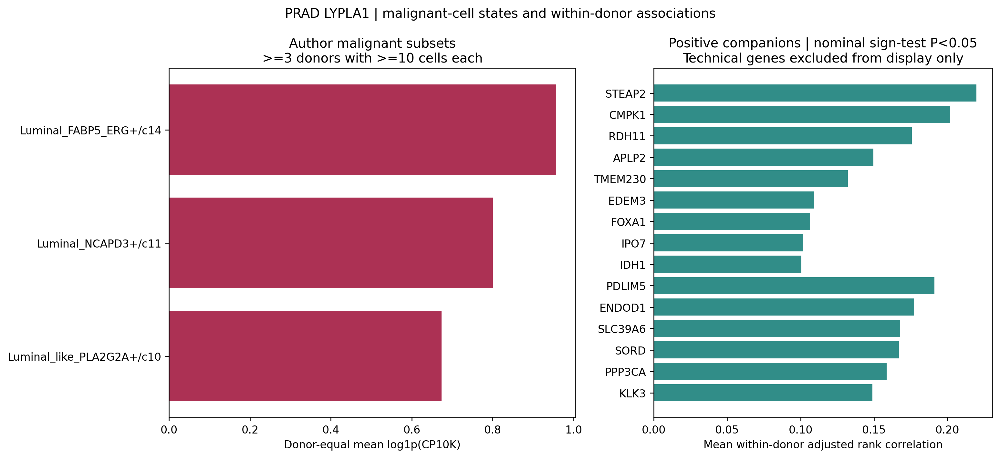

# PRAD LYPLA1 癌细胞亚群与患者内伴随表达

## 本轮问题

LYPLA1 是否集中于特定恶性上皮亚群？同一患者内，LYPLA1 较高的癌细胞同步表达哪些基因？按照用户要求，先做 PRAD 跨队列复现，不新增跨癌种计算。名义 P<0.05 用于探索性筛选；保留完整 q 值，不以 q 作为入选门槛。

## 输入与范围

- 复用固定 PRAD24 CELLxGENE 数据版本 `68b23fda-7191-46a5-8870-819feca3e66e`。精确选择 `type=cancer`、`celltype_major_v2=Epithelial`、`malignant_anno_merged=malignant`，共 3,157 个恶性细胞、24 个作者 donor_id。
- 沿用作者 `celltype_subset_v2` 的 20 个细分标签，不重新聚类、不用 LYPLA1 定义亚群。
- 从 raw counts 按全部原始基因计算 library，再使用 log1p(CP10K)。源矩阵、细胞及患者明细留在 server165。
- 关联要求每患者至少 30 个恶性细胞，LYPLA1 至少在 10 个细胞检出；16 位患者可评估。每个伴随基因在该患者中至少 10 个、且至少 10% 细胞检出；至少 8 位患者可评估才做跨患者方向检验。
- 每患者内部计算相关，不把所有患者细胞混合检验。主分析为秩变换后，校正总 UMI 与线粒体比例的残差相关；这是额外技术敏感性控制，不是 DESeq2 的 size-factor 模型。另保留普通 Spearman、加入作者亚群固定效应、仅 LYPLA1 阳性细胞三种分析。
- 主要 P 值是患者相关方向的双侧精确二项符号检验，衡量正负方向是否一致，**不是合并细胞相关 P，也不是相关强度检验**。全部可评估基因为各模式的固定 BH 检验族。

## 实际结果

### 亚群定位

多个腔面型恶性亚群均广泛检出 LYPLA1。较大亚群的 pooled 检出率包括：SPON2_ERG 90.9%、ERG++ 88.2%、FABP5_ERG 87.0%、ETV4 77.0%、NCAPD3 74.5%。这不能直接证明相对良性细胞普遍上调；本轮亚群比较的参照为同患者其他恶性亚群。

严重的患者与亚群混杂限制了亚群特异性结论：ERG++、ETV4 各仅来自一位患者；SPON2_ERG 的 99.76% 细胞来自一位患者。不能把这些亚群之间的 pooled 表达差异当作可重复亚群效应。

要求每患者每亚群至少 10 细胞、至少 3 位患者后，仅 3 个亚群可提供患者等权描述：

|作者亚群|满足条件患者数|患者等权平均 log1p(CP10K)|
|---|---:|---:|
|Luminal_FABP5_ERG+/c14|6|0.957|
|Luminal_NCAPD3+/c11|4|0.800|
|Luminal_like_PLA2G2A+/c10|3|0.674|

三个均值来自不同患者子集，不是配对差异检验。没有亚群达到 8 位患者、同患者亚群和其他恶性细胞各至少 10 个的推断要求。正式亚群比较保留 NOT_EVALUABLE，不为了得到 P 值放宽阈值。

### 患者内关联

9,057 个基因达到主分析覆盖要求；505 个正向、136 个负向伴随基因达到名义 P<0.05。全量表保留，不能将 641 个名义发现均作为已验证机制。

|基因|正相关患者 / 可评估患者|平均校正相关系数|方向一致性 P|
|---|---:|---:|---:|
|STEAP2|16/16|0.220|0.0000305|
|CMPK1|16/16|0.202|0.0000305|
|RDH11|16/16|0.176|0.0000305|
|FOXA1|16/16|0.106|0.0000305|
|KLK3|15/16|0.149|0.000519|

这些是弱到中等的细胞内共变，相关系数不是倍数。STEAP2、CMPK1、RDH11、FOXA1 和 KLK3 在加入亚群效应或只保留 LYPLA1 阳性细胞后仍有正向且名义显著的方向一致性。其他基因的敏感性结果并非全部支持，例如 APLP2 加入亚群效应后的方向一致性 P=0.0768；完整反证保留在 results.tsv.gz。

跨队列：本批 PRAD24 计算已完成；Hirz2023 原作者的癌细胞注释和原始计数已取得，第二队列核验另行追加交付。本批不宣称复现完成。

## 新手解释

当前更可靠的线索是“LYPLA1 与一组基因在多个患者内部共同变化”，而不是“已经找到一个专属 LYPLA1 高表达癌细胞亚群”。亚群在患者间分布不均，对 pooled 排名的解释影响很大。

## 限制与反证

- 24 位患者均保留覆盖记录，只有 16 位达到关联要求；缺覆盖不当作零相关。
- 遵循作者 donor_id，未取得可做基因型核验的 BAM/VCF，因此不能声称本轮独立排除了样本身份错误。性别元数据全为 male；没有人为补充临床信息。
- rank residual correlation 仍可能受测序、细胞状态及组成影响。共同归一化分母不能完全排除组成效应。亚群控制和阳性限定分析属于同数据敏感性分析。
- 名义 P 仅为探索；RNA 相关不是直接调控、酶活或 LPC 通量证据。
- 没有跨患者可比亚群的充分覆盖，不推断 ERG/ETV4 等亚群特异性，也不声称本轮证明某种通路。

## 当前决定

第一队列计算完成。优先将全量正向伴随基因锁定后到第二 PRAD 队列验证，不根据第二队列结果重新选择第一队列阈值。

## 下一步

核验 Hirz2023 癌细胞与患者映射，在满足覆盖时采用同一患者内关联方法；如果患者不足，保留描述与不可评估状态，不放宽阈值以制造显著性。

## 复现命令

在 server165 新建唯一运行目录后：

```bash
OPENBLAS_NUM_THREADS=1 python prad_lypla1_states_associations_v1.py --out NEW_RUN --source PRAD24_cellxgene.h5ad --commit BASE_COMMIT
```

`gene_associations_all.tsv.gz` 为四种模式全量结果；`results.tsv.gz` 汇总主分析及敏感性；`state_summary.tsv` 保留所有 20 亚群。对 9 个标量 Spearman 相关独立核算，最大误差 6.94e-18。无新聚类、无表达插补。


