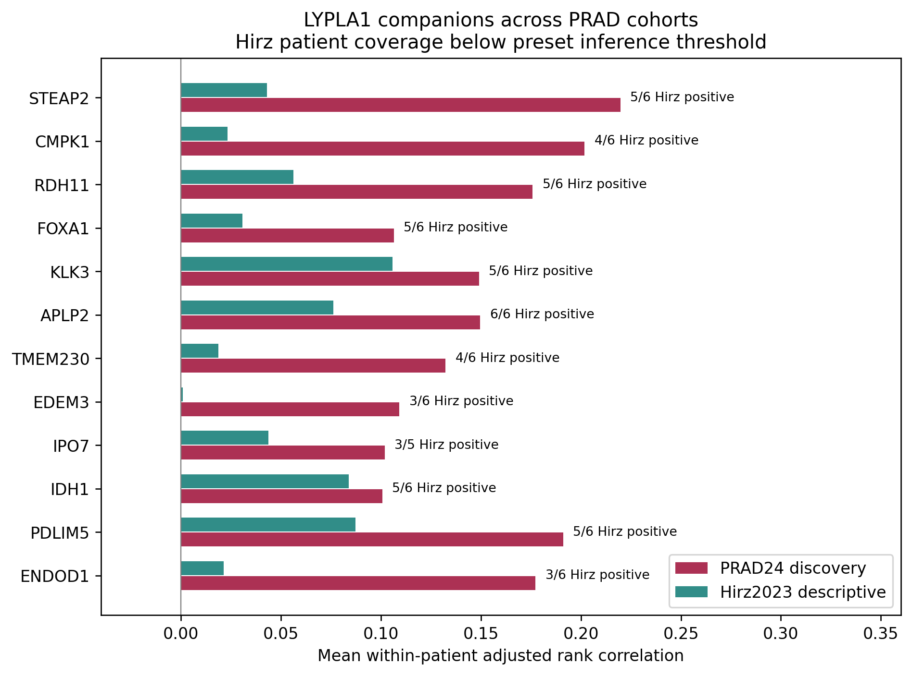

# LYPLA1 患者内伴随表达：第二 PRAD 单细胞队列复核

## 本轮问题

复核 PRAD24 中锁定的 LYPLA1 伴随基因，在另一个 PRAD 研究的癌细胞中是否保持患者内关联方向。用户已明确先只做 PRAD，不扩展跨癌种。

## 输入与范围

- [Hirz et al., Nature Communications 2023](https://www.nature.com/articles/s41467-023-36325-2)，[原作者分析仓库与数据链接](https://github.com/shenglinmei/ProstateCancerAnalysis)，GSE181294。
- 下载作者提供的 `counts.scRNAseq2.rds` 与 `cell.ano.scRNAseq.rds` 到 server165。按完整 barcode 精确连接，不重新推断恶性，不把全部 Epitheial_Luminal 当作癌细胞。
- 作者标签 `cell1=Tumor` 共 1,237 个细胞，均在肿瘤样本。用补充表 1 的临床 fname、Tumor=Y 和 grade，构造作者完整样本名并精确核对；没有按编号顺序配对。一个样本的文件名级别与临床级别矛盾，涉及 5 个细胞，排除并保留私有日志。剩余 1,232 个癌细胞，来自 15 个有癌细胞的患者。
- 其中 6 位达到预设每患者至少 30 个癌细胞、LYPLA1 至少 10 个阳性细胞要求。沿用第一队列每基因至少 10 阳性细胞、至少 10% 检出，以及正式推断至少 8 位患者的门槛。
- 逐样本全部原始基因总 UMI 作分母；不会用跨样本交集基因重新缩小归一化分母。
- 复核第一队列所有 9,057 个可评估基因，预先标记其中 505 个名义显著正向基因。按唯一精确符号映射，缺失或不唯一保留状态。全量不只保留同向基因。
- 第一队列输出提交 `9b8d205` 已先上传；第二队列不参与第一队列的基因筛选。

## 实际结果

|基因|PRAD24 正向患者数|PRAD24 平均校正相关|Hirz 正向患者数|Hirz 平均校正相关|
|---|---:|---:|---:|---:|
|STEAP2|16/16|0.220|5/6|0.043|
|CMPK1|16/16|0.202|4/6|0.023|
|RDH11|16/16|0.176|5/6|0.056|
|FOXA1|16/16|0.106|5/6|0.031|
|KLK3|15/16|0.149|5/6|0.106|
|APLP2|16/16|0.150|6/6|0.076|
|IDH1|16/16|0.101|5/6|0.084|

以上为预先重点展示的伴随基因，不代表全部候选。完整结果中，505 个正向候选有 400 个在第二队列至少 3 位患者中可提供描述；其中 289 个平均相关方向仍为正，111 个未保持正向。这个 72.25% 是描述性方向一致比例，不能写成显著复现率；其余 105 个缺少足够描述覆盖，不能补零作为阴性。

仅保留 LYPLA1 阳性癌细胞时，KLK3 在 6/6 位患者中同向，平均校正相关为 0.164；FOXA1 为 5/6、0.031。STEAP2、CMPK1、RDH11 则各为 4/6 同向，不能将阳性限定分析统一写成全部稳健。

**正式跨患者复现检验：NOT_EVALUABLE。** 第二队列只有 6 位合格患者，未达到预设的 8 位；P/q 为 NA，不因个别基因 6/6 同向而事后降低阈值。

**亚群复现：NOT_EVALUABLE。** 作者提供的 Tumor 类别没有与第一队列对应的恶性上皮细分亚群；未把另一研究的聚类编号强行匹配。

## 新手解释

第一队列中 LYPLA1 的伴随表达有跨患者的一致性；第二队列对部分基因提供同向线索，但相关强度明显减弱。因此目前可以优先关注 STEAP2、RDH11、FOXA1、KLK3 等候选，不能称其为已经稳定复现的 LYPLA1 调控网络。APLP2 在第二队列同向较一致，但第一队列加入亚群效应后不再达到名义显著，仍保留这一反证。

## 限制与反证

1. 第二队列癌细胞覆盖少、可评估患者少；正式统计不足不是结果为零，也不是已经证实无关联。
2. 一条临床级别映射冲突已明确排除。首次运行在身份检查时停止、没有产出相关结果；错误日志留在服务器 `20260928T134000Z_lypla1_hirz_replication_v1/ERROR.json`，本报告为另建的修正运行。
3. 不同研究名称不自动证明患者完全无重叠；未取得跨研究身份映射，故不声称已经核实患者完全独立。
4. 同一 Hirz 研究之前用于 Slide-seq 的结果，不是这次单细胞关联的另一独立队列。
5. 技术协变量控制不能消除全部单细胞检出和组成偏差；相关系数不是倍数，RNA 共变不是调控或酶活证据。
6. 公开全部可计算与不可计算基因；名义 P<0.05 偏好不意味着将不满足预设统计条件的条目补算 P。

## 当前决定

第二 PRAD 队列的计算与核验完成，提供描述性方向支持，正式复现仍因患者覆盖不足而不可评估。癌细胞亚群特异性尚未建立。现有空间癌区富集、第一队列患者内伴随表达、第二队列弱同向支持应分别陈述，不拼成机制验证。

## 下一步

下一批优先找恶性细胞更充分、逐患者和恶性亚群注释完整的 PRAD 队列；沿用已锁定候选与当前覆盖门槛。未启动新下载任务或后台任务。

## 复现命令

```bash
python prad_hirz_scrna_fetch_v1.py DISCOVERY_RUN --proxy OPTIONAL_PROXY
Rscript prad_hirz_scrna_extract_v1.R DISCOVERY_RUN
OPENBLAS_NUM_THREADS=1 python prad_lypla1_hirz_replication_v1.py --source-run DISCOVERY_RUN --out NEW_UNIQUE_RUN --commit BASE_COMMIT
```

补充表 1 源地址为 `https://media.springernature.com/original/springer-static/esm/art%3A10.1038%2Fs41467-023-36325-2/MediaObjects/41467_2023_36325_MOESM4_ESM.xlsx`，需下载到 DISCOVERY_RUN/source/supplementary_data1.xlsx。计数、临床表和患者级结果仅存服务器。`results.tsv.gz` 包含普通、技术校正和阳性细胞限定三种分析；`priority_gene_comparison.tsv` 为重点基因汇总。


